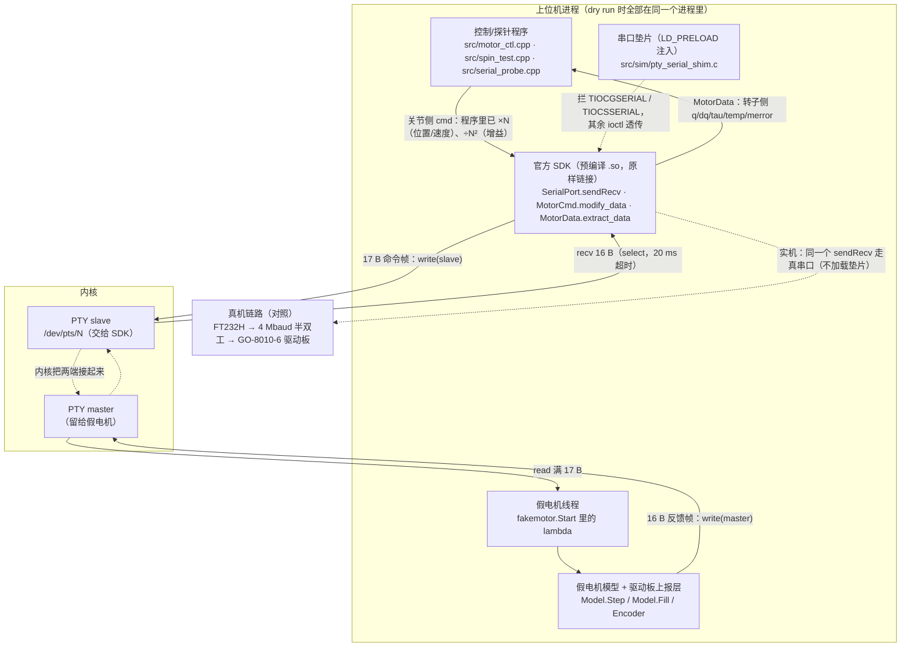
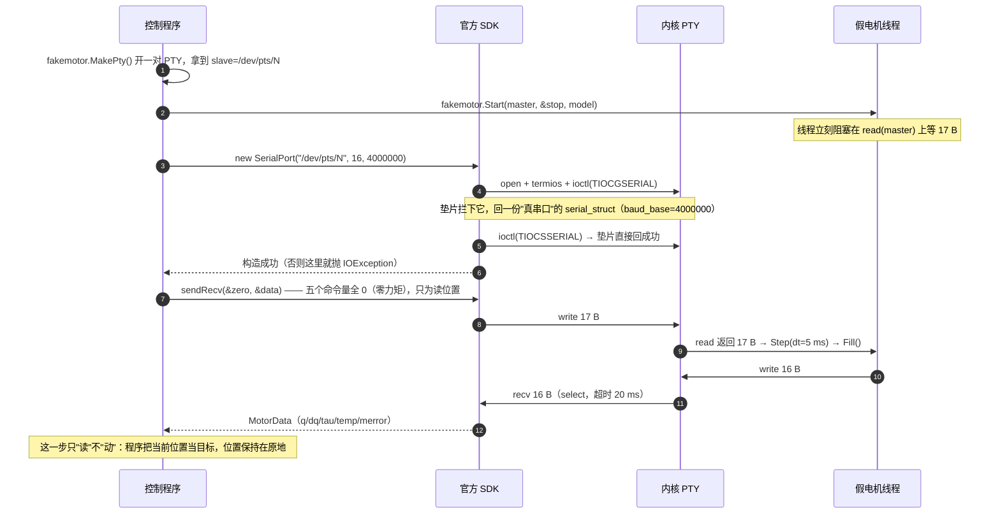
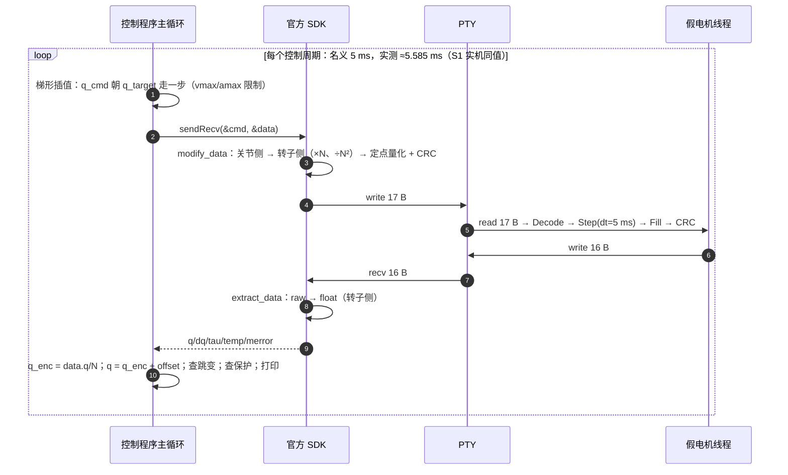
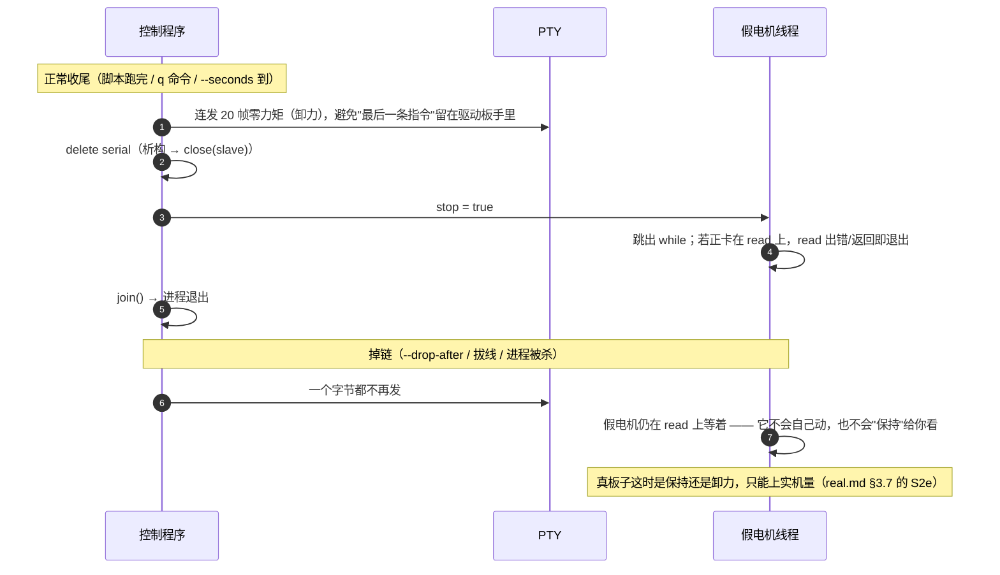
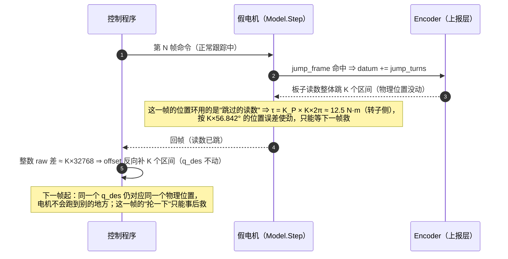

# 仿真电机：让官方 SDK 以为真的接了一台 GO-8010-6

> 实体电机一时拿不到（当前最大阻滞项）时，它让**同一份上位机代码**（同一套 SDK 调用、同一套报文与换算）
> 在没有硬件的情况下跑起来。实现只有两个文件：[`../src/sim/fake_motor.h`](../src/sim/fake_motor.h)
> （假电机）与 [`../src/sim/pty_serial_shim.c`](../src/sim/pty_serial_shim.c)（串口垫片）。
>
> 怎么跑：[`../README.md`](../README.md) §3（手工编译）/ §6（CMake 产物 + 四种自检情形）；
> 实机计划与验收：[`real.md`](real.md) §3；缩写： [`glossary.md`](glossary.md)。
> 证据：[`../../output/terminal/motor-ctl-dryrun-20260929.txt`](../../output/terminal/motor-ctl-dryrun-20260929.txt)。

## 1 它解决什么问题（以及不解决什么）

"没有硬件时怎么办"要分成两层，我们的做法也分两层：

| 层 | 要验证什么 | 我们做到哪一步 |
|---|---|---|
| **协议层 mock**（本文件的主角） | 上位机代码路径、指令换算对不对、反馈解码对不对、状态机/标定/跳变逻辑 | ✅ 完整：官方 SDK **原样链接**，报文、CRC、定点标度全部按实机实测值收发（[`../README.md`](../README.md) §4） |
| **物理层模型** | 控制器参数、力矩/转速边界、轨迹可行性 | 🔧 行为级：一阶速度响应 + 库仑摩擦 + 力矩限幅；转子惯量/摩擦/减速器效率/热模型都还是"旋钮"，没做参数辨识 |

宇树**没有**发布 GO-M8010-6 的现成仿真模型（没有 MJCF/URDF，官方 SDK 里也没有 mock 模式），但手册
（《GO-M8010-6 电机数据手册》/《M8010 电机开发指南》）给了建模要用的大部分量：减速比 6.33、峰值扭矩
23.7 N·m、扭矩常数、最大转速 30 rad/s、控制律、帧格式、编码器位数；缺的是转子惯量、摩擦、效率、热——
这些得靠社区值（`mujoco_menagerie/unitree_go1`、`mjlab` 的 Go1 常量）或自己辨识（S2d 的 kd 扫描就是一次
初步辨识）。本组那份调研记录见 <https://yb.tencent.com/s/XIoPdyQnpzmi>（分享链接，结论是"没有现成模型、
参数够自建"）。

所以本目录的定位是：**协议层当真、物理层够用**。它能让"回归 0 / 键盘给角度 / 标零点 / 零点跳变"这条
逻辑链在真机上只剩"数值标定与安全验证"要做，而不是在那里才发现代码有 bug。

## 2 层级架构（一次 dry run 的进程内分层）

每层的职责、对应文件与"实机上的对应物"：

| 层 | 在哪 | 职责 | 实机上的对应物 |
|---|---|---|---|
| 控制/探针程序 | `src/motor_ctl.cpp`、`src/spin_test.cpp`、`src/serial_probe.cpp`、`src/sim/fake_motor_dryrun.cpp` | 控制律、插值、键盘、标定与跳变逻辑 | **同一份程序**，只把 `--self-test` 换成 `--port /dev/ttyUSB0` |
| 官方 SDK | `ReadOnly.d/unitree_actuator_sdk`（头文件 + 预编译 `.so`） | 打包 17 B 命令帧（含 CRC 与定点量化）、`write`、`recv` 16 B、解包成物理量 | 同左 |
| 串口垫片 | `src/sim/pty_serial_shim.c`（`LD_PRELOAD`，CMake 目标 `pty_serial_shim`） | 让 `SerialPort` 构造时的 `TIOCGSERIAL`/`TIOCSSERIAL` 通过（PTY 一律回 `ENOTTY`，见 [`../README.md`](../README.md) §2） | FTDI 驱动提供的真 `serial_struct`（实测 `baud_base=60000000`、4 Mbaud 整除） |
| PTY 对 | `fakemotor::MakePty()` | 造一对"串口"：slave 给 SDK，master 给假电机 | FT232H ↔ TTL/RS485 线 ↔ 驱动板 |
| 假电机线程 | `fakemotor::Start()` | 收满 17 B → `Step()` 积分 → `Fill()` → 回 16 B | 驱动板（位置环/速度环 + 报文）+ 电机本体 |
| 上报层 | `Model::Reported()`、`Model::LoopPosition()`、`Encoder` | 把"真实转子位置"变成"板子报出来的位置"：里程计 / 锯齿 / 上电基准 / 中途换基准 | 单圈绝对值编码器 + 驱动板的零点约定（[`real.md`](real.md) §5） |

## 3 接口信息

### 3.1 进程内的 C++ 接口（`sim/fake_motor.h`）

| 接口 | 签名 | 契约 |
|---|---|---|
| 造 PTY | `std::string MakePty(int *master)` | `posix_openpt`+`grantpt`+`unlockpt`+`ptsname`；返回 slave 路径（如 `/dev/pts/9`），`*master` 给调用方 |
| 起假电机 | `std::thread Start(int master_fd, std::atomic<bool> *stop, Model model)` | `model` **按值**拷进线程（之后改调用方的 `model` 不影响线程）；线程体是"收满 17 B → `Step(cmd, dt=0.005)` → `Fill()` → 写 16 B"，`read` 出错时 `usleep(200)`；停止 = `stop->store(true)` + `join()` |
| 解帧 | `static void Model::Decode(const ControlData_t &c, double *tau_des, double *w_des, double *p_des, double *k_pos, double *k_spd)` | 按**实测标度**把 raw 换成物理量（不走 SDK 的 `float` 路径，直接看 `comd` 的整数字段） |
| 积分一步 | `void Model::Step(const ControlData_t &c, double dt)` | 先 `Decode` 再把 raw 目标换成物理量，然后 `τ = τ_ff + K_P·(Pos_des − 板子读数) + K_W·(W_des − ω)`，减库仑摩擦（含"静摩擦推不动就停住"）、按 `tau_max` 限幅、以 `J` 积分角速度、再积分位置；同时处理"中途换基准"注入 |
| 打包回帧 | `void Model::Fill(const ControlData_t &cmd, MotorData_t *r) const` | 物理量 → raw（含截断），填 `head/mode/fbk`，算 CRC（覆盖前 14 B） |
| 板子读数 | `double Model::Reported() const` | `p + datum×2π`；锯齿模式再折回 `0…2π` |
| 位置环口径 | `double Model::LoopPosition(double p_des) const` | 锯齿模式把上报值按**最短有环差**折到 `Pos_des` 附近（板子自己知道圈数） |
| 注入 | `struct Encoder { int mode; int datum; long jump_frame; int jump_turns; }` | `mode`：0 里程计 / 1 锯齿；`datum`：上电基准平移 k 个**转子整圈**（= 认错零点）；`jump_frame/jump_turns`：第 N 帧注入一次"读数往前跳 k 个区间" |

`Model` 的物理旋钮（都是转子侧）：`tau_max = 20 N·m`（力矩限幅）、`tau_fric = 0.002 N·m`（库仑摩擦）、
`J = 1e-3 kg·m²`（等效惯量，写在 `Step()` 里；速度的时间常数 = `J/K_W`）、`temp`（随力矩慢慢涨，
>89 °C 置 `merror=1`，只是为了让错误码那条路径能测）。
**改这些不影响标度那部分**：报文格式与定点换算必须与实机一致（[`../README.md`](../README.md) §4）。

### 3.2 报文接口（谁负责哪一段）

| 帧 | 长度 | 布局 | 谁负责 |
|---|---|---|---|
| 命令（上位机 → 驱动板） | 17 B | `head[2] "FE EE"` + `mode`（bit0-3 = id，bit4-6 = 0 锁定 / 1 FOC / 2 校准）+ `comd` 12 B（`tor_des` q8、`spd_des` q7×π、`pos_des` q15 圈、`k_pos`、`k_spd`）+ CRC16 | 官方 SDK 打包；**假电机只解析** |
| 反馈（驱动板 → 上位机） | 16 B | `head[2]` + `mode` + `fbk` 11 B（`torque` q8、`speed` q7、`pos` q15 圈、`temp` int8、`MError` 3 bit + 力传感 12 bit）+ CRC16 | **假电机打包**（`Fill()`）；官方 SDK 解包 |

定点标度、截断与钳位（`spd_des` 是 q7 的 **π 倍**、增益超量程静默截断到 `32766`、整数除法导致 1 LSB 差…）
都是实机实测出来的，逐条列在 [`../README.md`](../README.md) §4，这里不重复；`MotorCmd` 的 `q/dq/kp/kd`
**都是转子侧**，SDK 不做换算，所以换算责任在调用方（程序里 `×N` / `÷N²`）。

### 3.3 环境接口

| 项 | 值 | 说明 |
|---|---|---|
| 前置库 | `LD_PRELOAD=<build>/libpty_serial_shim.so` | 不加就会在 `SerialPort` 构造时抛 `IOException (25) Inappropriate ioctl for device` |
| 设备 | `MakePty()` 产出的 `/dev/pts/N` | 属于当前用户，**不需要 root**、不需要内核模块 |
| 构造 | `new SerialPort(slave, 16, 4000000)` | 实参对应 `recvLength=16`、`baudrate=4000000`；其余用默认：`timeOutUs=20000`（收不到回复时按 20 ms 超时返回 `false`）、`BlockYN::NO`、8N1、无流控。实测一帧 `sendRecv` ≈5.5 ms ≫ `usleep(5000)`，说明它**收到 16 B 就返回**，不是死等 20 ms |
| 与真机的差别 | 没有 4 Mbaud 半双工的时序争用、没有 USB 延迟/抖动/丢字节、没有电气问题 | 链路层的问题（S0/S1 已实测）在 dry run 里**永远不会出现**，别指望它替 S1 |

### 3.4 dry run 专用的注入开关（怎么"制造故障"）

| 开关 | 注入什么 | 对应讲义/计划里的哪一条 |
|---|---|---|
| `--self-test` | 启用 PTY + 假电机（不加就是真串口） | 全部 dry run |
| `--fake-sawtooth` | 板子只报"相对最近零点"的角度（0…1 个区间） | 讲义 §2.4 的锯齿读数（S2b 要判定哪种） |
| `--fake-datum-turns N` | 上电基准平移 N 个转子整圈（N 可负） | 讲义 §2.6 的"认错零点"（S5 的上电那一半） |
| `--fake-jump-frame N` / `--fake-jump-turns K` | 第 N 帧注入一次"读数往前跳 K 个区间" | 运行中换基准（S5 的另一半；K=1 正跳、K=-1 反跳） |

## 4 通信时序

### 4.1 启动（从 `MakePty()` 到第一帧反馈）

### 4.2 运行时一帧（`sendRecv` 内部与帧周期）

> **时间基的差别（重要）**：假电机每收到一帧就按**固定 5 ms** 积分，而墙钟上一帧要 5.585 ms
> ⇒ 假电机的"内部时间"比墙钟快约 11%。所以 dry run 里"到目标用时""墙钟转速"会比实机偏快，
> 而**程序内部的判据（阈值、斜率）与实机是同一套**。要更真就把实测帧周期传给 `Step()`（待改进项）。

### 4.3 结束与掉链（两种收场）

### 4.4 注入点：跳变发生在哪一步、为什么要"事后一帧"才修

## 5 它能证明什么、不能证明什么

| 项 | dry run（假电机） | 真机 | 影响 |
|---|---|---|---|
| 报文/CRC/定点标度 | 按实测值收发，官方 SDK 原样解析 | 同 | ✅ 这一层可信（协议层 mock 的全部价值所在） |
| 标定/跳变/状态机逻辑 | 可反复跑、可注入故障（§3.4） | 只能试几次 | ✅ 这是它最大的价值 |
| 时间基 | 每帧固定 5 ms 积分，墙钟 ≈5.585 ms | 真实墙钟 | ⚠ 到目标用时偏快 ~11% |
| 转子惯量 | `J = 1e-3`（旋钮值） | 未知（社区值 ≈1.1e-4） | ⚠ 跳变那一下的位移被放大 |
| 摩擦/效率 | 固定库仑 0.002 N·m | 未知，S2d 量 | ⚠ 低速稳态误差不同 |
| 链路 | 无延迟、无噪声、无丢字节、无半双工争用 | 4 Mbaud 半双工（S0/S1 已实测） | ⚠ 链路问题它永远测不出来 |
| 上电/掉电 | 只能靠 `--fake-datum-turns` 注入"结果" | 真实行为 | ⚠ 上电基准会不会变要 S2f 量 |
| 热 | 极简（力矩 ∝ 升温），只为触发错误码 | 真热模型未知 | ⚠ 不做温升精度 |

## 6 怎么跑（复现命令）

见 [`../README.md`](../README.md) §6 的"① 离线自检"：四条命令分别覆盖"回 0 + 给角度 + 标定 + 跳变修正"
"上电认错零点""运行中换基准""锯齿读数"。全部输出留档在
[`../../output/terminal/motor-ctl-dryrun-20260929.txt`](../../output/terminal/motor-ctl-dryrun-20260929.txt)，
用 `analyse_ctl_log.py` 可以一秒读完（会给出每个运行的一行摘要）。

上实机时的执行顺序、记录表与验收演示见 [`runbook.md`](runbook.md)（本文件负责"为什么"，runbook 负责"怎么做"）。

## 7 待实机确认的小项（跟假电机的保真度有关）

1. **反馈帧的头字节**：手册写 `FD EE`，我们的假回帧用 `FE EE`，SDK 照样解出（把 `Fill()` 改成 `FD EE`
   甚至 `00 00` 实测也能解 ⇒ 这条路径上 SDK **不校验**头字节）。真板子发什么，上实机抓一次原始字节即可。
2. **真实帧周期**：S1 实测 5.585 ms（名义 5 ms）。若与 dry run 的固定 5 ms 差得多，`Step()` 的 `dt`
   应该改用实测值。
3. **断链后驱动板的行为**（S2e）：假电机只是"不发也不动"，真板子可能保持最后指令或自行卸力，
   这决定"到位后保持"能不能只靠我们持续发帧。
