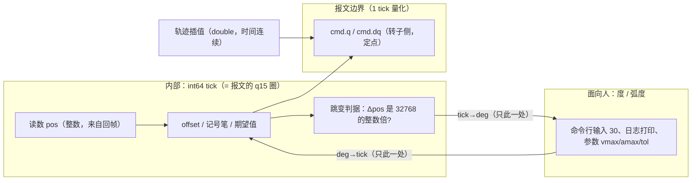

# 定点数、浮点误差与编码器精度（含"待实机复验"清单）

> 起因是三个问题：① 宇树 SDK 的**定点数发送**是否被官方明确支持？② **编码器本身**的误差有多大， 浮点读取/控制带来的误差与它相比如何？③ 把程序内部表示**统一成定点数**（int64、小数长度不变）、 只在面向人的日志里用弧度/角度，收益边界在哪？
>
> 本文只记结论与依据（含可复现命令）；不接电机的部分已经做完，**需要上机的项累积在 §6**。 相关文档：[`real.md`](real.md)（硬件与计划）、[`runbook.md`](runbook.md)（现场执行）、 [`fake-motor.md`](fake-motor.md)（仿真电机）、[`glossary.md`](glossary.md)（缩写）。

## 1 结论速览

| # | 问题 | 结论 | 强度 |
|---|---|---|---|
| 1 | 定点发送是否被支持 | **支持，而且官方文档就是按定点写的**：手册 §8「移植到其他上位机平台」明确"读者可以在任意满足硬件要求的平台上给电机发送控制命令并接收电机状态"，并给出 17 B/16 B 全字段表与公式（×256、×256/2π、×32768/2π、×1280），还写明"通讯协议内所有的数据类型都为整形""请确保控制主机处理器平台为小端(LSB)模式"。SDK 的 float API 只是方便层 | ✅ 一手（手册） |
| 2 | 编码器分辨率 | **15 bit 单圈绝对值、装在转子端**（官方产品页规格表）。1 LSB = 1/32768 转子圈 = **0.001735°（输出端）**；协议里的 `pos` 就是 q15 圈 ⇒ 分辨率与协议一致 | ✅ 一手（官方产品页） |
| 3 | 编码器**准确度**（非线性/重复性/背隙/温漂） | **官方没有任何数字**（手册与产品页都没有）。只能实机测 ⇒ §6 | ⚠ 待测 |
| 4 | 浮点读数的误差 | 官方 `.so` 的位置换算是 `q = pos × 2π′/32768`，其中 **π′ = 3.1416**（不是真 π）⇒ **+2.34 ppm 的标度误差**：每 ≈13 个转子圈就把读数挪 1 tick；1000 圈时 **+0.135°（输出端）**；8192 圈时 **+1.07°** | ✅ 本轮实测 |
| 5 | 浮点发送的误差 | 同一常数也用在打包：`pos_des = q/(2π′)×32768`（实测 1000 rad 时少 13 tick）。命令里 q 本身量化到 1 tick（0.0017° 输出端），所以**发送侧**的 π′ 影响 = 2.34 ppm × 目标角（30° 时 0.00007°，可忽略） | ✅ 本轮实测 |
| 6 | 与浮点误差**同量级**的其它误差 | 减速比取值差 **6.33 vs 19:3**（5.26e-4 相对 = 225 倍于 π′）⇒ **每输出圈 0.19°**；摩擦/重力在 kp=80 时 0.1 N·m ⇒ 0.07°。两者都**远大于** π′ 与量化误差 | 计算（有依据） |
| 7 | 内部统一成定点（int64 tick）值不值 | **值，但收益是"不再引入额外误差 + 可审计"，不是"控制更准"**：控制精度瓶颈在机械与减速比标度；报文又只有 1 tick 的分辨率，内部比 tick 更细没有意义。**已落地**（§5.1，三处实机程序都用 `src/ticks.h`） | ✅ 已完成 |

## 2 官方协议与"定点发送是否被支持"

来源：官方《GO-M8010-6 Motor 使用手册 V1.0》<https://oss-global-cdn.unitree.com/static/ba47968cb8b54cc0a602d672e51d15c3.pdf> （§8「移植到其他上位机平台」，含 §8.1 通信配置、§8.2 电机运动控制指令格式）。

* **总纲**："考虑到部分用户会使用特殊的上位机平台来控制电机，在此我们也会讲解如何编写自己的电机控制程序。
  根据本节所述的方法，**读者可以在任意满足硬件要求的平台上给电机发送控制命令并接收电机状态**。" ⇒ 自己组 17 B 定点帧是**被官方支持的用法**，不是 hack。
* **数据类型**："通讯协议内所有的数据类型都为整形"；"请确保控制主机处理器平台为**小端(LSB)**模式"。
* **字段公式**（表 1，主机 → 电机）：`τ_set = τ_ff × 256`；`ω_set = ω_des/(2π) × 256`；
  `θ_set = θ_des/(2π) × 32768`（注明"期望电机输出位置(**多圈累加**)"）；`K_pos = K_p × 1280`、`K_spd = K_w × 1280`。 范围：`|τ_ff| ≤ 127.99 N·m`、`−804.0 ≤ ω_des ≤ 804.0 rad/s`、`0 ≤ K_p, K_w ≤ 25.599`。
* **反馈公式**（表 2）：`τ = τ_fbk/256`、`ω = ω_fbk/256 × 2π`、`θ = θ_fbk/32768 × 2π`。
  包头：命令 `0xFE 0xEE`、反馈 **`0xFD 0xEE`**（注意不同；我们假电机发 `0xFE 0xEE` 时 SDK 照样解出， 见 [`fake-motor.md`](fake-motor.md) §7 —— 真板子发什么，上机抓一次原始字节即可，已列 §6）。
* **手册也承认量化损失**："（力矩）这种操作虽然会丧失一些精度，但是对于实际应用是完全足够的。" "由于在赋值过程中存在强制取整，所以 𝜏_ff 的数值越大，保存的小数精度越低。"

**与头文件注释的一处出入**：SDK 头文件把 `spd_des` 注释成 `unit: rad/s (q7)`（读起来像 ×128）， **手册 §8.2 写的是 ω/(2π)×256**，即 ×128/π ≈ ×40.74 —— 我们实机实测（6.33 rad/s → `spd_des=257`） 与**手册一致**。所以"少一个 π"的是头文件注释，不是手册（实测记录见 [`protocol.md`](protocol.md) §3）。

**我们能走的"全定点"路径**（都只用 public API）：

| 方向 | 全定点怎么做 | 现状 |
|---|---|---|
| 收 | `data.get_motor_recv_data()`（public）拿到 16 B 原始帧 → `memcpy` 成 `MotorData_t` → 直接读 `fbk.pos/speed/torque/temp/MError` 的整数 | 本轮实测有效；**目前代码还没用**（在用 float `data.q`） |
| 发 | 自己拼 `ControlData_t`（17 B，CRC = `crc_ccitt(0, buf, 15)`）→ `SerialPort::sendRecv(uint8_t*, uint8_t*, 17)` | 我们已有同款代码（在假电机与 dryrun 里），只是方向相反；**尚未用于实机** |

## 3 误差预算（都在输出端角度上比较）

| 项 | 数值 | 依据 |
|---|---|---|
| 编码器/协议**量化** | 1 tick = 1/32768 转子圈 = **0.001735°** | 手册表 2 + 产品页 15 bit |
| 位置**发送**量化 | 同上 0.001735°（`pos_des` 也是 q15 圈） | 手册表 1 |
| 速度量化 | 1 LSB = π/128 rad/s 转子 = **0.222°/s** 输出端 | 手册表 1 + 实测 |
| 力矩量化 | 1 LSB = 1/256 N·m 转子 = **0.0247 N·m** 输出端 | 同上 |
| 增益量化 | 1 LSB = 1/1280（归一化）⇒ kp_out 步长 ≈ **0.031** | 同上 |
| SDK 的 π′ = 3.1416（**读数**） | 相对 **+2.34 ppm**；每 ≈13 转子圈 +1 tick；1000 圈 **+0.135°**；8192 圈 **+1.07°** | 本轮实测（§4） |
| SDK 的 π′（**发送**） | 2.34 ppm × 目标角（30° 时 0.00007°）——可忽略 | 本轮实测（§4） |
| float32 自身（若不走 π′ 路径） | raw > 2²⁴ tick（512 圈）后开始丢 tick；8192 圈 +7.5 tick = **0.013°** | 计算（模拟 float32） |
| **减速比 6.33 vs 19:3** | 相对 **5.26e-4**：每输出圈 **0.189°**；30° 时 0.016°；56.842° 区间时 0.030° | 计算（讲义 §2.4 的 19:3；手册/产品页写 6.33） |
| 摩擦/重力（kp=80） | 0.05/0.1/0.2 N·m ⇒ **0.036°/0.072°/0.143°** | 计算 + 讲义参数 |
| 机械背隙/重复性/编码器非线性/温漂 | **未知** ⇒ §6 | 官方无数据 |

**一句话**：π′ 与量化是"数值层"的小误差（0.0017°~0.13° 量级，随累计圈数线性长）， 真正吃精度的是**减速比取值**（每圈 0.19°）与**机械/摩擦**（0.07° 量级）。

**编码器本身的准确度没有官方数字**：手册 §3 只讲"单圈绝对值、装在转子上、读数语义"， 产品页只给"电机端编码器分辨率 15bit"。社区能查到的是**整机模型拟合值**（例如 `mujoco_menagerie/unitree_go1` 的 `<joint damping="2" armature="0.01" frictionloss="0.2"/>`、`mjlab` 的 `ROTOR_INERTIA=1.11842e-4`）， 它们是把"电机 + 减速器 + 编码器"一起拟合出来的等效量，**不能当作编码器指标**用。⇒ 只能实机测（§6 的 F3/F4/F8）。

## 4 实测证据（可复现）

两个实验都在"不接电机"的情况下完成：PTY + 假电机（[`fake-motor.md`](fake-motor.md) 那套）， 唯一区别是**直接看回帧/命令帧里的整数**，不经过 float。

**实验 1（读数方向）**：让假板子报 `pos = 1000000 / 31415926 / 100000000 / 300000000`， 用 `data.get_motor_recv_data()` 取原始帧、同时打印 `data.q`，反解 π′ = `q × 32768 / (2×pos)`：

```
RAW=1000000    帧内 pos=1000000    data.q=191.748047   ⇒ π_eff=3.141600000
RAW=31415926   帧内 pos=31415926   data.q=6023.94238   ⇒ π_eff=3.141599964
RAW=100000000  帧内 pos=100000000  data.q=19174.8047   ⇒ π_eff=3.141600000
RAW=300000000  帧内 pos=300000000  data.q=57524.4141   ⇒ π_eff=3.141600000
```

**实验 2（发送方向）**：给 `cmd.q` 一个大角度，抓命令帧里的 `pos_des`，与两种 π 的预测比：

```
cmd.q=1000（float32 1000）  报文 pos_des=5215176   真 π 预测 5215189   3.1416 预测 5215176  ⇒ 与 3.1416 相符
cmd.q=5000                  报文 pos_des=26075884  真 π 预测 26075945  3.1416 预测 26075884 ⇒ 与 3.1416 相符
cmd.q=100                   报文 pos_des=521517   真 π 预测 521518    3.1416 预测 521517   ⇒ 与 3.1416 相符
```

⇒ **收发两个方向都用 π′ = 3.1416**（不是 3.141593，也不是 3.14159：后两者的预测分别差 4 与 13 tick）。 这也说明"自己组帧"除了合规与可控之外，还有一个具体好处：**可以不用这个 π′ 近似**。

> 复现方式：实验程序是临时文件（`/tmp` 下，未入库）：一边是 PTY + 假板子（`sim/fake_motor.h` 的写法）， 一边是 `SerialPort`；`RAW` 由假板子填进 `fbk.pos`，命令侧把 master 侧读到的前 17 B 里的 `comd.pos_des` 打印出来。要固化成脚本的话，放进 `scripts/agent_scripts/` 即可（见 §6 的 TODO）。

## 5 内部表示：统一成 int64 定点，边界在哪

**建议**：把"位置类"的量（当前角度、目标、`offset`、记号笔坐标、跳变判据、区间号）统一成 **int64 的 tick**，1 tick = 1/32768 转子圈（**小数长度不变**，就是报文的 q15 圈）；只在三处出现角度/弧度：



* **为什么是 int64**：int32 的 `pos` 本身到 ±65536 转子圈就绕回（协议限制）；内部用 int64 后 "圈数 × 32768" 与"offset 加减"都不会溢出，也不用担心把 int32 混进乘法。
* **为什么小数长度不变**：报文只有 1 tick 的分辨率（0.0017° 输出端），内部比它细没有意义；
  而 1 tick 也足以让"整数相等/整数倍"这类判据成立。
* **轨迹插值仍用 double**：时间/速度是连续量，梯形（或 S 曲线）每帧算出一个**实数**位置， 组帧那一刻量化到 tick。这样既没有 1 tick 的步进感，也不会累积舍入。

**收益边界（什么时候值得 / 什么时候无所谓）**：

| 方面 | 收益 | 边界/代价 |
|---|---|---|
| 数值精度 | 去掉 π′（2.34 ppm）与 float32 的累计误差；读数、目标、offset 都做到 1 tick 精确 | 收益**随累计圈数线性增长**：<13 转子圈（≈2 圈输出端）时不足 1 tick，可以忽略；1000 圈时 0.135°，8192 圈时 1.07° |
| 判据严谨性 | 跳变判据变成"Δpos 是否 32768 的整数倍"，容差只需覆盖**驱动板那一帧的物理位移**（实测 ~3°），不必再为浮点噪声留余量 | 现行 8° 容差在 4096 圈内仍然安全（float 误差 0.007°），所以这是"更干净"而非"现在就会错" |
| 可审计/合规 | 与手册"全是整形 + 小端 + 固定标度"一一对应，验收时可以直接对着表 1/表 2 讲代码 | 需要在日志/输入处做一次转换，写反了会很难查（尤其 offset 的 ±） |
| 控制精度本身 | **没有提升** | 瓶颈是机械（0.07°）、减速比标度（0.19°/圈）、以及报文 1 tick 的量化 |
| 代码量 | 三处程序 + 一个转换头（`deg↔tick`、`rad↔tick`、`tick↔(int32)raw`） | 一次性改动；之后所有"角度"只以 tick 或度两种形态出现，不再有"哪个 float 是转子侧/输出侧"的歧义 |
| 速度/力矩 | 不值得定点化 | int16 量化（0.222°/s、0.0247 N·m）才是瓶颈；内部用 double 算完再量化最省心 |

### 5.1 已经这么做了（2026-09-29）

`src/ticks.h` 是唯一入口，三个实机程序（`motor_ctl` / `spin_test` / `serial_probe`）**位置类量全部是 `int64_t` 的转子 tick**（读数、目标、`offset`、记号笔、插值位置）；减速比只出现在"与人打交道"的地方：

| 边界 | 函数 | 说明 |
|---|---|---|
| 收（回帧 → tick） | `ticks::ReadFeedback()` | 用 public 的 `get_motor_recv_data()` 读 16 B 原始帧拿整数 `fbk.pos`；顺手把 `speed/torque/temp/MError` 也取成整数。**同时**对拍 SDK 的 `data.q`，差 > 2 tick 就打一次警告（防 SDK 换实现） |
| 发（tick → 报文） | `ticks::CmdQRotor()` | 走 SDK 时按 **π′ = 3.1416** 换算，让 SDK 打包出的 `pos_des` 正好等于我们要的 tick；若自己组帧，直接用 `ticks::TicksToRaw()` |
| 与人（tick ↔ 度） | `ticks::TicksToDeg()` / `DegToTicks()` | 只在**命令输入**、**打印**、以及 `--vmax/--amax/--tol/--jump-tol` 这些参数的换算处调用；换算用真实减速比 **19:3** |

因此程序里再也没有"这个 float 是转子侧还是输出端"的歧义，跳变判据是纯整数：

```text
Δpos == k × 32768   （k 为整数；残差只用来容忍"跳变那一帧驱动板自己走的那点位移"）
offset_ticks -= k × 32768      // 只改 offset，q_des 不动 ⇒ 物理目标不变
cmd.q_ticks   = q_des_ticks − offset_ticks
```

**减速比取 19:3**（`ticks::kGearTrue`）：报文里的 `pos` 本来就是转子侧的整数，减速比只影响我们 "度 ↔ tick"的换算与 kp/kd 的 ÷N²，取真值比取 SDK 的 6.33 更严谨（差 5.26e-4；详见 §6 的 F2， 上机量一次整数圈就能证实/证伪）。`queryGearRatio()` 仍会打印出来做对照。

### 5.2 如果必须走 SDK 的 float 接口，应该怎么写

"必须"指三种情况：别人给你的是 `MotorCmd`/`MotorData` 的封装、或你要链官方 `.so` 的现成函数。 这时**位置仍然可以在 tick 空间算**，只是过一遍 float：

1. **收**：优先 `data.get_motor_recv_data()`（整数、无损）。如果只有 `data.q`：
   `ticks = llround(data.q × 32768 / (2π′))`，**π′ 必须用 3.1416**（用真 π 会差 2.34 ppm，见 §4）。
2. **发**：`cmd.q = ticks × (2π′/32768)`，同样用 π′ —— 因为 SDK 打包时算 `q/(2π′)×32768`， 两边同用 π′ 才能让报文里的 `pos_des` 正好是 tick（用真 π 会系统性少 2.34 ppm）。
3. **接受 float32 的量化**：`cmd.q` 是 float，尾数 24 bit ⇒ 转子 |tick| > 2²⁴（512 圈）后每帧可能差几 tick；
   想完全避开就自己组 17 B 帧（`ControlData_t` + `crc_ccitt(0, buf, 15)` + `sendRecv(uint8_t*,uint8_t*,17)`， 手册 §8.2 明确支持）。
4. **速度/力矩/增益**：这些量本来就是"算完再量化"，内部用 double、下发布点时量化即可；
   注意 π′ 只影响位置与速度（`ω = raw×π/128`），力矩与增益与它无关。
5. **不要让两种表示混用**：`ticks.h` 里对拍警告就是为这个设的（差 > 2 tick 立刻提示）。

## 6 待实机复验清单（累积，做完就往 runbook §5 记一行）

> 规则：**只认实机的项写在这里**；做完一项就把结论搬去 [`runbook.md`](runbook.md) §5 的记录表（或对应 §）， 并在本文把这行标成 ✅（保留"当时怎么测的"）。目前全部为 ⏳。

| # | 项 | 怎么测（尽量不额外写程序） | 预期 / 判据 |
|---|---|---|---|
| F1 | **反馈包头字节**：手册说 `0xFD 0xEE`，我们假电机发 `0xFE 0xEE` 也能被 SDK 解出 | S0/S1 那次抓一次原始 16 B（`serial_probe` 加个打印，或用 `get_motor_recv_data()` 打 hex） | 真板子发 `FD EE` ⇒ 记下来；不影响我们（SDK 不校验）但文档要准 |
| F2 | **减速比到底是 6.33 还是 19:3**（代码已按 19:3 实现，上机只需证实/证伪） | 固定输出端、用手/夹具精确转**整数圈**（比如 10 圈，配合记号笔 + 长指针），比较读数变化；或对称地发 `0` 与 `10×360°`，量物理角 | 程序里现在是 `ticks::kGearTrue = 19/3`；两侧（6.33 vs 19/3）在 10 圈输出端上差 **1.9°**，量得出来。若实测偏向 6.33，把 `kGearTrue` 改成实测的 `N_eff` 即可（一个常数） |
| F3 | **编码器重复性/背隙**：同一物理点来回定位 | `motor_ctl`：`30` → `0` → `30` → `0` … 各 5 次，每次记末位置（读 runbook §5 的摘要行） | 极差（重复性）与正反向到位差（含背隙）各记一个数；这决定"≤1°"的验收标准有多紧 |
| F4 | **上电语义与零点重复性** | S2f（runbook 批次 3）：同一物理位置断电重上电 3–5 次，记 `pos` tick | **预期**：每次上电 `pos` 的整数部分都是 0（范围 `[0, 32768)`）——这正是"掉电丢圈数"的体现，见 [`zero-semantics.md`](zero-semantics.md) §1；同一位置的 `pos` 差 ≤ 1 tick ⇒ 编码器零点稳定 |
| F5 | **长会话的 float 误差（验证 §4 的结论）** | 让电机累计转到 ~1000 转子圈（≈158 圈输出端）附近，同一帧里同时打印 `data.q` 与 `get_motor_recv_data()` 的 `fbk.pos` | 预期差 **+78 tick ≈ +0.135°**；若吻合 ⇒ 说明"内部改定点"确有必要；不吻合 ⇒ 记下真实数字（可能 .so 版本不同） |
| F6 | **位置模式稳态误差 vs kp** | `motor_ctl --kp-out 40/80/160` 各跑一次 `30`，记末位置与力矩 | 稳态误差 ≈ τ_fric/kp，用于把"机械误差"和"数值误差"分开 |
| F7 | **命令量化是否可见**：1 tick 的目标差能不能让电机真的动 | 连续发 `30.000°` 与 `30.0017°`（差 1 tick），看读数/力矩有没有变化 | 预期：1 tick 在噪声之下（摩擦 > 0.0024 N·m 对应的力矩），所以"内部做到 1 tick"是上限而非瓶颈 |
| F8 | **温度漂移**：跑热后零点/读数是否移动 | S1 那三档转速跑完（温度 30→35 °C 量级）后回到同一物理点，比较 `q_enc` | 记一个"每 10 °C 漂多少 tick"的数 |
| F10 | tick 化之后的回归 | 用 `runbook.md` §4 批次 1–6 的正常流程跑一遍（dry run 已全绿） | 读数、目标、offset 全是整数 tick；日志里应能看到 `pos ... tick` 与"跳变残差 0 tick" |
| F9 | 把 §4 的两个实验固化成仓库脚本 | 加 `scripts/agent_scripts/probe_sdk_scaling.py`（或 C++ 工具）复现 π′ 与 pos_des 的对比 | 便于以后换 SDK 版本时回归（本轮用的是 2025-01 的 `.so`） |

## 7 依据与出处

* 官方《GO-M8010-6 Motor 使用手册 V1.0》（§3 单圈绝对值编码器、§7 各种模式、§8 移植与报文表）：
  <https://oss-global-cdn.unitree.com/static/ba47968cb8b54cc0a602d672e51d15c3.pdf>
* 官方产品页规格表（15 bit 编码器、1:6.33、23.7 N·m、30 rad/s、0.63895 N·m/A、4 Mbps、6000 Hz）：
  <https://www.unitree.com/cn/go1/motor/>
* 官方 SDK（头文件注释、例程、`example_goM8010_6_motor.cpp` 的 `-6.28*N`）、本地副本 [`../../../../ReadOnly.d/unitree_actuator_sdk`](../../../../ReadOnly.d/unitree_actuator_sdk)（BSD-3-Clause）， 及其 `lib/libUnitreeMotorSDK_Linux64.so`（本轮实测对象）
* 讲义《关节电机培训》§2.3–§2.6（19:3、候选零点间距、认错零点）：[`../../docs/teaching-materials/motor.pdf.md`](../../docs/teaching-materials/motor.pdf.md)
* 我们自己的实测：报文/CRC/定点标度（[`protocol.md`](protocol.md)）、S1 六次实跑（[`real.md`](real.md) §3.6）、 dry run 五种情形（tick 版：[`../output/terminal/motor-ctl-dryrun-20260929.txt`](../../output/terminal/motor-ctl-dryrun-20260929.txt)）
