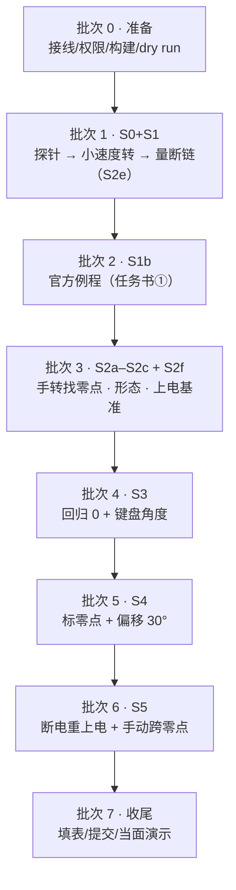

# 实机实验计划（现场执行清单）

这是站在电机边上照着做的清单。每一批给出：命令、期望看到什么、把哪些数字记到 §5 的表里。

相关文档：设计依据与实测数字在 [`real.md`](real.md)；零点的上电/运行/离线语义与验收程序的设计在
[`zero_semantics.md`](zero_semantics.md)；离线自检那套在 [`fake_motor.md`](fake_motor.md)。

任务书四条要求：① 官方 SDK 例程让电机转起来；② 写程序让电机慢慢回到 0 位，键盘输入角度后缓慢转过去；
③ 记号笔标下零点，把零点正向偏移 30°，再回到 ② 的角度看是否符合预期；④ 处理零点跳变。
任务书还要求：提前做好保护、用插值让电机缓慢转动、用大疆电池供电、接线找老队员。

## 1 任务书四条与批次的对应

| 任务书 | 批次 | 阶段 | 验收看什么 | 记到哪 |
|---|---|---|---|---|
| 准备 | 0 | 不动电机 | 端口能开、设备在、dry run 仍通过 | §5 表 D0 行 |
| ① | 1 | S0 + S1 | 探针通过；`spin_test` 三种转速、0 超时 | §5 表 S0/S1 行 |
| ①（字面要求） | 2 | S1b | 官方例程跑起来、能停 | §5 表 S1b 行 + 终端留档 |
| ④ 的前半、② 的前提 | 3 | S2a–S2c + S2f | 手转读数形态、跨零点是否跳、上电基准 | §5 表 S2 行 + `/tmp/s2.log` |
| ② | 4 | S3 | 回归 0 到位；输入 30°/60° 时误差 ≤ 1° | §5 表 S3 行 + `motor_ctl` 日志 |
| ③ | 5 | S4 | 记号笔那点读数 +30.00°；再回同一角度时落在记号笔那点 | §5 表 S4 行 + 日志 |
| ④ | 6 | S5 | 断电重上电后程序能重新锚定圈数并回到记号笔那点；手转跨零点不跑偏 | §5 表 S5 行 + 日志 |
| 收尾 | 7 | — | 记录写回文档、提交、当面演示 | §7 |

任务书允许先做 ④ 再回 ③，所以批次 5 与 6 可以对调，`offset` 用哪一版都行。

## 2 一次性准备（批次 0，最好提前做完）

| # | 事项 | 命令或判据 |
|---|---|---|
| 0.1 | 接线：问老队员转接头是 TTL 还是 RS485、几根线、电机与转接头共地没有；顺便问清电机 ID（出厂 0？有没有用 `changeID` 改过） | real.md §4 第 1–2 条 |
| 0.2 | 电源：大疆电池电压、要不要限流；USB 只供通信（设备声明 100 mA） | real.md §1 |
| 0.3 | 机械保护：电机夹紧，输出端没有会甩出去的线，手能随时断电 | real.md §4 第 4 条 |
| 0.4 | 权限：`sudo`，或 `sudo usermod -aG dialout $USER` 后重新登录 | `id \| tr ',' '\n' \| grep -c dialout` |
| 0.5 | 设备：插上转接头后确认设备节点，并确认这条串口上只有这一台电机 | `lsusb \| grep 0403:6014`；`ls -l /dev/ttyUSB0` |
| 0.6 | 构建：`pixi run cmake -S @20260927_motor/cpp_part2 -B @20260927_motor/cpp_part2/build && pixi run cmake --build @20260927_motor/cpp_part2/build` | 产物在 `build/` |
| 0.7 | dry run 回归：`export LD_PRELOAD=$PWD/@20260927_motor/cpp_part2/build/libpty_serial_shim.so`，再跑 README §6 的四条 | 0 超时、跳变修正按预期 |
| 0.8 | 日志：每条实机命令都用 §2 的 `$RL <阶段> …` 包装 | 自动生成带时间戳的文件 |
| 0.9 | 分析脚本先试一遍 | `pixi run python @20260927_motor/scripts/agent_scripts/analyse_ctl_log.py <日志>` |

下面各批都用这组变量，先设一次：

```bash
cd <仓库根目录>                       # MyMonoRepo.d/
B=@20260927_motor/cpp_part2/build
P=$PWD/$B/serial_probe                # 探针（S2a/S2f 用）
T=$PWD/$B/spin_test                   # S1/S2e 用
C=$PWD/$B/motor_ctl                   # S3–S5 用
L=@20260927_motor/output/terminal     # 日志目录
RL=@20260927_motor/scripts/run_log.sh # 包装脚本：行缓冲 + 自动命名日志
```

`run_log.sh` 的用法：需要 root 的把 `sudo` 写在前面，不需要 root 的直接调用。

```bash
sudo $RL s0 $P --port /dev/ttyUSB0
$RL s2b pixi run python @20260927_motor/scripts/agent_scripts/analyse_watch_log.py /tmp/s2.log
sudo $RL s_stop $T --port /dev/ttyUSB0 --id 0 --rev-per-s 0 --ramp 0.5 --hold 1   # 急停
```

脚本做三件事：用 `stdbuf -oL` 让输出逐行刷新；在 `output/terminal/` 开一个
`motor-real-<YYYYMMDDHHmm>-<阶段>.txt`；把时间与完整命令写在日志头。stdin 不重定向，
所以 `motor_ctl` 的键盘和 `serial_probe` 的回车打标记照常。为什么 `sudo` 放在脚本外面：
`sudo` 只认可执行文件、不能调用 shell 函数；写在外面还能一眼看出哪条命令要 root。

`stdbuf` 的必要性：接上管道后 stdout 不再是终端，C 库改成按块缓冲（4 KB），终端会攒一大段才刷、
还会从半行中间断开。实测：不修时四行会在进程结束时挤在 0.01 s 内一起到，加上 `stdbuf -oL` 后按 0.4 s
的间隔均匀到达。细节见 [`../../../docs/pitfalls/environment.md`](../../../docs/pitfalls/environment.md)
的「管道让程序输出变卡顿」一节。

两条最常踩的用法：

* `--expect-deg` 比的是 `q`（= `q_enc + offset`），所以上电检查要填 `mark` 打印的 `q` 值，
  并且这次启动的 `--offset-deg` 要和那次一致；不带 `--offset-deg` 时两者才相等。
* `offset` 改过之后，“软件零点”和“记号笔那点”不是一回事：后面说“回到零点附近”时，指的是记号笔那点。

## 3 批次总览



批次 3 的两个结论决定后面怎么写：

* 读数形态：里程计（S1 已倾向这种）⇒ 跨零点不用管；锯齿 ⇒ 每次跨零点都会报一次“跳变”并补一个区间，
  行为上等效里程计，日志里条数会多一些，属正常。
* 上电基准：每次相同 ⇒ `offset` 可以跨会话存档，上电用 `--expect-deg` 对一下；
  差 ≈ 1 个区间 ⇒ `offset` 只在会话内有效，每次上电都要 `expect` + `fix`。

预计时间（单人）：批次 1 约 30 min，批次 2 约 15 min，批次 3 约 40 min（手转要慢），
批次 4 约 25 min，批次 5 约 20 min，批次 6 约 30 min。每批之间让电机歇一下，不烫手再继续。

## 4 逐批执行卡

### 批次 1 · S0 端口探针 + S1 转起来 + S2e 断链

```bash
# S0：只开端口，一个字节都不发
sudo $RL s0 $P --port /dev/ttyUSB0

# S1：从小速度开始，电机固定好，手里别拿东西，手边能断电
sudo $RL s1a $T --port /dev/ttyUSB0 --id 0 --rev-per-s 0.1 --ramp 2 --hold 3
sudo $RL s1b $T --port /dev/ttyUSB0 --id 0 --rev-per-s 0.2 --ramp 2 --hold 3
sudo $RL s1c $T --port /dev/ttyUSB0 --id 0 --rev-per-s 1.0 --ramp 2 --hold 3

# S2e：断链后驱动板是保持还是卸力（低速先测清楚，后面“到位保持”都靠它）
sudo $RL s2e $T --port /dev/ttyUSB0 --id 0 --rev-per-s 0.1 --kd-out 0.5 --ramp 1 --hold 30 --drop-after 4
```

期望：S0 打印 `baud_base` 与构造成功；S1 三次都 0 超时，电机确实转，退出后能停；
S2e 那次故意不发收尾指令，观察电机是否继续转。

记录：转速达成率、温度、`merror`、方向（看输出端盘，正 `dq` 是逆时针还是顺时针）。

已实测（2026-09-29）：S2e 的结果是不卸力，`--drop-after` 之后电机继续按最后一条指令转；
断电再上电后停止。也就是说“停”只能靠程序自己发零速度/零力矩，或者断电；程序被强杀时电机不会停，
手边常备 §2 的急停。

注意：`--drop-after` 那一步是故意断链，先做好断电准备；量完再用拔 USB 线复现一次。

### 批次 2 · S1b 官方例程（任务书 ① 的字面要求）

官方例程是 `while(true)`、`kd=0.01`、`dq = -6.28×N`（输出端 1 圈/s）一直转，没有斜坡也没有异常处理，
所以用 `timeout` 掐表跑，别让它无人看管。

```bash
S=../ReadOnly.d/unitree_actuator_sdk
pixi run g++ -O2 -std=c++14 -I$S/include -I$S/include/unitreeMotor \
    $S/example/example_goM8010_6_motor.cpp -L$S/lib -lUnitreeMotorSDK_Linux64 \
    -Wl,-rpath,"$PWD/$S/lib" -o $B/example_go            # 产物落在 build/，不入库

sudo $RL s1b_example timeout -s INT 5 $B/example_go      # 转 5 秒就 SIGINT 掐掉
sudo $RL s_stop $T --port /dev/ttyUSB0 --id 0 --rev-per-s 0 --ramp 0.5 --hold 1   # 必须补一条急停
```

期望：编译不需要硬件；跑起来电机转（1 圈/s，比 `spin_test` 快）；5 秒后进程退出。

注意：官方例程被掐死后驱动板不会自己停（2026-09-29 实测），所以必须紧接着跑一次急停或断电；
手一直放在电池开关上。与 `spin_test` 的区别（没有插值/限幅/错误处理）写进记录表。

### 批次 3 · S2a–S2c 手转找零点 + S2f 上电基准

```bash
# S2a：零力矩，电机自由可手转，每帧都记；手转时按回车打 MARK
sudo $RL s2a $P --port /dev/ttyUSB0 --id 0 --watch 60 --every 1 --log /tmp/s2.log
#   手转：同方向慢慢转 2–3 圈，再反向半圈；经过记号笔位置时按一下回车；速度 ≤ 0.25 圈/s
$RL s2b pixi run python @20260927_motor/scripts/agent_scripts/analyse_watch_log.py /tmp/s2.log

# S2f：把输出端停在能重复的位置，断电、上电、只读一帧，重复 3–5 次
sudo $RL s2f $P --port /dev/ttyUSB0 --id 0 --watch 1 --every 1
```

期望：S2a 读数连续、与手转方向一致、0 超时；S2b 脚本给出“里程计/锯齿”结论；
S2c（同一脚本里的反向段）也连续、没有整间隔跳变；S2f 每次上电记下的 `pos` 整数部分都是 0
（掉电丢圈数的直接体现），同一物理位置的 `pos` 差很小。

上机之前先离线预演一遍同样的动作（不接电机、不需要 sudo）：

```bash
export LD_PRELOAD=$PWD/@20260927_motor/cpp_part2/build/libpty_serial_shim.so
B=@20260927_motor/cpp_part2/build/motor_ctl

# 手转跨零点：零力矩 + 假板子替我们推输出端 ±120°（来回各跨 2 个零点区间）
$B --self-test --fake-hand-deg 120 --fake-hand-period-s 6 --script "free;state" --seconds 8 --every 200
#   里程计模式：读数连续、跳变修正 0 次（对应 S2a/S2c 的期望）
$B --self-test --fake-sawtooth --fake-hand-deg 120 --fake-hand-period-s 6 --script "free;state" --seconds 8
#   锯齿模式：每次跨零点都报"零点跳变 → 修正 offset"，q 与里程计模式逐帧一致（对应 S2b/S5）

# 上电语义：断电 M 帧后重新上电（读数丢圈数 + 速度和力矩先归零），期间手还在推
$B --self-test --fake-off-after 200 --fake-off-frames 200 --fake-hand-deg 80 --script "free;state" --seconds 6
#   程序应报"离线 → 重锚 turn_base → 位置真值 = 掉线前 + 被推的角度"，且力矩峰值是零点几 N·m
$B --self-test --fake-cycle-frame 250 --script "60" --seconds 4 --every 50
#   单次上电复位：raw 在 250 帧处跳 -1 个区间，程序报"零点跳变 → 修正 offset"，q 仍停在 60.0°
```

记录：`/tmp/s2.log` 里 MARK 的读数（记号笔那点的 `pos` tick）、形态结论、上电读数表，都填进 §5。

注意：一个零点区间 = 输出端 56.842°，手转快了会被当成跳变（脚本会提示先怀疑手速）。

### 批次 4 · S3 回归 0 + 键盘给角度

```bash
sudo $RL s3 $C --port /dev/ttyUSB0 --id 0 --vmax-deg 30 --amax-deg 60 --tau-out-limit 1.0 --every 50
#   启动后先看它打印的位置与 offset，确认是“读”不是“动”
#   然后按： 0       回 0 位
#           +10     先小角度试方向，看输出端往哪转，记下来
#           30      任务书② 的键盘给角度
```

期望：`0` 之后输出端回到软件零点（≤ 1°）；输入 30°/60° 时读数与目标差 ≤ 1°，到位后手推能感觉到保持。

记录：每段末位置与目标、力矩峰值、温度、方向符号，填 §5 的 S3 行。

注意：如果读数已经攒到几百上千度，`0` 会是多圈行程，程序会先打印预计时间，确认输出端周围没人、
线不会绕；嫌远就用 `--set-zero-read` 把 0 位放到手边（离零点边界 ≥ 10° 更好）。

### 批次 5 · S4 标零点 + 正向偏移 30°

在输出端与电机外壳上画两条线：回 0 位画线 A，去 30° 画线 B。

```bash
sudo $RL s4 $C --port /dev/ttyUSB0 --id 0 --expect-deg <上次 mark 的 q 值>
#   0        回 0 位，画线 A
#   mark     记下线 A 这一点（打印 q 与 q_enc，抄进记录表，只 mark 一次）
#   30       去 +30°，画线 B
#   o+30     零点正向偏移 30°：电机不动，线 A 的读数从 0.00° 变成 +30.00°
#   expect   与记录值对照，应报“≈0，零点没跳变”
#   30       再命令同一个角度 30°：电机会朝反方向转 30°，回到线 A
```

期望：`o+30` 之后线 A 读数 +30.00°；再命令 30° 时电机回到线 A、读数仍是 +30.00°；
`o+30` 那一步 `q_enc` 不变，说明只改了我们的解释，没让电机动。

记录：`mark` 的 `q` 与 `q_enc`、offset 首末值、两段末位置，填 §5 的 S4 行；offset 数值抄下来，
下次可以 `--offset-deg 30` 直接用。

注意：零点偏移之后，“同一个物理点”读数变大 30°，而“同一个目标角”要少转 30° 才到位，这两句是同一件事。

### 批次 6 · S5 零点跳变（重点是上电那一次）

```bash
sudo $RL s5 $C --port /dev/ttyUSB0 --id 0 --offset-deg 30 --jump-tol-deg 8
#   先看启动检查：与记录值差 ≈ 1 个区间，说明这次上电落在了别的候选零点
#   stop     卸力，用手把输出端慢慢转过线 A（正、反各两次；一帧最多 2°，慢点）
#   hold     回到位置保持
#   30       命令同一个目标角 30°：应回到线 A、读数仍是 +30.00°
#   expect   与记录值对照，应 ≈0
#   断电 → 上电（输出端位置不变）→ 再跑一次本命令：
#     程序启动时会按“位置没动”重新锚定圈数，并打印一行事件
#     然后 30 仍应回到线 A
```

期望：手转跨线 A 时不跑偏；断电重上电后程序重新锚定圈数（`pos` 整数部分又回到 0）并仍能回到线 A；
若某次上电真的落在别的候选零点，启动检查会报“差了 ±1 个零点区间”，用 `fix` 修，
或去掉 `--no-fix-startup` 让它自动修。

记录：跳变次数与方向、重锚次数、修正后的 offset 与末位置，填 §5 的 S5 行。

注意：跳变那一帧驱动板自己会抡一下（我们只能事后救），先低速试；连续跳很多次就停下来查供电与接线
（程序在超过 `--max-fixes` 时会自己停）。

## 5 记录表

每次跑完先用分析脚本打出摘要行，再抄进下表。`spin_test` 的日志用 `analyse_spin_log.py`，
`serial_probe` 的用 `analyse_watch_log.py`，`motor_ctl` 的用 `analyse_ctl_log.py`。

| 批次 | 阶段 | 命令（简写） | 关键数字 | 结论 / 异常 | 日志文件 |
|---|---|---|---|---|---|
| D0 | dry run 回归 | README §6 四条 | 0 超时、跳变修正按预期 | | |
| S0 | 端口探针 | `sudo $RL s0 $P --port /dev/ttyUSB0` | ✅ 已完成（2026-09-29）：`baud_base=60000000`、除数 15.000 整除、构造成功 | 与 09-27 一致 | [`s0`](../../output/terminal/motor-real-202609291654-s0.txt) |
| S1 | 小速度转 | `sudo $RL s1a/s1b/s1c` | ✅ 已完成（2026-09-29）：0.1→0.0603（60%）、0.2→0.1583（79%）、1.0→0.9358 圈/s（94%）；1601 帧 0 超时；27/30/30 °C；帧周期 6.38 ms | 低速达成率偏低，与 S2d 的摩擦/标度问题呼应 | [`s1a`](../../output/terminal/motor-real-202609291655-s1a.txt) [`s1b`](../../output/terminal/motor-real-202609291658-s1b.txt) [`s1c`](../../output/terminal/motor-real-202609291658-s1c.txt) |
| S1b | 官方例程 | `sudo $RL s1b_example timeout -s INT 5 $B/example_go` + 急停 | ✅ 已完成（2026-09-29） | 掐死后不停转，必须补急停 | 批次 2 日志 |
| S2e | 断链 | `sudo $RL s2e ... --drop-after 4` | ✅ 已完成（2026-09-29） | 不卸力：继续执行最后一条指令；断电重上电后停止 | 批次 1 日志 |
| S2a | 手转读数 | `sudo $RL s2a $P … --watch 60 --every 1 --log /tmp/s2.log` | ✅ 已完成（2026-09-29，两次）：各 12000 帧、0 超时；两次都覆盖 10–12 个零点区间 | 两次都未打 MARK（回车没按？见 §6 备注） | [`1824`](../../output/terminal/motor-real-202609291824-s2a.txt) [`1829`](../../output/terminal/motor-real-202609291829-s2a.txt) + `/tmp/s2.log` |
| S2b | 读数形态 | `analyse_watch_log.py` | ✅ **里程计**（读数累计跨越 10.77 个区间） | 跨零点不用我们补区间；上电落在哪个零点仍不确定 | 同上 |
| S2c | 反向跨零点 | 同上脚本 | ✅ 正反两向都有位移（+756°/−924°），`≥2°` 的步进 **0 次**、整间隔跳变 **0 次** | 手转最大步进 1.89°（低于 2° 阈值） | 同上 |
| S2f | 上电基准 | 3–5 次断电上电 | 每次 `pos` 整数部分为 0？同一点差多少 tick？ | | |
| S3 | 回归 0 + 角度 | `motor_ctl` 的 `0` / `30` | 末位置；误差 ≤ 1°？ | | |
| S4 | 标零 + 偏移 30° | `mark` / `o+30` / `30` | 线 A 读数 = +30.00°？ | | |
| S5 | 零点跳变 | `stop` 手转 / `hold` / `30` / 断电重上电 | 重锚与修正次数；修正后是否对上 | | |

## 6 日志与产物命名

终端日志：`@20260927_motor/output/terminal/motor-real-<YYYYMMDDHHmm>-<阶段>.txt`，
由 §2 的包装脚本自动生成（`sudo $RL s3 $C …` ⇒ `motor-real-202609301530-s3.txt`）；
阶段取 `s0/s1/s1b/s2a/s2b/s2e/s2f/s3/s4/s5`。脚本在
[`../../scripts/run_log.sh`](../../scripts/run_log.sh)。同一分钟内重跑会覆盖同名文件，
隔一分钟再跑，或手动在阶段后加 `-2`。每批一个文件。

照片或短视频（记号笔位置、方向）：放 `@20260927_motor/output/media/`，文件名规则同上。
每批一张关键照片就够，不用堆。

两条备注：

* 用 `sudo $RL …` 落盘的日志属主是 `root`（因为进程是 root）。要改属主就 `sudo chown $USER <文件>`，
  不改也没关系——每次都会新建文件。
* `serial_probe` 的 MARK 靠“读 stdin”，如果命令是在管道里跑（stdin 不是终端）就打不了标记；
  想打标记就在终端里直接跑 `sudo $RL s2a …`，手转到记号笔位置时按一下回车。

分析结果：直接贴进 §5 表，或另存 `motor-real-<时间>-<阶段>-分析.txt`（与日志同目录）。

## 7 收尾：提交与当面验收

提交：先把 §5 填完，再把结论写回 [`real.md`](real.md) 的实测小节与任务
[`README.md`](../../README.md) 的状态表，然后提交日志与照片。按阶段分开提交，不要攒到最后。

当面验收大约 10 分钟，按下面的顺序演示：

1. 讲一句结构：`cpp_part2/src/` 的三个程序加 `sim/` 的仿真电机；报文的标度是实测出来的（README §4）。
2. 离线也能跑：`LD_PRELOAD=... motor_ctl --self-test --script "0;30;mark;o+30;expect;30"`。
3. 接上电机：`serial_probe --watch 3` 看读数与温度，然后 `motor_ctl` 跑 `0` 与 `30`。
4. 任务书③：`o+30` 前后把线 A 的读数指给验收人看（0 → +30.00°），再 `30` 让它少转 30° 回到线 A。
5. 任务书④：断电重上电，让程序报出重新锚定，再 `30` 验证仍回到线 A；然后 `stop` 手转跨零点前后，
   程序报出“零点跳变 + 修正”。
6. 打开 [`real.md`](real.md) 的实测表与本文档 §5，说明数字都是当场抄下来的。
