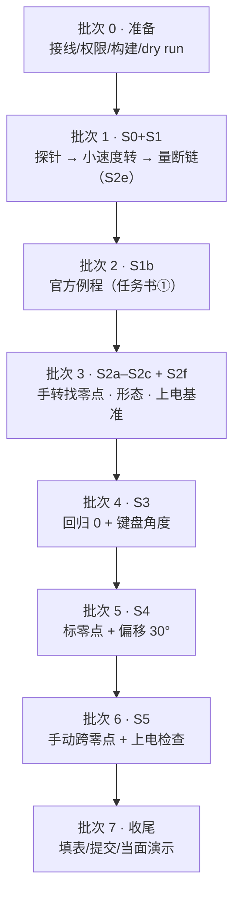
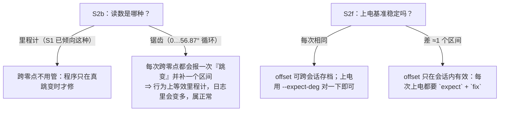

# 实机实验计划（现场执行清单）

> 这是**在电机边上照着做**的清单：什么时候、按什么顺序、敲什么命令、看什么、记到哪。
> "为什么这么设计"、实测数字、标定符号约定在 [`real.md`](real.md)（§3 计划表 / §3.5–§3.8 手册 / §5 约定）；
> "仿真电机"那一层在 [`fake_motor.md`](fake_motor.md)。三者不重复：**依据 → real.md，日常命令 → 本文件，离线行为 → fake_motor.md**。
>
> 对应任务书四条：① 官方例程让电机转起来 → ② 回归 0 + 键盘给角度 → ③ 标零点 + 正向偏移 30° → ④ 零点跳变；
> 以及任务书的三条硬要求：**提前做好保护**（插值缓转）、**大疆电池**供电、**接线找老队员**。

## 1 任务书四条 → 我们的批次（验收映射）

| 任务书 | 我们的批次 | 阶段 | 验收要看的东西 | 证据记到哪 |
|---|---|---|---|---|
| （准备） | 批次 0 | 不动电机 | 端口能开、设备在、dry run 仍通过 | 本文件 §5 表 D0 行 |
| ① 例程转起来 | 批次 1 | S0 + S1 | `serial_probe` 探针通过；`spin_test` 三种转速、0 超时 | §5 表 S0/S1 行 |
| ① （字面要求） | 批次 2 | S1b | **官方例程**跑起来、能停 | §5 表 S1b 行 + 终端留档 |
| ④ 的前半 + ② 的前提 | 批次 3 | S2a–S2c + S2f | 手转读数形态（里程计/锯齿）、跨零点是否跳、**上电基准会不会变** | §5 表 S2 行 + `/tmp/s2.log` 分析 |
| ② 回归 0 + 键盘角度 | 批次 4 | S3 | 回归 0 到位；输入 30°/60° 读数差 ≤ 1°（先按增益调） | §5 表 S3 行 + `motor_ctl` 日志 |
| ③ 标零点 + 偏移 30° | 批次 5 | S4 | 记号笔那点读数 **+30.00°**；再回同一目标角**落在记号笔那点** | §5 表 S4 行 + 日志 |
| ④ 零点跳变 | 批次 6 | S5 | 手转跨零点前后不跑偏；程序报出并修正跳变 | §5 表 S5 行 + 日志 |
| 收尾 | 批次 7 | — | 文档写回、提交、当面演示 | §7 |

> 任务书允许**先做 ④ 再做 ③**（"或者，你可以先完成 4，再来完成 3"）。我们的批次 6 依赖批次 3 的 S2f 结论，
> 所以默认顺序是 3→4→5；如果你想把 ④ 提到 ③ 前面，直接跳批次 6、再回来做批次 5 即可（`offset` 用哪一版都行）。

## 2 一次性准备（批次 0，建议提前做完，别占用实机时间）

| # | 事项 | 命令 / 判据 |
|---|---|---|
| 0.1 | **接线**（问四足/电控老队员）：转接头出来是 TTL 还是 RS485、要几根线、电机与转接头**共地**没有；顺便问清**电机 ID**（出厂 0？有没有用 `changeID` 例程改过） | real.md §4 第 1–2 条 |
| 0.2 | **电源**：大疆电池电压、是否需要限流/保险；USB 只供通信（设备声明 100 mA） | real.md §1 |
| 0.3 | **机械保护**：电机夹紧/固定；输出端没有会甩出去的线；手能够到电池开关 | real.md §4 第 4 条 |
| 0.4 | **权限**：要么 `sudo`，要么 `sudo usermod -aG dialout $USER` 后**重新登录**（本机 `bis` 在 `sudo` 组、不在 `dialout`） | `id \| tr ',' '\n' \| grep -c dialout` |
| 0.5 | **设备在**：插上转接头后 `lsusb \| grep 0403:6014`、`dmesg \| tail -5`、`ls -l /dev/ttyUSB0`；确认这条串口上**只有这一台电机** | 期望 `crw-rw---- root:dialout` |
| 0.6 | **构建**：`pixi run cmake -S @20260927_motor/cpp_part2 -B @20260927_motor/cpp_part2/build && pixi run cmake --build @20260927_motor/cpp_part2/build` | 产物在 `build/`（不入库） |
| 0.7 | **dry run 回归**（证明程序没坏）：`export LD_PRELOAD=$PWD/@20260927_motor/cpp_part2/build/libpty_serial_shim.so`，再跑 README §6 的四条 | 期望 0 超时、跳变修正按预期触发 |
| 0.8 | **日志留档**：每次实机都用 `2>&1 \| tee @20260927_motor/output/terminal/motor-real-<YYYYMMDDHH>-<阶段>.txt` | 命名见本文件 §6 |
| 0.9 | **分析脚本拿一条命令试过**：`pixi run python @20260927_motor/scripts/agent_scripts/analyse_ctl_log.py <日志>` | 能打出每次运行的摘要行 |

一次性环境（下面各批都用）：

```bash
cd <仓库根目录>                       # MyMonoRepo.d/
B=@20260927_motor/cpp_part2/build
P=$PWD/$B/serial_probe                # 探针（S2a/S2f 用）
T=$PWD/$B/spin_test                   # S1/S2e 用
C=$PWD/$B/motor_ctl                   # S3–S5 用
L=@20260927_motor/output/terminal     # 日志目录
```

**两条最容易踩的用法**（`motor_ctl --help` 里也有）：

* **`--expect-deg` 比的是 `q`，不是 `q_enc`**：`q = q_enc + offset`。所以"上电检查"要填的是 `mark` 打印出来的
  **q 值**，并且**这次启动的 `--offset-deg` 要和那次一致**；不带 `--offset-deg`（= 0）时两者才相等。
* **`o+30` 之后"0 位"和"记号笔那点"就不是一回事了**：软件 q=0 落在"线 A 往前 30°"，
  而线 A 读 +30°。所以后面说"回到零点附近"时，**指的是线 A**（物理上的编码器零点），别被读数绕晕。

## 3 批次总览



**批次 3 的两个结论会决定后面怎么写**（这就是把它排在 S3 前面的原因）：



预计时间（单人、含接线检查）：批次 1 ≈ 30 min、批次 2 ≈ 15 min（含编译）、批次 3 ≈ 40 min（手转要慢）、批次 4 ≈ 25 min、批次 5 ≈ 20 min、批次 6 ≈ 30 min。**每批之间断电休息**，电机不烫手再继续（S1 实测 30–31 °C）。

## 4 逐批执行卡

### 批次 1 · S0 端口探针 + S1 转起来 + S2e 断链

```bash
# 1) S0：只开端口、一个字节都不发（会打印 TIOCGSERIAL/波特率复核与 SDK 构造结果）
sudo $P --port /dev/ttyUSB0                       | tee $L/motor-real-<时间>-s0.txt

# 2) S1：从小速度开始（电机固定好、手里别拿东西、手边能断电）
sudo $T --port /dev/ttyUSB0 --id 0 --rev-per-s 0.1 --ramp 2 --hold 3  | tee $L/motor-real-<时间>-s1a.txt
sudo $T --port /dev/ttyUSB0 --id 0 --rev-per-s 0.2 --ramp 2 --hold 3  | tee $L/motor-real-<时间>-s1b.txt
sudo $T --port /dev/ttyUSB0 --id 0 --rev-per-s 1.0 --ramp 2 --hold 3  | tee $L/motor-real-<时间>-s1c.txt

# 3) S2e：断链后驱动板是保持还是卸力？（低速、先测清楚，后面所有"到位保持"都靠它）
sudo $T --port /dev/ttyUSB0 --id 0 --rev-per-s 0.1 --kd-out 0.5 --ramp 1 --hold 30 --drop-after 4
```

**判定**：S0 构造成功、`baud_base` 给出；S1 三次都"0 超时"、电机确实转、退出后能停；S2e 观察并**记下**（保持 / 卸力 / 变松）。
**记录**：转速达成率、温度、`merror`、方向（看着输出端盘，正 `dq` 是逆时针还是顺时针）。
**注意**：`--drop-after` 那一步**故意**不发收尾指令，**先做好断电准备**；量完再用"拔 USB 线"复现一次。

### 批次 2 · S1b 官方例程（任务书 ① 的字面要求）

官方例程是 `while(true)`、`kd=0.01`、`dq = -6.28×N`（输出端 1 圈/s）一直转、没有斜坡也没有异常处理，
所以**用 `timeout` 掐表跑**，别让它无人看管：

```bash
S=../ReadOnly.d/unitree_actuator_sdk
pixi run g++ -O2 -std=c++14 -I$S/include -I$S/include/unitreeMotor \
    $S/example/example_goM8010_6_motor.cpp -L$S/lib -lUnitreeMotorSDK_Linux64 \
    -Wl,-rpath,"$PWD/$S/lib" -o $B/example_go            # 产物落在 build/（不入库）

sudo timeout -s INT 5 $B/example_go                      # 转 5 秒就 SIGINT 掐掉
```

**判定**：编译通过（不需要硬件）、跑起来电机转（1 圈/s，比 `spin_test` 快得多）、5 秒后进程退出。
**注意**：① 退出后驱动板可能**保持最后指令**（S2e 的结论），所以手放在电池开关上；② 与 `spin_test` 的区别写进记录表
（官方例程没有插值/限幅/错误处理 —— 这正是任务书要"提前做好保护"的原因）。

### 批次 3 · S2a–S2c 手转找零点 + S2f 上电基准

```bash
# S2a：零力矩（电机自由、可手转），每帧都记；手转时按回车打 MARK
sudo $P --port /dev/ttyUSB0 --id 0 --watch 60 --every 1 --log /tmp/s2.log | tee $L/motor-real-<时间>-s2a.txt
#   手转：同方向慢慢转 2–3 圈 → 反向半圈 → 经过"记号笔那个位置"时按回车；手转 ≤0.25 圈/s
pixi run python @20260927_motor/scripts/agent_scripts/analyse_watch_log.py /tmp/s2.log | tee $L/motor-real-<时间>-s2b.txt

# S2f：把输出端停在能重复的位置 → 断电 → 上电 → 只读一帧，重复 3–5 次
sudo $P --port /dev/ttyUSB0 --id 0 --watch 1 --every 1         # 每次上电后跑 1 秒，抄下读数
```

**判定**：S2a 读数连续、与手转方向一致、0 超时；S2b 脚本给出"里程计 / 锯齿"结论；S2c 反向也连续、无整间隔跳变；
S2f 给出"上电基准每次相同 / 差一个区间"，并附**边界多近会认错**的观察。
**记录**：`/tmp/s2.log` 里的 MARK 读数（记号笔那点的 `q_enc`）→ §5 表；两个结论 → §5 表末两行。
**注意**：一个零点区间 = 输出端 **56.87°**（转子 360°）；手转快了会被当成跳变（脚本里会提示先怀疑手速）。

### 批次 4 · S3 回归 0 + 键盘给角度

第一次跑建议把速度再降一档、力矩上限压小，确认无误后再放到默认值：

```bash
# 交互式最顺手（h 看命令）；也可以 --script "0" 一条条来
sudo $C --port /dev/ttyUSB0 --id 0 --vmax-deg 30 --amax-deg 60 --tau-out-limit 1.0 --every 50 \
    2>&1 | tee $L/motor-real-<时间>-s3.txt
#   启动后程序会打印 q_enc / offset / q 与"要转多少度、直线时间多少秒"——先确认它是"读"不是"动"
#   然后敲： 0        （回 0 位；上电后读数本来就在 0…56.87° 内，所以这通常是**小行程**）
#           +10       （先小角度试方向：看输出端往哪转，记下来）
#           30        （任务书② 的"键盘给角度"）
```

**判定**：`0` 后输出端回到上电基准（≤1°）；输入 30°/60° 时终端读数与目标差 ≤ 1°、到位后**手推能感到保持**。
**记录**：每段"末位置 vs 目标"、力矩峰值、温度、方向符号 → §5 表 S3 行。
**注意**：如果中途读数已经攒到几百上千度（读数从上电起累计），`0` 会变成**多圈行程** —— 程序会先打印预计时间与警告，
确认输出端周围没人、线不会绕；嫌麻烦就用 `--set-zero-read` 把"手边这个位置"定义成 0（离零点边界 ≥10° 最好）。

### 批次 5 · S4 标零点 + 正向偏移 30°

在输出端与电机外壳上画**两条线**：回 0 位画**线 A**，去 30° 画**线 B**（B 是备用参照）。

```bash
sudo $C --port /dev/ttyUSB0 --id 0 --expect-deg <上次 mark 的 q 值> 2>&1 | tee $L/motor-real-<时间>-s4.txt
#   0        回 0 位（板子读数 0）→ 在 0 位画线 A
#   mark     记下 A 这一点（程序会打印 q 与 q_enc，抄进记录表；只 mark 一次，别覆盖这个基准）
#   30       去 +30° → 在 30° 位画线 B
#   o+30     零点正向偏移 30°：**电机不动**，但线 A 的读数从 0.00° 变成 **+30.00°**，
#            线 B 的读数从 30.00° 变成 +60.00°   ← 这就是任务书③ 的"零点正向偏移 30°"
#   expect   与记录值对照，应报"≈0，零点没跳变"（记号笔那个点仍读 30.00°）
#   30       再命令**同一个目标角** 30°：电机会**朝反方向转 30°**，正好回到**线 A**
#            （因为零点往前挪了 30°），读数仍 = +30.00°  ← 任务书③ 的"是否符合预期"
```

**判定**：① `o+30` 之后**线 A 的读数 = +30.00°**（不动电机、只改解释）；② 再命令 30° 时电机回到**线 A**、
读数 = +30.00°；③ 全程 `q_enc`（板子读数）在 `o+30` 那一步**不变** ⇒ offset 只改了我们的解释、没让电机动。
**记录**：`mark` 时的 `q`/`q_enc`、offset 首末值、两段末位置与最终读数 → §5 表 S4 行；
把 `offset` 数值抄下来（下次可以 `--offset-deg 30` 直接用）。
**注意**：`o+30` 之后**同一个物理点**（线 A）读数变大 30°，而"同一个目标角"要**少转 30°**才到位
—— 这两句是同一件事，别当成矛盾；符号写反会变成正反馈（一给目标就飞），见 real.md §5.2。
dry run 里按上面这串命令跑过一遍，实测：线 A 读数 0.000° → **+30.000°**、命令 30° 后电机从 +30.009° 回到
**0.000°** 那条线、`expect` 报 ≈0（证据见 [`../../output/terminal/motor-ctl-dryrun-20260928.txt`](../../output/terminal/motor-ctl-dryrun-20260928.txt)）。

### 批次 6 · S5 零点跳变

```bash
sudo $C --port /dev/ttyUSB0 --id 0 --offset-deg 30 --jump-tol-deg 8 2>&1 | tee $L/motor-real-<时间>-s5.txt
#   启动检查会自动对照（若带了 --expect-deg）：差 ≈1 个区间就是认错零点
#   stop     卸力（电机自由）
#   （用手把输出端**慢慢**转过**线 A**：正方向过两次、再反方向过两次；一帧最多 2°，慢点）
#      为什么是线 A：上电时板子以"最近经过的候选零点"为基准，而线 A（我们 `0` 过去的那一点）
#      差不多就是那个候选零点 ⇒ 线 A 附近是**最容易发生基准跳变**的地方（讲义 §2.6）
#   hold     回到位置保持
#   30       命令同一个目标角 30°：应回到**线 A**、读数仍 = +30.00°，不许"跳走"
#   expect   对照记录值（mark 的 q），应 ≈0
#   上电检查：断电 → 上电 → sudo $C --offset-deg 30 --expect-deg 30 --no-fix-startup
#             （只报警不动手）看到"差了 ±1 个零点区间"就是这次认错零点了；
#             去掉 --no-fix-startup 让它自动修，再跑一次 30 验证是否回到线 A。
```

**判定**：手转跨线 A（编码器零点）时程序报出 `**零点跳变：pos 差 ±32768**` 并修正，修正后目标角仍对得上；
上电检查能报出"疑似认错零点"并（可选）自动修正。
**记录**：跳变次数与方向、修正前后的 offset、`expect` 的结果 → §5 表 S5 行。
**注意**：跳变那一帧**驱动板自己会抡一下**（我们只能事后救），所以先低速试；如果连续跳很多次，别继续跑，
先查供电/接线/编码器（程序在超过 `--max-fixes` 时会停下来）。

## 5 记录表（填这里）

> 每次运行后先用 `pixi run python @20260927_motor/scripts/agent_scripts/analyse_ctl_log.py <日志>`
> 把摘要行打出来，抄进下表；`spin_test`/`serial_probe` 的日志用 `analyse_spin_log.py` / `analyse_watch_log.py`。

| 批次 | 阶段 | 命令（简写） | 关键数字 | 结论 / 异常 | 日志文件 |
|---|---|---|---|---|---|
| D0 | dry run 回归 | README §6 四条 | 0 超时、跳变修正按预期 | | |
| S0 | 端口探针 | `serial_probe --port /dev/ttyUSB0` | `baud_base=`；构造成功? | | |
| S1 | 小速度转 | `spin_test 0.1/0.2/1.0` | 达成率；温度；方向 | | |
| S1b | 官方例程 | `example_go`（timeout 5 s） | 转了 / 停了 | | |
| S2e | 断链 | `spin_test --drop-after 4` | 保持 / 卸力 | | |
| S2a | 手转读数 | `serial_probe --watch 60 --every 1 --log` | 连续? 0 超时? | | `/tmp/s2.log` |
| S2b | 读数形态 | `analyse_watch_log.py` | 里程计 / 锯齿 | | |
| S2c | 反向跨零点 | 同上脚本 | 对称? 有整间隔跳变? | | |
| S2f | 上电基准 | 3–5 次断电上电 | 每次相同 / 差 1 区间 | | |
| S3 | 回归 0 + 角度 | `motor_ctl` 的 `0` / `30` | 末位置；差 ≤1°? | | |
| S4 | 标零 + 偏移 30° | `mark` / `o+30` / `30` | 0 位线读数 = +30.00°? | | |
| S5 | 零点跳变 | `stop` 手转 / `hold` / `30` / 上电检查 | 跳变次数；修正后是否对上 | | |

## 6 日志与产物命名

* 终端日志：`@20260927_motor/output/terminal/motor-real-<YYYYMMDDHH>-<阶段>.txt`，例如
  `motor-real-2026093015-s3.txt`（阶段取 `s0/s1/s1b/s2a/s2b/s2f/s3/s4/s5`；同一天多次加 `-2`）。
  沿用上次实跑的名字风格（`motor-real-2026092719.txt` 是 S1 那批），**每批一个文件、用 `tee` 落盘**。
* 相片/短视频（记号笔位置、方向）：放 `@20260927_motor/output/media/`（新建；文件名同上规则）。
  README §6 说"运行结果主要用于快速确认"，所以**每批一张关键照片足够**，不用堆。
* 分析结果：直接贴进 §5 表，或另存 `motor-real-<时间>-<阶段>-分析.txt`（与日志同目录）。

## 7 收尾：提交什么 + 当面验收演示

**提交**（分批 commit，别攒到最后）：把 §5 表填完 → 更新 [`real.md`](real.md) 的"实测结果"小节与任务
[`README.md`](../../README.md) 的状态表 → 提交日志与照片 → 每次一个小 commit（信息写清阶段）。

**当面验收 10 分钟演示脚本**（验收规范 §6：做出来、能运行、讲得清楚）：

1. 讲一句结构：`cpp_part2/src/` 三个程序 + `sim/` 仿真电机；报文的标度是实测出来的（引用 README §4）。
2. 拔掉电机也能跑：`LD_PRELOAD=... motor_ctl --self-test --script "0;30;mark;o+30;expect;30"`（离线复现 S3–S5）。
3. 接上电机：`serial_probe --watch 3`（读数、温度）→ `motor_ctl` 跑 `0` 与 `30`。
4. 任务书③：`o+30` 前后**指给验收人看** 线 A 的读数（0 → +30.00°），再 `30` 让它少转 30° **回到线 A**。
5. 任务书④：`stop` 手转跨零点前后，让程序报出"零点跳变 + 修正"，再 `hold` + `30` 验证没跑偏。
6. 打开 `docs/real.md` 的实测表与 `docs/runbook.md` §5，说明数字都是当场抄下来的。
