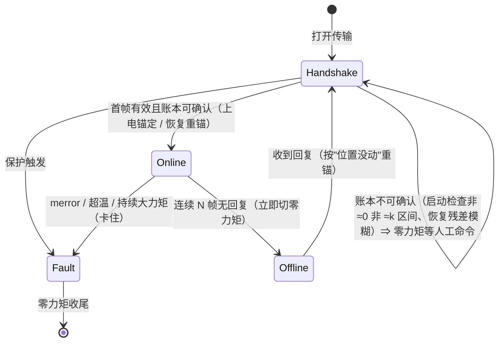

# cpp_part2 重做版：需求、设计与伪代码

> 本目录是子任务项二（实体电机控制）的**重做版**：功能目标不变（任务书四条 + 提前保护 + 插值），但按只读参考工程 `../../../../ReadOnly.d/quadruped_control/` 的分层、命名与文档规范重写，并修掉旧版（[`cpp_part2/`](../../cpp_part2/README.md)）在无硬件阶段暴露的缺陷。
> 本文是**设计阶段**的产物：需求、设计、伪代码、待确认决策、测试矩阵与里程碑；决策确认后进入实现。

依据：[任务书](../../docs/teaching-materials/第三次培训任务.pdf.md) 与 [讲义](../../docs/teaching-materials/motor.pdf.md)；旧版实测记录：[real.md](../../cpp_part2/docs/real.md)、[protocol.md](../../cpp_part2/docs/protocol.md)、[fixed-point.md](../../cpp_part2/docs/fixed-point.md)、[zero-semantics.md](../../cpp_part2/docs/zero-semantics.md)；仓库规范：[conventions.md](../../../docs/conventions.md)、[AGENTS.md](../../../AGENTS.md)。

## 1 目标与边界

### 1.1 任务书四条 → 验收动作

| 任务书 | 验收动作 | 旧版阶段名 |
|---|---|---|
| ① 用官方 SDK 例程让电机转起来 | 编译并运行官方 example，电机安全转动后停 | S1b |
| ② 让电机慢慢回归 0 位；键盘输入一个角度，输出端缓慢转过去 | `move 0` 回到**本次上电基准下的编码器零点**（默认 `offset = 0`，软件零点与其重合；到点后打记号笔标记）；`move 30` 平滑到位（插值限速） | S3 |
| ③ 记号笔标下零点，把零点正向偏移 30°，再回 ② 的角度，检查角度与终端读数 | 沿用 ② 在零点处打的标记：`zero move 30`（零点沿正方向移 30°）→ 标记点读数变 **−30.00°** → `move 30` 的落点比标定前**多 30°**（零点往前挪了） | S4 |
| ④ 处理零点跳变：把输出端手动转到 ② 的零点前后，再让电机转到 ③ 的位置 | `free` 手转跨标记点（前后都试）；断电重上电后自动重锚 / 修正；仍能回到标记点 | S5 |
| 保护 / 插值 / 大疆电池 / 接线 | 限速限加速度、力矩与温度保护、失联与退出保护 | 贯穿 |

### 1.2 重做目标

- **清晰**：一个控制循环、一个零点账本、一个显式状态机；照着伪代码能讲出实机每一步的行为。
- **可复现**：核心逻辑不依赖 SDK 与硬件；离线验证以**虚拟实验台**（PTY + 真实 SDK + 电机模型）为主，验收标准是**定性正确性**（到位、事件、读数关系成立），不依赖操作的严格时序。严格的逐字节确定性测试作为可选思路记在 M2a，**暂不实施**（D11 修订）。
- **安全**：故障与失联路径显式；任何退出路径（正常 / 故障 / 信号）都先发零力矩（旧版实测：驱动板不会自己卸力，见 [real.md](../../cpp_part2/docs/real.md) §3.7）。
- **可解释**：每次改动账本都有事件与理由，验收时能对着终端输出讲清"为什么这么补"。

### 1.3 明确不做的事

- 不改官方 SDK、不重写报文与 CRC 栈；实机传输继续用预编译的宇树 SDK（工程指标只有一台 GO-M8010-6）。
- 不做多电机、多关节、机器人整机的抽象（参考工程里的 `RobotIO`/`MotionRuntime` 那种规模用不上）。
- 不做参数辨识：假电机的惯量 / 摩擦 / 热只是标注清楚的模型旋钮，不作为实机结论。
- **不在实验台上跑自动化测试**：它跑真实时间、多线程，用来人工演练；测试的确定性由进程内通道保证（D11）。
- 不追求与旧版 CLI、文件名、目录一一对应；语义与验收步骤保持可比即可。

## 2 需求

### 2.1 功能需求

| # | 需求 | 验收标准 |
|---|---|---|
| R1 | 回编码器零点：`move 0` 把输出端缓慢（插值）转回**本次上电基准下的编码器零点**；默认 `offset = 0` 时软件零点与它重合；到点后操作者打记号笔标记 | 按差值方向转到位、误差 ≤ 1°；终端读数 ≈ 0.000°；全过程速度、加速度不超过配置上限 |
| R2 | 键盘给角度（贯穿全程的交互基线）：输入输出端角度（相对软件零点），缓慢转过去并保持 | `move <deg>` 平滑到位；终端读数与命令值一致（容差内） |
| R3 | 标定与正向偏移 30°：以 ② 的标记为物理基准，偏移 +30°，再回 ② 指定的角度 | 同一物理点（标记）读数从 0 变 +30.00°；`move <原角度>` 落在标记点（少转 30°） |
| R4 | 零点跳变检测与修正：上电认错零点（主线）与运行中基准变化（兜底） | 与记录值差 ≈ k 个零点区间时被识别；修正只动账本、物理目标不动；修正次数与理由可见 |
| R5 | 状态可查：账本、在线状态、事件、目标与差 | `state` 一行给出：raw / turn_base / offset / q / 目标 / 在线 / 事件计数 |
| R6 | 脚本化复现：stdin 即脚本通道——`;` 与换行等效、`wait <s>` 等待、`quit` 退出；`motor_ctl < script.txt`（或 here-string）就是无人值守模式 | 同一脚本两次运行数值一致；不需要专用 `--script` 开关 |
| R7 | 现场工具链：探针（只读 watch）、旋转测试（斜坡 / kd 扫描 / 掉线注入） | 两个工具能在实机安全执行各自的 S2 / S1 动作；默认参数保守 |

原 R5（指认编码器零点）已删除：编码器零点没法"指认"，其作用由 R1（回零即到它）与验收步骤（② 回零后打标记）替代，见 §2.5 与 §4 D7。

### 2.2 安全需求

| # | 需求 | 说明 |
|---|---|---|
| P1 | 插值：位置目标必须经限速限加速度的规划器，不允许阶跃 | vmax / amax 可配，默认 90 °/s、180 °/s² |
| P2 | 保护：`merror`、超温、持续大力矩（判定卡住）任一触发即零力矩并退出 | 阈值可配；退出码区分原因 |
| P3 | 失联：连续 N 帧无回复即切零力矩，不再追目标 | N 可配（默认 40 帧 ≈ 0.2 s）；M1 只做"切零力矩 + 报警退出"，恢复重锚在 M3 |
| P4 | 退出保护：正常退出、故障、`SIGINT`/`SIGTERM` 都必须先发 M 帧零力矩 | 旧版没有信号处理，是要修的缺口 |
| P5 | 握手保护：上电与离线恢复的第一帧一律零力矩；禁止在账本未对齐时下发位置目标 | 防止板子按最短弧追一个差整圈的目标（旧版实测力矩冲到 52.5 N·m） |

### 2.3 离线可测需求

| # | 需求 | 说明 |
|---|---|---|
| T1 | 核心可独立编译与测试：不 include 宇树 SDK、不依赖 PTY | `core/` 与单元自检（`core_tests`）在无 SDK、无硬件机器上构建并全绿 |
| T2 | 模型可控：外部力矩 / 握住 / 记号线可注入，命令序列结果可复现 | 同一模型状态下、同一命令序列产生同一结果（定性一致） |
| T3 | 模型可注入（M3/M4）：上电基准（整数区间）、锯齿上报、运行中换基准、断电窗口 | 覆盖 S2 / S5 要复现的现象 |
| T4 | 验证矩阵覆盖 R1–R4 与 P1–P5 | 见表 §5；M2b 起以实验台脚本 + 人工加入 |

### 2.4 工程需求

| # | 需求 | 说明 |
|---|---|---|
| E1 | 代码风格按参考工程：C++17、Allman、100 列、`snake_case` 函数 / `kPascalCase` 常量、中文 `@file/@brief` 文件头 | 工程目录放一份自己的 `.clang-format` |
| E2 | 依赖方向单向：`core` ← `backends` ← `apps`；`core` 不暴露 SDK 类型 | 参考工程 AGENTS.md 的依赖边界 |
| E3 | 不写死绝对路径；SDK 路径可配（默认按"与本仓库根同级的 `ReadOnly.d/`"推算） | 仓库约定 §4 |
| E4 | 编译产物 / 缓存不入库；文档单一权威、README 只做入口 | 仓库约定 §2/§4 |
| E5 | 测试用零第三方框架，接入 CTest | 参考工程做法 |

### 2.5 术语与上电约定

- **编码器零点**：本次上电基准下板子 `pos = 0` 的物理点。板子上电时把"上电位置往回最近的那个候选零点"当基准，所以从任意上电位置出发，`pos` 表示"从该零点量起的角度"。
- **软件零点**：`q = 0` 的物理点，由 `offset` 决定；默认 `offset = 0` 时与编码器零点重合（R1 的回零目标）。标定（`zero move 30`：零点沿正方向移 30°）之后软件零点离开编码器零点，此后 `move 0` 去的是软件零点。
- **"上电时把输出端放在同一位置附近"**的准确含义：把输出端摆在**同一个物理位置附近**（四足上的对应约定是"上电前先摆成趴卧位姿"），目的是让板子选中的候选零点尽量一致。注意区分两种"同一"：操作要求的是**物理位置**相同；"读数是同一个候选零点"是**推断结果**，不是操作要求。
- M1 简版只在**程序启动时**处理这件事（接受当前读数、`offset` 取配置初值）；启动检查与运行时修正属于 M4。

## 3 设计

### 3.1 分层与依赖方向

**两种场景（实机 / 实验台）的完整链路**——只差最后一跳，代码一行不改（实验台把端口从 `/dev/ttyUSB0` 换成 `/dev/pts/N`）：

```text
实机:   core（会话）→ backends/unitree_sdk → 官方 SDK ──▶ /dev/ttyUSB0 ──▶ 真驱动板
实验台: core（会话）→ backends/unitree_sdk → 官方 SDK ──▶ /dev/pts/N  ──▶ wire → sim
                        ▲（构造期：tools/pty_shim 补两个 ioctl）      （同一进程 motor_sim）
```

`tools/pty_shim` 只作用于控制进程里 SDK 的**构造期**（`TIOCGSERIAL`/`TIOCSSERIAL`），运行期的 17 B / 16 B 收发是普通读写，不经过它——PTY 是内核的透明管道，没有任何"拦截"。

**依赖方向**（箭头 = "依赖"）：

```text
apps/motor_ctl ──▶ backends/unitree_sdk ──▶（官方 SDK，PIMPL 包住）
apps/motor_sim ──▶ wire/（帧）──▶ core/ ◀── sim/（模型）
     │                └──▶（SDK 头文件：结构与 CRC）        ▲
     └───────────────────────────────────────────────────┘（模型 → core）
tests/ ──▶ core/（+ wire/，走 SDK 头文件）
```

- `core/`（无 SDK、无 I/O、无绝对时间）与 `backends/`（控制侧传输）是**两种场景共用**的；
- `wire/`（设备侧帧）与 `sim/`（模型）只在**实验台进程**里参与，二者分开是因为依赖边界：模型不依赖 SDK，帧层要用 SDK 头文件；
- `tools/pty_shim` 是宿主侧的运行时垫片（C、无依赖、注入控制进程），不参与任何 target 的链接。

两条离线通道（D11 修订：当前只实施第二条）：

| 通道 | 形态 | 用途 | 状态 |
|---|---|---|---|
| 进程内传输（M2a） | `backends/sim/` 的 `SimTransport` 直接驱动模型 | 严格的确定性自动化测试、`motor_ctl --sim` | **暂不实施**：功能被实验台覆盖，定性正确性已足够，测试总时长可控（保留为可选思路，见 §3.5） |
| PTY 实验台（M2b） | `apps/motor_sim/` 独立进程 ↔ PTY ↔ `motor_ctl`（走**真实 SDK**） | 人工双终端演练；M3/M4 注入（断线 / 断电 / 换基准） | **当前实施**：真实时间、多线程；不进 CTest |

两条通道共用 `sim/` 模型库（`motor_sim_model`，只依赖 core）；报文的编解码（`wire/`，只依赖 SDK 头文件）由实验台与报文往返测试共用。

拟建目录（计划，实现后本文按实际更新）：

```text
cpp_part2_remake/
├── CMakeLists.txt                     # 工程入口：选项、核心库、模型库、后端、apps、tests
├── .clang-format                      # 本工程：Allman + 4 空格 + 100 列
├── README.md                          # 入口：构建、运行、文档索引
├── core/
│   ├── CMakeLists.txt
│   ├── include/motor/counts.hpp       # 计数与角度换算（含 π′ 与输出端换算）
│   ├── include/motor/protocol.hpp     # 报文标度（raw ↔ 物理量；模型与测试共用同一份定义）
│   ├── include/motor/ledger.hpp       # 零点账本（turn_base / offset / 事件）
│   ├── include/motor/trajectory.hpp   # 梯形插值（计数空间）
│   ├── include/motor/transport.hpp    # 设备帧结构 + Transport 接口（边界）
│   ├── include/motor/command.hpp      # 命令定义与纯文本解析
│   ├── include/motor/session.hpp      # 会话状态机（核心）
│   ├── include/motor/format.hpp       # 角度显示（±圈数 ±<360°）
│   └── src/*.cpp
├── sim/
│   ├── include/motor_sim/model.hpp    # 电机 + 驱动板模型（转子动力学、上报语义、外部力矩、记号线）
│   └── src/model.cpp
├── wire/
│   ├── include/motor_wire/wire.hpp    # 17 B 命令解帧 / 16 B 回帧组帧（只依赖 SDK 头文件 + core 标度）
│   └── src/wire.cpp
├── backends/
│   ├── unitree_sdk/                   # 控制侧传输（实验台里只是把端口换成 PTY，代码不变；PIMPL 包住 SDK）
│   └── sim/                           # SimTransport（M2a，暂不实施）
├── apps/
│   ├── motor_ctl/main.cpp             # 验收程序（实机与实验台都用；实验台只是 --port 换成 PTY）
│   ├── motor_probe/main.cpp           # 只读探针（M2c）
│   ├── motor_spin/main.cpp            # 旋转与 kd 扫描（M2c）
│   └── motor_sim/main.cpp             # PTY 实验台（M2b；只用 SDK 头文件取结构与 CRC）
├── tools/pty_shim/                    # LD_PRELOAD 垫片：让 SDK 的 SerialPort 认 PTY
├── tests/
│   ├── core_tests.cpp                 # 单元（换算 / 账本 / 插值 / 命令 / 会话）
│   └── wire_tests.cpp                 # 报文往返（需 SDK 头文件；锚点来自 protocol.md）
└── docs/                              # design.md + runbook.md
```

`Transport` 是唯一的硬件边界；`core` 只看设备帧：

```cpp
// core/include/motor/transport.hpp（草稿）
struct DeviceCommand
{
    Counts pos_counts;     // 板子读数空间的目标位置（= q_des − offset − turn_base）
    double speed_rotor;    // 转子侧速度前馈 [rad/s]
    double torque_rotor;   // 转子侧前馈力矩 [N·m]
    double kp_rotor;       // 转子侧刚度 [N·m/rad]
    double kd_rotor;       // 转子侧阻尼 [N·m·s/rad]
    bool zero_torque;      // true ⇒ 五个量全 0（显式零力矩，防止漏清）
};

struct DeviceFeedback
{
    Counts raw;            // 回帧 pos（q15 圈，上电后 ∈ [0, 32768)）
    double speed_rotor;    // [rad/s]
    double torque_rotor;   // [N·m]
    int temp_c;
    unsigned merror;
    unsigned status_bits;  // bit1 期望速度超范围、bit2 期望位置超范围
    bool from_raw_frame;   // 来自原始帧 / 还是 SDK float 反算
};

class Transport
{
  public:
    virtual ~Transport() = default;
    virtual bool send(const DeviceCommand& cmd, DeviceFeedback* out) = 0; // false = 本帧无回复
    virtual const char* name() const = 0;
};
```

### 3.2 位置与单位：三层表示（准确表述）

| 层 | 符号 | 类型 | 语义 |
|---|---|---|---|
| 板子读数 | `raw` | `int32` 计数 | 回帧 `pos`：q15 转子圈。**上电时整数部分清零**；圈内残量 = "从**本圈起点**（位置减小方向上、往回遇到的那个候选零点）量起的角度"，∈ `[0, 32768)`；同一上电周期内是里程计（连续累计、跨候选零点不跳） |
| 会话位置 | `pos` | `int64` 计数 | `pos = raw + turn_base`，`turn_base = k × 32768`：补"上电落在哪一个候选零点"，使会话内位置连续 |
| 软件位置 | `q` | `int64` 计数 | `q = pos + offset`：软件零点坐标系；命令、目标、显示都在这层 |

换算与不变量：

```text
输出端角度[°] = q / 32768 × 360 × 3/19      # 19:3 为真减速比；1 计数 = 0.0017347°
q_des  →  板子目标 pos_des = q_des − offset − turn_base     # 收到加、下发减（讲义 §2.5）

I1  turn_base 恒为 32768 的整数倍；offset 为任意整数
I2  raw ⇄ pos ⇄ q 是纯整数、无损、可逆（不含浮点、不累积误差）
I3  改 offset（标定 / 修正 / 跳变）时，目标与插值位置必须同步平移同样量 ⇒ pos_des 不变、物理目标不动
I4  运行中 Δraw ≈ k×32768（k≠0，残差小于阈值）⇒ 只做 offset −= k×32768，不挪目标
I5  账本未对齐（上电 / 离线恢复）时只允许零力矩
I6  退出（正常 / 故障 / 信号）前必须发 M 帧零力矩
```

两个必须放在明处的边界事实（旧版实测，见 [fixed-point.md](../../cpp_part2/docs/fixed-point.md)）：

- SDK 的 float 换算用 **π′ = 3.1416**（不是真 π）；计数 → float 用同一个 π′，才能让报文里的 `pos_des` 恰好等于想要的计数（±1 LSB 截断）。
- 减速比真值是 **19:3**（SDK 的 `queryGearRatio()` 报 6.33，差 5.26e-4）：一个零点区间 = 转子 1 圈 = 输出端 56.8421°。

### 3.2b 板子边界：下发的只有 5 个量；判断类参数都在我们这侧

报文（`wire/` 与实机 SDK 都按它打包）里承载我们意图的**只有 5 个量**，其余都是报文头（id、mode）：

| 量 | 报文字段 | 标度（实测，见 [protocol.md](../../cpp_part2/docs/protocol.md)） | 我们的来源 |
|---|---|---|---|
| 目标位置 | `pos_des`（int32） | q15 转子圈 = 32768 计数/圈；float 弧度走 SDK 的 π′ | `q_des − offset − turn_base`（计数） |
| 速度前馈 | `spd_des`（int16） | `ω × 128/π`（截断） | 插值器的速度（计数/s → 转子 rad/s） |
| 力矩前馈 | `tor_des`（int16） | `τ × 256`（截断） | 目前恒 0 |
| 位置刚度 | `k_pos`（uint16） | `K × 1280`，超 32766 静默钳位 | `--kp-out` ÷ N² |
| 阻尼 | `k_spd`（uint16） | 同上 | `--kd-out` ÷ N² |

板子里只有"MIT 位置环 + FOC 电流环"这两层（原理与本次实机误差分析见 [control-loop.md](control-loop.md)）。所以下面这些**判断类参数都不上报文**、不改变板子行为——按"谁拥有"分：

| 参数 | 归谁 | 作用 |
|---|---|---|
| `kp` / `kd` | 下发（÷N² 进报文） | 板子的 MIT 位置环刚度 / 阻尼 |
| `tol-deg` | 我们 | 到位判据（`⇒ 到位`）、脚本收尾条件 |
| `vmax-deg` / `amax-deg` | 我们 | 梯形插值（板子只看到位置/速度目标） |
| `tau-out-limit` / `stall-s` | 我们 | 卡住判定 ⇒ 保护退出 |
| `temp-limit` / `offline-frames` | 我们 | 保护 / 失联判定 |
| `jump-tol-deg` / `expect-tol-deg`（M4） | 我们 | 跳变残差 / 启动检查判据 |

这条边界解释了为什么改这些参数**不用重开串口**、也不会改变板子内部行为：它们只影响"我们怎么算、怎么判断"。

### 3.3 会话状态机



Handshake 里"等人工命令"的出口（D5 的落地）：操作者显式发出 `hold` / `move` / `jog` / `offset`（`fix` 启用后一并算）之一 ⇒ 视为**对账本的确认**，转入 Online（`free` 只是保持零力矩，不算确认）。

正交的两个开关（与链路状态无关地组合）：

- `enabled`（出力开关）：`free` 命令关、`hold`/`move`/`jog` 开。关时下发零力矩，规划器不推进。
- 目标 `q_des`：`move <deg>` 设为绝对角；`jog <d>` 设为当前 + d；`hold` 设为当前位置。

### 3.4 零点账本与事件

账本是**纯整数**的，只做三件事，每件事都记一条事件：

| 操作 | 何时 | 改什么 | 为什么 |
|---|---|---|---|
| 上电锚定 `anchor(k0)` | 会话第一帧 | `turn_base = k0×32768`（默认 `k0 = 0`：接受当前位置） | 板子掉电丢圈数，必须先假设一个基准 |
| 启动检查 `align(want)` | 锚定后（可选，`--expect-deg` 或 `check`） | `offset += (want − q_now)` | 与记录值差 ≈ 整数个区间 ⇒ 认错零点；对齐后**电机不动** |
| 跳变修正 `fix_jump(k)` | 运行中 Δraw ≈ k×32768；或 `fix` 命令 | `offset −= k×32768` | 板子中途换基准（含锯齿上报的每次"掉回"）；只补账本，物理目标不变 |
| 离线重锚 `reanchor(raw)` | 离线恢复第一帧 | `turn_base = round((pos_before − raw)/32768)×32768` | "板子没断电"与"断过电"在数学上不可区分，统一按"物理位置未动"取最近整圈 |

离线重锚的诚实说法（旧版文档 §4 的三判据其实互相重叠、代码也没实现）：

```text
pos_before = raw_last + turn_base_old          # 必须用重锚前的账本先算好（旧版这里算错，见 §3.7）
k          = round((pos_before − raw_new) / 32768)
turn_base  = k × 32768
residual   = (raw_new + turn_base) − pos_before     # 位置恒有 |residual| ≤ 16384（构造如此）
处理：|residual| ≤ 模糊阈值（默认 12000 计数 ≈ 20.7°）⇒ 照常继续，residual 打印为"离线期间被推的角度"；
      |residual| > 阈值 ⇒ 判为模糊（区间选择可能不确定）⇒ 保持零力矩，等操作者确认（同 D5 原则）。
```

### 3.5 伪代码

主循环（app 层，唯一接触 I/O 的地方）：

```text
open transport（real | sim）
session.arm()                                  # 进入 Handshake
loop:
    stmt = poll_statement(now)                 # 输入线程管道：按换行与 `;` 切句；`wait` 只推迟后续语句
    if stmt: session.apply(stmt)               # 立即生效：改目标 / 账本 / enabled / 请求退出
    session.step(dt)                           # 推进规划器，产出本帧 DeviceCommand（含零力矩判定）
    ok = transport.send(session.device_command(), &fb)
    session.on_feedback(ok ? &fb : null, now)  # 恢复 / 跳变 / 保护 / 到位
    if session.need_print(now): print(session.snapshot())
    if session.fault() or session.quit(): break
    sleep(dt); now += dt                       # 实机用单调墙钟；离线用虚拟时钟（不睡）
send_zero_frames(M)                            # 收尾：无论正常/故障/信号
```

会话状态机（core 层，无 I/O）：

```text
session.step(now, dt):
    if link != Online or not enabled:
        device_command = ZERO_TORQUE                       # I5：未对齐/离线/自由 ⇒ 只发零力矩
    else:
        q_cmd = planner.step(dt)                           # 梯形插值（限速限加速度）
        device_command = { pos_counts : q_cmd − offset − turn_base,
                           speed_rotor: v_cmd（前馈）, kp_rotor, kd_rotor, torque_rotor: 0 }

session.on_feedback(fb, now):
    if fb == null:                                         # 本帧没收到回复
        miss += 1
        if miss ≥ offline_frames and link == Online:
            link = Offline; enabled_was = enabled; enabled = false     # P3
            event("离线：连续 N 帧无回复，切零力矩")
        return
    miss = 0
    if link == Handshake:
        if 从未收到过帧:                                    # 上电
            anchor(k0 = 0)
            if expect_set and startup_check(want) == unknown:
                提示"请确认位置后 hold / move / jog / offset"; last_raw = fb.raw; return   # D5：零力矩等待
            target = q_now; planner.snap(target); enabled = true                    # 就地保持
            link = Online
        elif 本次进入 Handshake 的原因是离线恢复:            # 离线恢复
            pos_before = last_raw + turn_base_old           # 重锚前先算好（用旧账本）
            reanchor(fb.raw, pos_before)
            if |residual| > 模糊阈值:                        # 见 §3.4
                提示"恢复残差 X°，确认后 hold / move / jog"; last_raw = fb.raw; return  # 零力矩等待
            enabled = enabled_was
            if recover_hold: target = q_now; planner.snap(target)   # 默认：维持原目标
            link = Online
        else:
            pass                                           # startup_unknown：零力矩等确认（命令可转 Online）
        last_raw = fb.raw
    else:                                                  # Online
        delta = fb.raw − last_raw; k = round(delta / 32768); resid = delta − k×32768
        if k ≠ 0 and |resid| ≤ jump_tol: fix_jump(k)
        elif k ≠ 0:                       warn("本帧步进不是整圈（手转太快？噪声？）")
        last_raw = fb.raw
    # 保护（任意状态下收到反馈时检查）
    if merror ≠ 0 or temp ≥ temp_limit: fault("错误/温度")
    if enabled and |fb.torque_rotor×N| ≥ tau_limit 持续 ≥ stall_s: fault("卡住")

apply(command):
    move <deg>      : target = deg_to_counts(deg);       enabled = true; planner.snap(now); planner.target(target)
    jog <d>         : target = q_now + deg_to_counts(d); enabled = true; ...
    free            : enabled = false                                        # 零力矩
    hold            : target = q_now; enabled = true; planner.snap(target)
    zero move <d>   : shift_offset(−deg_to_counts(d))    # 零点沿正方向移动 d（D12）；若 enabled：target 与 plan 同步平移同样量
    offset set <deg>: shift_offset(deg_to_counts(deg) − offset)   # 直接设 offset 变量（复现标定值用）
    mark            : mark_q = q_now; mark_pos = pos_now      # 记下物理点（供 check 对照）
    mark goto       : target = mark_q; enabled = true
    check <deg>     : d = q_now − want; k = round(d/32768)；报告"≈0 / ≈k 个区间 / 都不是"
    fix             : 若 k≠0 且残差合格 ⇒ fix_jump(k)（并受 max_fixes 限制）
    hold / state / help / quit
```

规划器（core，计数空间）：

```text
step(dt):                                  # 梯形速度：先按 v²=2a|Δ| 求该踩的速度，再按 a 斜坡逼近
    err = target − position
    v_cap = min(sqrt(2×amax×|err|), vmax)
    v_plan += clip(v_want − v_plan, ±amax×dt)
    if |err| ≤ |v_plan×dt|: position = target; v_plan = 0
    else:                   position += v_plan×dt
    return position
```

规划器选型：梯形（本设计）vs 三次 / S 曲线。旧版（[trajectory.hpp](../../cpp_part2/include/motor_bench/trajectory.hpp)）实现的就是本节的梯形——`v² = 2a|Δ|` 限速 + 加速度斜坡，长距离是梯形速度剖面、短距离退化成三角；旧文档把它写成"梯形/三次插值"是笔误（三次从未实现，见 §3.7 第 11 条）。相比三次样条 / S 曲线：梯形的位置二阶连续、**加速度有阶跃**（jerk 无限），但参数只有 vmax/amax、每帧可重规划（换目标、中途被打断都安全）、能精确停点；三次 / S 曲线更平滑，但要先知道终点与总时长、改目标需重规划，速度上限还得额外裁剪。在 90 °/s、180 °/s²、kp=80/kd=3 的工况下梯形已足够（旧版 S1 六次实跑 0 丢帧、转速平稳）；要更低冲击再加 S 曲线（jerk 限制）也不迟。

假后端（backends/sim，**M2a：暂不实施**；保留为"将来要严格确定性回归时"的可选思路）：

> 暂不实施的理由（D11 修订）：功能被 M2b 实验台覆盖；正确性标准是定性的（到位、事件、读数关系），不依赖严格时序；各阶段测试总时长可控（分钟级）。

```text
send(cmd, &fb):
    frame += 1
    if 在断电窗口(frame): free_step(dt)（可选：手推）; return false      # 板子没电：不积分、不回帧
    if frame == cycle_frame: board.power_cycle()                       # 上电复位：raw 重新落回 [0,32768)
    if frame == jump_frame:  board.datum += jump_turns                  # 中途换基准（兜底注入）
    # 板子位置环量的是"板子自己上报的角度"（datum 一移，物理目标就动一个区间 —— 这正是要防的）
    tau = kp×(pos_des − board_loop_position(pos_des)) + kd×(w_des − w)
    摩擦 / 限幅 / 以 J 积分（与旧版假电机同一套模型，见 fake_motor.md）
    fb = { raw = board_report(), speed, torque, temp, merror, status_bits }
    return true
```

### 3.5b 虚拟实验台（apps/motor_sim，M2b：当前实施的离线通道）

把同一份模型做成**独立进程**，通过一对 PTY 冒充串口，另一头是我们控制程序**原样的 SDK 路径**：

```text
终端 2：motor_sim（实验台）                         终端 1：motor_ctl（控制程序）
  REPL（主线程）  ── 改 模型状态（力/记号线/注入）      本程序不改一行：--port /dev/pts/N
  PTY master 线程 ── 收 17 B 命令 → Step → 回 16 B ── PTY slave ←→ 官方 SDK（SerialPort）
                     └── 报文编解码用 SDK 的头文件（结构体 + crc_ccitt），与实机同字节
```

- **为什么需要垫片**：SDK 构造函数对串口做 `TIOCGSERIAL`/`TIOCSSERIAL`，PTY 一律 `ENOTTY`；`tools/pty_shim/`（`LD_PRELOAD`，只拦这两个 ioctl，旧版 44 行已验证）让 SDK 把 PTY 当串口。**它只作用于构造期的这两个 ioctl，数据面完全不经过它**——PTY 是内核的透明字节管道，17 B / 16 B 的收发都是普通读写，没有任何"拦截"或 hook。实机不加载垫片。
- **模型与真实板子一致的一条**：收不到命令时**继续执行最后一条指令**（S2e 实测：断链后驱动板不卸力）。所以控制程序退出后，"电机"不会自己松劲——这正是实机行为；实验台单独运行时 `hold` / `torque` 照样生效。
- **报文不重造**：编解码用 `wire/`（直接借用 SDK 的结构体与 `crc_ccitt` 表，不链 `.so`），标度用 `core/protocol.hpp`；`motor_wire_tests` 按 `protocol.md` 的实测锚点（`pos_des=16506`、`spd_des=257`、`k_pos=2555`）钉住往返。
- **为什么 `wire/` 是独立 target**：① 设备侧不该调上位机库（SDK 是上位机实现），独立实现才能与 SDK 对拍——SDK 打包若有偏差，实验台与实机的表现会不同；② 依赖边界：`sim/model` 必须无 SDK（`MOTOR_ENABLE_SDK=OFF` 也能构建），而 `wire/` 需要 SDK 头文件，所以不能并进模型库。
- **它证明什么**：SDK 的打包、CRC、超时与收发时序都在环内；控制程序与实机路径**同一份二进制**。**不用于自动化测试**（真实时间、多线程，非确定）；不再重复"1 LSB 截断"那类标度问题（那是 `core/protocol.hpp` 的事）。
- **手推的两种模型**（都是输出端 N·m，正方向 = 输出角增大）：
  - `torque <N·m>`：恒力矩。物理诚实——自由轴上恒力矩会一直加速，到**最高转速**（手册 30 rad/s 转子 ≈ 271 °/s 输出端，反电动势限制）为止；要"手扳到某处"请用 `hold`；
  - `hold <角度>`：手握住，软弹簧拉向目标角（不带参数 = 保持当前角），适合"慢慢扳到某个位置"与跨零点试验；给定力矩下位置环顶不住时会被推走（实测：输出端 kp=80 N·m/rad 时 3 N·m 压出 2.15°，与 3/80 rad 一致）；
  - `release`：松手（外力归零）。
- **模型参数**（`sim/include/motor_sim/model.hpp`，都是转子侧）：`tau_max 20 N·m`、`tau_friction 0.010 N·m`（2026-10-01 实机反推：kp=80 时 ±26 计数的停稳死区，见 [control-loop.md](control-loop.md)）、`J 1e-3 kg·m²`、`max_speed 30 rad/s`、手握住 `k 1.0 / d 0.01 / 上限 1.0 N·m`。它们只是"物理层旋钮"，报文与标度（`core/protocol.hpp`）不受影响。
- **记号笔的线**（任务书③④的物理参考，独立于软件读数）：
  - `line draw` 在当前输出角画线（可随时重画，重画即换参考）；
  - `line angle` 打印"线与当前输出端的夹角"：缠绕角（±180°，眼睛看到的那条夹角）+ 累计角（多圈，如 `+1 圈 +3.500°`）；
  - `line clear` 擦掉。
  - 验收用法：`move 0` 后画线 ⇒ 线夹角 ≈ 0°；`zero move 30` 后**原地不动** ⇒ 线夹角仍 ≈ 0° 而 `motor_ctl state` 的 q 变 **−30.000°**（标记点读数）；再 `move 30` ⇒ 电机落到线前方 **+60°**（同一个命令比标定前多转 30°），终端读数仍是 +30.000°。符号 / 比例 / 标定任何一处错，这张表都对不上。

实验台命令（REPL 与 `motor_ctl` 同风格：`;` / 换行切句、`wait <s>`、`quit`）：

| 命令 | 语义 |
|---|---|
| `status` | 模型状态：输出角 / 转速 / 力矩 / 温度 / 供电 / 基准 / 收帧数 / 原始命令字段 |
| `torque <N·m>` / `hold <角度>` / `release` | 恒力矩 / 手握住（软弹簧） / 松手 |
| `line draw` / `line angle` / `line clear` | 画线 / 查夹角 / 擦线 |
| `wait <s>` / `help` / `quit` | 与 `motor_ctl` 同语义 |

启动参数：`--print-interval <秒>`（周期状态打印间隔，默认 1.0；0 = 关闭）、`--frame-period <秒>`（空闲推进的名义步长，默认 0.005）。启动时会按本程序的实际构建位置打印一行可直接复制的 `LD_PRELOAD=… motor_ctl --port /dev/pts/N` 命令。

实验台主循环（主线程 REPL + 一个 PTY 线程，互斥保护模型）：

```text
线程 A（主）：读 stdin → 切句 → 执行（改 外力 / 记号线 / 状态）；wait 只推迟后续语句
线程 B（PTY）：while true:
                 读满 17 B（阻塞） → 拆帧（head/mode/comd）
                 if 断电窗口: 自由积分、不回帧; continue
                 model.step(cmd, dt)                     # dt = 实测帧周期（用真实时间）
                 组 16 B 回帧（fbk 按 protocol.hpp 换算 + crc_ccitt）→ 写回
```

模型库与依赖：`sim/`（`motor_sim_model`）只依赖 `core` 的换算与标度定义；实验台只额外用 SDK 的**头文件**（`ControlData_t` / `MotorData_t` / `crc_ccitt`），不链 `.so`。M3/M4 的注入（`drop <s>` / `power off|on` / `datum <k>` / `sawtooth on|off`）以实验台命令加入，语义与进程内注入一致。

### 3.6 命令集（已确认 D3：语义化 token，不留别名）

命令大小写不敏感、多余空白忽略；`;` 与换行等效（一条输入行可写多条语句），`motor_ctl < 脚本文件`（或 here-string）即脚本模式——不设 `--script` 专用开关。解析失败的语句打印错误并继续执行；非交互模式（stdin 非 TTY）下若有解析错误，收尾退出码为 2。

两条显示 / 输入约定：

* **角度显示**一律为 `±圈数 ± 一个绝对值小于 360 的度数`（截断式：x = k×360° + r，k = trunc(x/360)，r 与 x 同号且 |r| < 360）：`+3 圈 + 243.456°`、`+0 圈 - 0.009°`、`-1 圈 - 3.000°`；需要时同时给出原始计数。
* **角度输入**支持单位后缀 `deg` / `rad` / `r`（`rev` 同义，大小写不敏感），默认 `deg`；单位都指**输出端**（例：`move 0.5r` 等于 `move 180deg`）。暂不支持表达式运算。

| 命令 | 语义 | 对应任务书 |
|---|---|---|
| `state` | 打印账本与状态 | 每步演示前 |
| `move <deg>` | 去相对软件零点的角度；默认 `offset = 0` 时 `move 0` 就是回编码器零点（R1） | ② |
| `jog <d>` | 相对当前位置挪 d 度（带符号） | 找标记位置 |
| `zero move <d>` | 把软件零点沿正方向（读数增大方向）移动 d 度；电机不动，标记点读数减少 d | ③ 的"零点正向偏移 30°" |
| `offset set <deg>` | 直接设定内部 offset 变量（= 零点沿负方向移动该角度）；复现标定值用，日常用 `zero move` | — |
| `mark` / `mark goto` | 记下 / 回到标记点（② 回零后打标记，③④ 复用） | ②③④ |
| `check [<deg>]` | 与记录值（默认标记点）对照，报"≈0 / ≈k 个区间 / 都不是" | ③④ |
| `fix` | 按 `check` 的结论修正（受 `max_fixes` 限制） | ④ |
| `free` / `hold` | 零力矩（可手转）/ 位置保持 | ④ 手转前后 |
| `wait <s>` | 推迟后续语句至少 s 秒（脚本节拍） | ②③④ 演示节拍 |
| `help` / `quit` | 帮助 / 先卸力再退出 | — |

### 3.7 与旧版的差异（已知缺陷修复清单）

| # | 旧版问题 | 证据 | 新版处理 |
|---|---|---|---|
| 1 | 离线恢复日志把"掉线前的位置"按**新** `turn_base` 计算，且固定差 k 个区间；不带手推也会报"被推了 ±56.842°" | [motor_ctl.cpp](../../cpp_part2/apps/motor_ctl.cpp) 恢复分支；实测复现：无手推时打印 "断线前的 +114.491° + 被推的 −56.842°" | 先算 `pos_before`（旧账本）再重锚；residual 只作"被推量"报告（§3.4） |
| 2 | 文档承诺的"离线三判据 / 选错区间要报警"没有实现，代码无条件取最近 k | [zero-semantics.md](../../cpp_part2/docs/zero-semantics.md) §4 vs `ReanchorAfterOffline` | 统一为"最近 k + residual 报告 + 模糊区（>20.7°）提示"；语义写清"两种情形不可区分" |
| 3 | `--max-fixes` 只解析不使用 | [cli.md](../../cpp_part2/docs/cli.md) §3 | 真正生效：超限后只报警、拒绝自动修正 |
| 4 | `main()` 约 650 行，控制律与 I/O 混在一起 | [motor_ctl.cpp](../../cpp_part2/apps/motor_ctl.cpp) | 会话状态机进 `core/session`，可单测；app 只做 I/O 与打印 |
| 5 | 核心头文件里直接 `printf` 告警、对 SDK 对象 `const_cast` | [ticks.hpp](../../cpp_part2/include/motor_bench/ticks.hpp) `ReadFeedback` | 换算函数返回状态 / 数据；SDK 的 `const_cast` 收进 `backends/unitree_sdk` 一处 |
| 6 | 无 `SIGINT` 处理：Ctrl-C / 强杀不会卸力（驱动板保持最后指令） | [pitfalls.md](../../cpp_part2/docs/pitfalls.md) §4 | 信号处理器置原子标志；主循环正常收尾 + 零力矩；文档写明"仍不覆盖 SIGKILL，现场留断电手段" |
| 7 | 输入层有两套（键盘 / `--script`），且脚本丢弃空 token、空行有"回零点"的特殊语义 ⇒ 脚本无法表达该命令 | `LoadScript` | 单一路径（stdin 解释器）：`;` 与换行等效、语句显式（`move 0`）、空行无特殊语义（§4 D9） |
| 8 | `AnchorAtStartup(raw, k)` 参数 `raw` 未用；`AlignTo` 事件里的 `k = delta/32768` 带残差、有误导 | `zero_tracking.cpp` | 去掉无用参数；事件记 `delta` 本身并标注是否整圈 |
| 9 | 命名歧义：`DegToTicks` 的"度"是输出端，头文件没点明 | `ticks.hpp` 文件头 | 新命名区分 `output_deg` / `rotor_rad`；文件头写明单位约定 |
| 10 | "回零"被实现为任意软件零点（`reset here` 为主线），与任务书 ②"回归 **0 位置**（编码器零点）"不一致 | 旧版 [zero-semantics.md](../../cpp_part2/docs/zero-semantics.md) §5 的命令表与 `motor_ctl` 的 `reset` | R1 改为回编码器零点（默认 `offset = 0` 时两者重合）；删除任意零点命令，软件零点只由 `zero move` / `offset set` 移动（§4 D6/D12） |
| 12 | ③ 的"零点正向偏移 30°"被实现成"标记点读数 +30°"（即零点沿**负**方向移动），与任务书字面相反 | 旧版 [real.md](../../cpp_part2/docs/real.md) §5.3 的"标记点必须读 +30°"；实机实测：`offset add 30` 后同一物理点读数 +30.000° | 改为 `zero move <d>`：零点沿正方向移动 d，标记点读数 −d（§4 D12） |
| 11 | 文档把插值写成"梯形/三次插值"，实现只有梯形（三次从未实现） | [setup.md](../../cpp_part2/docs/setup.md) 目录树 | 新版只写梯形，并在 §3.5 给出与三次 / S 曲线的对比与选型理由 |

## 4 决策记录

**已确认**（2026-10-01）：D1 —— `core` 不依赖 SDK；实机走 SDK 后端、离线走进程内假后端（同步、确定性），弃用 PTY + `LD_PRELOAD` 垫片。D2 —— 位置一律 `int64` 转子计数；速度 / 力矩 / 增益用 SI；人机边界用输出端度。D3 —— 命令集只用语义化 token（`move` / `jog` / `zero move` / `offset set` / `mark` / `check` / `fix`），不留旧短命令别名。D4 —— 重做三个实机工具 + 假后端 + 测试（官方例程仍按文档手工编译运行）。D5 —— 启动检查无法归因时保持零力矩、等人工确认（"模糊即停"原则，恢复残差模糊同样适用）。D6 —— 回零语义按任务书 ② 修正为"回本次上电基准下的编码器零点"（默认 `offset = 0` 使软件零点与其重合）；不提供"把任意位置定义为零点"的命令。D7 —— 删除原 R5（指认编码器零点）；标记改由验收步骤在 ② 回零后完成。D8 —— 里程碑按"假设强度逐级放宽"重排（§6）。D9 —— 输入层统一为 stdin 解释器（`;` 等效换行、`wait <s>`、`quit`），删除 `--script` / `--script-step` / `--seconds`。D10 —— 角度显示为"±圈数 ±<360°"（截断式），角度输入支持 `deg` / `rad` / `r` / `rev` 后缀（默认 `deg`，均为输出端）。D11 —— 离线只实施**实验台**一条通道（`sim/` 模型 + `wire/` 编解码 + `motor_sim` + 垫片）；进程内确定性通道（M2a）暂不实施、记为可选思路（理由：功能覆盖 + 定性正确性足够 + 测试总时长可控）。**D12 —— ③ 的"零点正向偏移 30°"采用"移动零点"语义（`zero move`：零点沿正方向移 30°，标记点读数 −30.000°；`offset add` 取消、`offset set` 保留为高级命令）**。命名无争议、按推荐执行：库 `motor_core`、命名空间 `motor`、后端 `motor_unitree` / `motor_sim`。

| # | 决策 | 结论 | 备注 / 备选 |
|---|---|---|---|
| D1 | 分层与离线路径 | ✅ 按推荐：`core` 不依赖 SDK；实机 `unitree_sdk` 后端，离线进程内 `sim` 后端。**修订（2026-09-30，见 D11）**：离线再加一条 PTY 实验台通道，但自动化测试仍只用进程内通道 | 离线不再经过官方 SDK：报文层的一致性由实机批次 0–1 与 `protocol.md` 实测值保障 |
| D2 | 位置表示 | ✅ 按推荐：位置 `int64` 转子计数；其余物理量 SI；人机边界用输出端度 | `core` 内部不出现浮点位置；计数→报文的浮点换算只在 `backends/unitree_sdk` 一处，用 π′=3.1416 |
| D3 | 命令集 | ✅ 只用新命令、不留别名（命令表见 §3.6） | 文档、脚本、记录表都按新命令写；旧 runbook 的旧写法不兼容 |
| D4 | 范围 | ✅ 三个实机工具（`motor_ctl` / `motor_probe` / `motor_spin`）+ 假后端 + 测试 | 官方例程（S1b）不写辅助脚本，按 runbook 手工编译运行 |
| D5 | 启动检查无法归因时的行为 | ✅ 保持零力矩、等人工确认；Handshake 中显式命令（`hold` / `move` / `jog` / `offset`，以及启用后的 `fix`）视为确认并可转 Online | 恢复残差模糊（>20.7°）按同一原则处理（见 §3.4） |
| D6 | 回零语义（R1） | ✅ 回"本次上电基准下的编码器零点"；默认 `offset = 0` 时软件零点与其重合；删除任意零点命令 | 标定（+30°）之后 `move 0` 去的是软件零点，文档与验收话术要区分 |
| D7 | 原 R5（指认编码器零点） | ✅ 删除（伪需求：没法指认）；标记由验收步骤在 ② 回零后完成，程序侧只需 `state` 可读 | 旧版 `zero at-encoder` / `zero here` 命令随之删除 |
| D8 | 里程碑组织 | ✅ 按假设逐级放宽（A1 在线连续 → A2 基准正确 → A3 里程计 → A4 操作在场，见 §6） | M1 为在线简版实机；M2a/M2b 建工具与两条离线通道；M3/M4 逐条放宽；M5 脚本化与收尾 |
| D9 | 输入层 | ✅ 统一为 stdin 解释器：`;` 等效换行、新增 `wait <s>` 与 `quit` 语句；重定向 / here-string 即脚本模式，删除 `--script` / `--script-step` / `--seconds` | 无命令行开关；工具（`motor_probe` / `motor_spin`）仍用自己的参数 |
| D10 | 角度显示与输入单位 | ✅ 显示"±圈数 ±<360°"（截断式，见 §3.6）；输入支持 `deg` / `rad` / `r` / `rev` 后缀、默认 `deg` | 不实现表达式运算 |
| D11 | 离线仿真的形态 | ✅ **修订（2026-09-30）**：只实施**实验台**一条通道（`sim/` 模型 + `wire/` 编解码 + `apps/motor_sim` + `tools/pty_shim`，双终端人工演练）；进程内确定性通道（M2a）**暂不实施**，记为可选思路。理由：功能被实验台覆盖；正确性以定性为准、不依赖严格时序；测试总时长可控 | 报文层一致性由实验台另一头的**真实 SDK** + T13 往返测试保障；将来若需要严格确定性回归，再按 §3.5 落地 M2a |
| D12 | ③ 的"零点正向偏移 30°"语义 | ✅ 采用"移动零点"（任务书字面）：`zero move +30deg` 把软件零点沿正方向移 30° ⇒ 标记点读数 **−30.000°**、同一个角度命令的落点比标定前多 30°；`offset add` 命令取消，`offset set` 保留为"直接设 offset 变量"的高级命令 | 依据：任务书字面 + 实机数据（旧实现 `offset add 30` 让标记点读数 +30.000°，即零点沿负方向移动，与字面相反）；内部公式 `q = q_enc + offset` 不变（讲义 §2.5） |

## 5 测试与验收矩阵

### 5.1 离线验证（实验台脚本 + 人工；定性）

> 当前只有实验台通道（M2b）：真实时间、多线程，**不做逐字节确定性的硬性断言**；每项的判据用"到位 / 事件 / 读数关系"这类定性量。严格的确定性 CTest（虚拟时钟）属 M2a，**暂不实施**（D11 修订）。

| # | 场景 | 注入 | 断言 | 引入阶段 |
|---|---|---|---|---|
| T1 | 单点移动与回零 | — | 到位误差 ≤ 1°；无多余账本事件；限速内 | M2b |
| T2 | 移零点 +30° | — | 同一点读数 **−30.000°**；同一个角度命令的板子目标多 30°；移零点时下发的 `pos_des` 不变 | M2b |
| T3 | 上电认错区间 | `datum = ±1 / ±2` | 启动检查报 k 个区间；对齐后 q = 记录值；**对齐过程零力矩** | M4 |
| T4 | 运行中换基准 | `jump_frame` | 判出 k；offset 修正；最终物理位置与未注入一致 | M4 |
| T5 | 锯齿上报 | `mode = sawtooth` | 跨区间读数被修正 k 次；不跑偏 | M4 |
| T6 | 断链（板子没断电） | 断电窗口 | 离线期零力矩；重锚 k 不变；residual = 手推量 | M3 |
| T7 | 断链 + 上电复位 | 断电窗口 + cycle | 重锚 k 变；**力矩峰值 ≤ 阈值**（旧版对照：修前 52.5 N·m / 修后 0.3 N·m） | M3 |
| T8 | 离线手推 | 断电窗口 + hand | 位置真值 = 掉线前 + 手推；恢复策略（维持目标 / `--recover-hold`）符合配置 | M3 |
| T9 | 保护 | `merror` / 高温 / 卡住 | 零力矩退出、退出码正确、原因可读 | M1（实机）/ M2b（实验台） |
| T10 | 信号退出 | `SIGINT` | 收尾零力矩帧数 = M | M1（实机）/ M2b（实验台） |
| T11 | 定性可复现 | 同一 stdin 脚本跑两遍 | 关键定性量一致（到位、事件数、offset 值）；逐字节确定性属 M2a（暂不实施） | M2b |
| T12 | 单位后缀与显示格式 | — | `move 0.5r` 等于 `move 180deg`；`move 3.14159rad` ≈ 180°；显示形如 `+0 圈 + 30.000°` | M1（已完成） |
| T13 | 报文往返 | — | 模型按 `core/protocol.hpp` 编解码的命令 / 反馈字段与 `protocol.md` 的实测锚点一致（`k_pos`=2555、`spd_des`=257、`pos_des`=16506）；CRC 自洽 | M2b（需 SDK 头文件） |
| T14 | 记号线语义 | — | `line draw` → `line angle` ≈ 0；转动 30° 后 ≈ 30°；再画线后归零；累计角 = 缠绕角 + 圈数 | M2b |

实验台只做**人工演练与脚本冒烟**，不进 CTest。M2b 完成后加一条"PTY 端到端冒烟"（人工触发的脚本：起 `motor_sim` → `motor_ctl` 跑主格脚本 → 检查关键行），不进默认测试。

### 5.2 实机（沿旧版批次，命令改为新版）

批次 0 准备（接线 / 权限 / 探针）与批次 1–2（S1 / S1b）在 M2a 完成；批次 3（S2 手转找零点、量断链）跨 M2a–M3；批次 4–5（S3 回零与给角度、S4 标定 +30°）的主干在 M1 即跑通、M2a 复跑（离线用实验台对照）；批次 6（S5 跳变与断电重上电）在 M4；批次 7 收尾在 M5。记录表与故障处置在新版 `docs/runbook.md` 落地（沿用旧版 [runbook.md](../../cpp_part2/docs/runbook.md) 的结构与实测数字）。

## 6 假设与里程碑（按假设强度逐级放宽）

主线 = "每级只放宽一条假设，并给出该级的验证手段"。M1 先上实机把任务书 ②③ 跑通（尽快暴露真实板子行为），M2a/M2b 建工具与两条离线通道（进程内 + PTY 实验台）并把 M1 固化成回归，M3 / M4 分别放宽"在线连续"与"基准正确"两条假设，M5 脚本化与收尾。

| # | 假设 | 内容 | 放宽后新增 |
|---|---|---|---|
| A1 | 在线连续 | 程序运行时段 ⊆ 电机上电时段（通信不断、板子不掉电） | 断线检测与恢复、离线重锚、程序重启后的对齐 |
| A2 | 基准正确 | 板子选中的候选零点与预期一致；运行中基准不变 | 启动检查与对齐、运行中跳变修正、"模糊即停" |
| A3 | 读数形态 | 板子上报里程计（连续累计，跨零点不跳） | 锯齿上报的跨区间修正 |
| A4 | 操作在场 | 每次异常都由人在场确认后才继续出力 | stdin 脚本（重定向 / here-string）无人值守（R6） |

| 阶段 | 放宽的假设 | 功能 | 验证 |
|---|---|---|---|
| M0 设计 | — | 本文 | 评审通过；D1–D11 确认 |
| M1 在线简版 | A1–A4 全部成立 | core 最小集（换算 / 账本 / 插值 / 命令 / 会话）+ `unitree_sdk` 后端 + `motor_ctl`：R1、R2、R3、R5 与 P1、P2、P4、P5；失联 = 报警退出（P3 的一半） | ✅ 已完成：`motor_core_tests` 全绿（零告警编译）；实机验证待执行（执行卡 [runbook.md](runbook.md)） |
| M2a 进程内测试通道 | 不变 | **暂不实施（记为可选思路）**：`backends/sim/` + `motor_ctl --sim` + 确定性 CTest（虚拟时钟） | 若将来需要严格的逐字节确定性回归再启用（§3.5） |
| M2b 虚拟实验台 | 不变 | `sim/` 模型库 + `wire/` 编解码 + `apps/motor_sim`（REPL：`torque` / `hold` / `line`）+ `tools/pty_shim/` + 执行卡 | ✅ 已完成（2026-09-30）：`motor_wire_tests` 全绿；双终端实测——控制程序 1728 帧 0 超时跑通 M1 主线；实验台 `hold 60` 把 free 状态下的"电机"扳到 60.011°、控制程序读数与线夹角一致；恒力矩 3 N·m 被位置环顶住 2.15°（= 3/80 rad，物理自洽）。2026-10-01 按 D12 改为 `zero move 30` 后复测：标记点读数 −30.000°、`move 30` 落到 +60°（比标定前多 30°） |
| M2c 现场工具 | 不变 | `motor_probe`（只读探针）/ `motor_spin`（旋转与 kd 扫描） | 实机批次 0–3（S0/S1/S1b/S2） |
| M3 断线恢复 | 放宽 A1 | 失联 → 零力矩 → 恢复重锚 → 恢复出力；程序重启后的基准对齐；`--recover-hold` 策略；实验台 `drop` / `power` 注入 | T6–T8；实机掉线实验（旧版 S2e 复跑） |
| M4 基准修正 | 放宽 A2、A3 | 启动检查（≈k 区间对齐 / 模糊即停）、运行中跳变修正、锯齿适配、`check` / `fix`；实验台 `datum` / `sawtooth` 注入 | T3–T5；实机批次 3（S2）与批次 6（S5） |
| M5 脚本化与收尾 | 放宽 A4 | R6（stdin 脚本 + `wait` / `quit`）、记录表与结果文档、验收演示 | 批次 0–7 全部记录；验收通过 |
