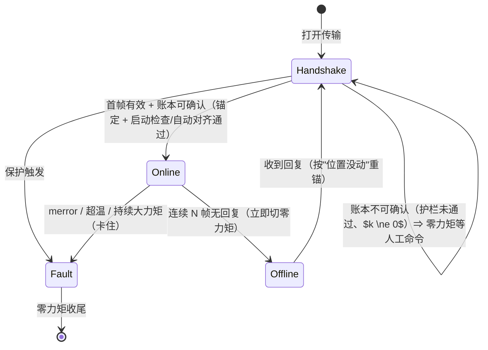

# 子任务项二（实体电机控制）：需求、设计与伪代码（v2）

> 本目录是子任务项二（实体电机控制）的**正式实现**：功能目标（任务书四条 + 提前保护 + 插值）已完成并验收通过（2026-10-03）；按只读参考工程 `../../../../ReadOnly.d/quadruped_control/` 的分层、命名与文档规范组织，并修掉历史版本（[`cpp_part2/`](../../cpp_part2/README.md)，仅作对照）在无硬件阶段暴露的缺陷。
> 本文是**当前有效的设计文档**（v2）：需求、符号约定、设计、伪代码、决策、测试矩阵与里程碑，内容即"标准"，不再按"改了什么"组织。
> 相对 v1（[`v1/design.md`](v1/design.md)）的差异集中在五处：① 新增 §2.6 **符号与变量约定**（唯一权威）；② 明确**转子零点 / 软件零点**两个概念与"整格不可判"边界（§2.5、§3.2）；③ ④ 的验收改为 `check` / `fix`（半格前提、模糊即停，§3.4–§3.6、§5）；④ 标定改为**启动参数化**（`--pose-ref` 等），不落文件（D13）；⑤ 手动转动**允许范围**与红黄绿现场规则（§5.2）。

依据：[任务书](../../docs/teaching-materials/第三次培训任务.pdf.md) 与 [讲义](../../docs/teaching-materials/motor.pdf.md)；旧版实测记录：[real.md](../../cpp_part2/docs/real.md)、[protocol.md](../../cpp_part2/docs/protocol.md)、[fixed-point.md](../../cpp_part2/docs/fixed-point.md)、[zero-semantics.md](../../cpp_part2/docs/zero-semantics.md)；仓库规范：[conventions.md](../../../docs/conventions.md)、[AGENTS.md](../../../AGENTS.md)。

## 1 目标与边界

### 1.1 任务书四条 → 验收动作

| 任务书 | 验收动作 | 旧版阶段名 |
|---|---|---|
| ① 用官方 SDK 例程让电机转起来 | 编译并运行官方 example，电机安全转动后停 | S1b |
| ② 让电机慢慢回归 0 位；键盘输入一个角度，输出端缓慢转过去 | `move 0` 回到**本次上电基准下的转子零点**（默认 `offset = 0`，软件零点与其重合；到点后打记号笔标记）；`move 30` 平滑到位（插值限速） | S3 |
| ③ 记号笔标下零点，把零点正向偏移 30°，再回 ② 的角度，检查角度与终端读数 | 沿用 ② 在零点处打的标记：`zero move 30`（零点沿正方向移 30°）→ 标记点读数变 **−30.00°** → `move 30` 的落点比标定前**多 30°**（零点往前挪了） | S4 |
| ④ 处理零点跳变：把输出端手动转到 ② 的零点前后，再让电机转到 ③ 的位置 | 两档：**④a 带电**——`free` 手转跨标记点前后（可多跨几个转子零点），读数连续、`move 30` 落点正确；**④b 断电重上电**——`check` 报"基准差 k 格 + 真实位移 δ"，在 $\lvert\delta\rvert < H$ 前提下 `fix` 对齐，`move 30` 仍正确；判不清时零力矩等人工确认 | S5 |
| 保护 / 插值 / 大疆电池 / 接线 | 限速限加速度、力矩与温度保护、失联与退出保护 | 贯穿 |

### 1.2 重做目标

- **清晰**：一个控制循环、一个零点账本、一个显式状态机；照着伪代码能讲出实机每一步的行为。
- **可复现**：核心逻辑不依赖 SDK 与硬件；离线验证以**虚拟实验台**（PTY + 真实 SDK + 电机模型）为主，验收标准是**定性正确性**（到位、事件、读数关系成立），不依赖操作的严格时序。严格的逐字节确定性测试作为可选思路记在 M2a，**暂不实施**（D11 修订）。
- **安全**：故障与失联路径显式；任何退出路径（正常 / 故障 / 信号）都先发零力矩（旧版实测：驱动板不会自己卸力，见 [real.md](../../cpp_part2/docs/real.md) §3.7）。
- **可解释**：每次改动账本都有事件与理由，验收时能对着终端输出讲清"为什么这么补"。

### 1.3 明确不做的事

- 不改官方 SDK、不重写报文与 CRC 栈；实机传输继续用预编译的宇树 SDK（工程指标只有一台 GO-M8010-6）。
- 不做多电机、多关节、机器人整机的抽象（参考工程里的 `RobotIO`/`MotionRuntime` 那种规模用不上）。
- 不做参数辨识：假电机的惯量 / 摩擦 / 热只是标注清楚的模型旋钮，不作为实机结论。
- **不在实验台上跑自动化测试**：它跑真实时间、多线程，用来人工演练；测试的确定性由进程内通道保证（D11）。
- 不追求与旧版 CLI、文件名、目录一一对应；语义与验收步骤保持可比即可。

## 2 需求

### 2.1 功能需求

| # | 需求 | 验收标准 |
|---|---|---|
| R1 | 回编码器零点：`move 0` 把输出端缓慢（插值）转回**本次上电基准下的编码器零点**；默认 `offset = 0` 时软件零点与它重合；到点后操作者打记号笔标记 | 按差值方向转到位、误差 ≤ 1°；终端读数 ≈ 0.000°；全过程速度、加速度不超过配置上限 |
| R2 | 键盘给角度（贯穿全程的交互基线）：输入输出端角度（相对软件零点），缓慢转过去并保持 | `move <deg>` 平滑到位；终端读数与命令值一致（容差内） |
| R3 | 标定与正向偏移 30°：以 ② 的标记为物理基准，偏移 +30°，再回 ② 指定的角度 | 同一物理点（标记）读数从 0 变 +30.00°；`move <原角度>` 落在标记点（少转 30°） |
| R4 | 零点跳变（④ 的核心）：上电基准错格（主线）与运行中基准变化（兜底）的**识别**与**可审计对齐** | 断电重上电后 `check` 打印"k 格 + 残差 r"；$\lvert\delta\rvert < H$ 时 `fix` 只动账本、物理目标不动、记事件；判不清（二义 / 超半格）时拒答（模糊即停）；带电手转跨格读数连续 |
| R5 | 状态可查：账本、在线状态、事件、目标与差 | `state` 一行给出：raw / turn_base / offset / q / 目标 / 在线 / 事件计数 |
| R6 | 脚本化复现：stdin 即脚本通道——`;` 与换行等效、`wait <s>` 等待、`quit` 退出；`motor_ctl < script.txt`（或 here-string）就是无人值守模式 | 同一脚本两次运行数值一致；不需要专用 `--script` 开关 |
| R7 | 现场工具链：探针（只读 watch）、旋转测试（斜坡 / kd 扫描 / 掉线注入） | 两个工具能在实机安全执行各自的 S2 / S1 动作；默认参数保守 |
| R8 | 启动锚定显式化：首帧 `raw` 只代表"格内相位"；打印锚定决策与"更像断过电 / 未断电"的证据 | 两个场景打印不同证据行；事件 1 条（§3.5） |
| R9 | `check`：打印唯一分解 $d = kC + r$、$r$ 的解释（= 真实位移 $\delta$，当 $\lvert\delta\rvert < H$）与二义点警告；分带提示见 R17 | 与 §5.4 表 A 逐行一致（±1 计数） |
| R10 | `fix`：只在 $\lvert\delta\rvert < H$ 前提下做区间重对齐（`offset -= kC`），打印前提与免责句，记事件，受 `max_fixes` 限制 | §3.6.3 伪代码 + §5.4 表 A 复现；超前提 / 已达上限时拒答 |
| R11 | 物理闭环：任何对齐后 `mark goto` / `move` 能回到记号线；`predict`（可选）打印漂移表 | 目视 ±1° |
| R12 | 里程计与标度验证：`free` 下手转 3 整圈（凭标记） | `q` 增 $1080.0000°$、计数增 $622592$（不是 $1080.5687°$，见 §5.4 表 D） |
| R13 | 实验台模型分层（M4）：真值（输出角）与上报（上电折圈 + 会话里程计）分离，可注入 `power off/on` 与整圈数 | T15–T18 全绿 |
| R17 | 提示层：与标定姿态差超过 $T_w$（$= C/6 = 9.4737°$）时打印提示；**只打印**，不影响对齐、不 gate；阈值可配 | T23 |
| R18 | 启动自动对齐（D20）：给了 `--pose-ref` 且护栏通过时，首帧自动 `fix`；护栏未通过时不自动、打印原因并停在 gate | ④b：断电重上电、摆回参考附近 ⇒ 启动即自动对齐（`kAlignFix` 事件 +1、电机不动、`move 30` 落点正确）；护栏外（`|k| \ge 2`、`|r| > W`、`raw0 \ge C`）⇒ 停在 gate；`--no-auto-fix` ⇒ 全人工路径 |

原 R5（指认编码器零点）已删除：编码器零点没法"指认"，其作用由 R1（回零即到它）与验收步骤（② 回零后打标记）替代，见 §2.5 与 §4 D7。

### 2.2 安全需求

| # | 需求 | 说明 |
|---|---|---|
| P1 | 插值：位置目标必须经限速限加速度的规划器，不允许阶跃 | vmax / amax 可配，默认 90 °/s、180 °/s² |
| P2 | 保护：`merror`、超温、持续大力矩（判定卡住）任一触发即零力矩并退出 | 阈值可配；退出码区分原因 |
| P3 | 失联：连续 N 帧无回复即切零力矩，不再追目标 | N 可配（默认 40 帧 ≈ 0.2 s）；M1 只做"切零力矩 + 报警退出"，恢复重锚属 M3（可选，D19） |
| P4 | 退出保护：正常退出、故障、`SIGINT`/`SIGTERM` 都必须先发 M 帧零力矩 | 旧版没有信号处理，是要修的缺口 |
| P5 | 握手保护：上电与离线恢复的第一帧一律零力矩；禁止在账本未对齐时下发位置目标 | 防止板子按最短弧追一个差整圈的目标（旧版实测力矩冲到 52.5 N·m） |
| P6 | 移动幅度上限：单次 `move` / `jog` 的转角 ≤ `max_move_deg`（默认 $360°$，可配），超限拒绝；发命令前打印"将转动 X°" | T20 |
| P7 | 免责句：凡"检查通过"的输出后必须跟"① 读数无法判定整格错位（±56.8421°）；② 请用记号线目视确认" | T22 场景可复现 |

### 2.3 离线可测需求

| # | 需求 | 说明 |
|---|---|---|
| T1 | 核心可独立编译与测试：不 include 宇树 SDK、不依赖 PTY | `core/` 与单元自检（`core_tests`）在无 SDK、无硬件机器上构建并全绿 |
| T2 | 模型可控：外部力矩 / 握住 / 记号线可注入，命令序列结果可复现 | 同一模型状态下、同一命令序列产生同一结果（定性一致） |
| T3 | 模型可注入（M4）：上电折圈（`power off/on`，整数格 + $1/19$ 圈相位）、运行中换基准、断电窗口、整圈数 | 覆盖 ④b / 任务书写明的"上电前先确定零点未跳变"与"零点跳变"两类现象（§5.4 表 A/B） |
| T4 | 验证矩阵覆盖 R1–R13、R17 与 P1–P7 | 见表 §5；M2b 起以实验台脚本 + 人工加入 |

### 2.4 工程需求

| # | 需求 | 说明 |
|---|---|---|
| E1 | 代码风格按参考工程：C++17、Allman、100 列、`snake_case` 函数 / `kPascalCase` 常量、中文 `@file/@brief` 文件头 | 工程目录放一份自己的 `.clang-format` |
| E2 | 依赖方向单向：`core` ← `backends` ← `apps`；`core` 不暴露 SDK 类型 | 参考工程 AGENTS.md 的依赖边界 |
| E3 | 不写死绝对路径；SDK 路径可配（默认按"与本仓库根同级的 `ReadOnly.d/`"推算） | 仓库约定 §4 |
| E4 | 编译产物 / 缓存不入库；文档单一权威、README 只做入口 | 仓库约定 §2/§4 |
| E5 | 测试用零第三方框架，接入 CTest | 参考工程做法 |

### 2.5 术语与上电约定

**两个"零点"必须分清**（后文一律用这两个名字；"零点"单独出现视为歧义，见 §2.6 使用规则）：

| | **转子零点**（候选零点 / 编码器零点） | **软件零点**（标定层，`q` = 0） |
|---|---|---|
| 本体 | 编码器相位零点落在输出端上的格点，间距 $L = 56.8421°$（三圈 19 个） | 账本坐标系的原点 |
| 谁决定 | 板子上电时取"位置减小方向上最近经过的那个"为基准（datum）；首帧 `raw` 即从它量起 | 我们：`--offset-deg` / `zero move` / `offset set` / `fix` |
| 能否移动 | **不能**（只有重新上电或改装配才会换） | 随时（只改账本；`offset` 变化时目标与标记必须同步平移，见 §3.2 的 I3） |
| 读数关系 | 同一上电周期内 `raw` 是里程计（连续累计，跨转子零点不跳） | `q = pos + offset`；命令、目标、显示都在这一层 |

- **"零点跳变"**：一律指**转子零点**（板子 datum）变了——上电落在别的格，或运行中基准被换。程序做的"修"是移动**软件零点**把坐标系对回去（`fix`：`offset -= kC`），而不是移动转子零点。（历史文档里的"编码器零点""候选零点"都是**转子零点**的同义词；本文件统一用"转子零点"，只在引用旧文时保留原词。）
- **"上电时把输出端放在同一位置附近"**的准确含义：把输出端摆在**同一个物理位置附近**（四足上的对应约定是"上电前先摆成趴卧位姿"），目的是让板子选中的候选零点尽量一致。注意区分两种"同一"：操作要求的是**物理位置**相同；"读数是同一个候选零点"是**推断结果**，不是操作要求。
- **读数能判什么、不能判什么**（§3.2 边界事实 3）：首帧 `raw` 只给出"姿态 mod $L$"；**整格错位（$\pm L$ 的整数倍）用读数发现不了**，只有物理标记（划线）与操作者声明能判。因此"检查通过"的输出永远附带免责句（P7）。
- **姿态有三个名字**：**Stand**（我们**指定**"软件零点在这里"的姿态；四足上 = 腿接近垂直于肚子，本任务里 = ③ 之后 `q = 0` 的那一点）、**Rest**（**约定**的启动姿态；四足上 = 理想趴卧，本任务里 = ② 画线的那一点）、**Rest_Instance**（现场每次**实测**的趴卧 ≈ Rest）。两个启动参数各自记其中一个姿态的读数，关系与填法见 §2.6 末"由符号表导出的标定关系"。
- M1 简版只在**程序启动时**处理这件事（接受当前读数、`offset` 取配置初值）；启动检查（`check` / `fix`）与运行时修正属于 M4。程序**不自动、也不询问**是否对齐软件零点：对齐一律由显式命令触发（D18）。

### 2.6 符号与变量约定（唯一权威）

本节是全文档的符号字典。**每个名字全文只用一种格式**：能与代码 / 命令 / 报文字段逐字对应的名字用**行内代码**（`raw`、`raw0`、`pos`、`turn_base`、`offset`、`q`、`q_des`、`p_des`、`q_m`、`pos_des`、`ref`、`q_now`、`target`）；只在公式与表格里出现的纯数学量用 **LaTeX**（$N$、$C$、$L$、$H$、$S$、$T_w$、$T_a$、$W$、$k_b$、$d$、$k$、$r$、$j$、$\delta$、$n$、$\psi$）。角度单位默认**输出端度**；计数一律是**转子侧计数**（板子回帧 `pos` 的单位）。"程序名"列给出它在上位机代码里的落点。

**常量**（不随会话变化）：

| 符号 | 定义 | 值 | 程序名 |
|---|---|---|---|
| $N$ | 真减速比（转子圈 / 输出圈） | $19/3 = 6.3333\ldots$（SDK 报 6.33，是近似值） | `kGearRatio` |
| $C$ | 一个转子圈的位置计数（q15 满量程） | $32768$ 计数 / 转子圈 | `kCountsPerTurn` |
| $L$ | 格距：相邻转子零点在输出端的间距（= 一个零点区间） | $360°/N = 56.8421°$ | `kZoneDegrees` |
| $H$ | 半格：单次读数能"判"的边界（越过它 $k$ 的解释会翻转） | $L/2 = 28.4211°$ | — |
| $S$ | 分支步长：断电期间净转 1 整输出圈造成的读数漂移（现象量，§5.4 表 B） | $360°/19 = 18.9474°$ | — |
| $T_w$ | 提示阈值（R17）：$r$ 越过它即打印提示，**不影响对齐** | $C/6 = 5461$ 计数 $= 9.4737°$（$= S/2$） | `pose_warn_counts` |
| $T_a$ | 到位容差 | 默认 $1.0°$ | `tol_deg`（→ `tol_counts_`） |
| $W$ | 自动对齐窗口（D20）：自动路径额外要求 $\lvert r\rvert \le W$ | 默认 $20°$ | `fix_window_deg` |

**账本链（会话状态）**：

| 符号 | 定义 | 来源 | 样例（验收主线，实机数） | 程序名 |
|---|---|---|---|---|
| `raw` | 板子回帧位置：本上电周期内从板子 datum 量起；首帧 $\in [0, C)$，同期内是里程计 | 电机回传（经 SDK 后端） | 启动首帧 `raw` = 14960 计数（$25.951°$）；`move 0` 到位后 `raw` = 0 | `DeviceFeedback::raw` / `last_raw()` |
| `turn_base` | 圈基准 $= k_bC$：补"板子本次上电的 datum 相对我账本参考点差了几个整转子圈" | 程序计算：会话首帧 `anchor(0)` ⇒ 0；离线恢复 `reanchor` ⇒ 自动算（算例见 §3.5） | 验收主线恒为 0；离线恢复算例中为 $19C$ = 622592 计数 | `Ledger::turn_base()` |
| `offset` | 软件零点偏移（任意整数计数）：`zero move` / `offset set` / `fix` 改它 | 启动参数 `--offset-deg`（初值）+ 命令 / `fix` | ③ 步 `zero move 30` 后 `offset` = −17294 计数（$-30.000°$） | `Ledger::offset()` |
| `pos` | 会话位置：`pos = raw + turn_base` | 程序计算 | 启动后 `pos` = 14960；`move 0` 后 `pos` = 0 | `Ledger::raw_to_pos` |
| `q` | 软件坐标：`q = pos + offset`；命令、目标、显示都用它 | 程序计算 | ② 步线处 `q` = 0；③ 步后线处 `q` = −17294 计数（$-30.000°$） | `q_now()` |
| `q_des` | 目标（软件坐标） | 命令：`move` / `jog` / `hold` / `mark goto` | `move 30` ⇒ `q_des` = +17294 计数 | `Session::target_` |
| `p_des` | 下发给板子的目标：`p_des = q_des − offset − turn_base` | 程序计算（每帧） | ③ 步后 `move 30` 的落点 `p_des` = 34588 计数（$60.000°$，比标定前多 30°） | `DeviceCommand::pos_counts` |
| `q_m` | 记号点（物理点在软件坐标下的表示） | 命令 `mark`（读当前 `q`） | ② 步 `q_m` = 0；③ 步后 `q_m` = −17294 计数 | `mark_q()` |

**参考与检查**（样例统一用 §5.4 表 A 的"$\delta = -10°$ 断电位移"）：

| 符号 | 定义 | 来源 | 样例 | 程序名 |
|---|---|---|---|---|
| `ref` | 参考读数：约定启动姿态（或记号点）当时的 `raw` | 启动参数 `--pose-ref`；或从记录表抄入 | `--pose-ref 0tick`（线画在格边界，`move 0` 到位时手工记 0） | `pose_ref_raw` |
| `raw0` | 会话首帧的 `raw`（程序接手时的读数） | 电机回传（首帧） | ② 会话首帧 +2832 计数；④b 例：27003 计数 | `last_raw()`（首帧后） |
| $d$ | 差：启动检查时取 `raw` 与 `ref` 之差；一般 `check` 取 `q` 与参考坐标之差 | 程序计算 | $d$ = 27003 计数 | `check_report` 内部 |
| $k$ | $d$ 的整格部分（单位：格 $=$ 转子圈） | 程序计算 | $k$ = +1（板子 datum 比参考低一格） | 同上 |
| $r$ | 残差：$r = d - kC$，$\lvert r\rvert \le C/2$ | 程序计算 | $r$ = −5765 计数（$-10.0004°$） | 同上 |
| $j$ | 板子 datum 相对参考时移动的格数（$\lvert\delta\rvert < H$ 时 $j = -k$） | 程序推断（板子不上报） | $j$ = −1 | — |
| $\delta$ | 真实位移（输出端角度）：$\lvert\delta\rvert < H$ 时 $\delta = r \cdot L/C$ | 由 $r$ 换算 | $-10.0004°$（真值 $-10.0000°$，差值是半计数量化） | — |
| $n$ | 断电期间净转的整输出圈数 | 现场事实（人工清点；读数看不出整圈） | 验收必须为 0，否则落 §5.3 红区（读数漂移 $n \bmod 3$ 个 $S$） | — |
| $\psi$ | 记号点相对最近转子零点的相位（**角度**：输出端度；内部按计数算，1 计数 $= 0.0017347°$） | 程序计算（`distance_to_zone_edge`） | ② 步线落在格边界 ⇒ $\psi$ = 0.000°（`mark` 打印"离零点边界 0.000°"是预期） | `distance_to_zone_edge` |

**由符号表导出的标定关系（`--pose-ref` / `--offset-deg` 填什么）**

三个姿态的名字（"约定指哪儿"、"约定在哪儿上电"、"每次实测"）：

| 名字 | 是什么 | 谁定 | 本任务里的对应 |
|---|---|---|---|
| **Stand** | 我们**指定**"软件零点在这里"的姿态（四足上：腿接近垂直于肚子；若希望它对应 `q_default` 而不是 0，把下面的 0 换成 `q_default`） | 需求 / 标定时的操作 | ③ 之后 `q = 0` 的那一点（记号线**前方 30°**） |
| **Rest** | 我们**约定**的启动姿态（四足上：理想趴卧；上电前把输出端摆到它附近） | 操作约定 | ② 的 `move 0` 之后画线的那一点 |
| **Rest_Instance** | 现场**实测**的趴卧（≈ Rest；摆放误差 $\varepsilon$ = 实测 $\rho_R$ 与记录值之差） | 每次都不同 | ④b 断电后重新上电时的位置 |

两个参数记的都是**标定会话里的读数**（逐关节各一份；狗上 12 个腿关节）：

| 参数 | 记什么 | 量纲 / 范围 | 操作上怎么得到 |
|---|---|---|---|
| `--pose-ref` | $\rho_R$：**在 Rest 上电**的首帧 `raw` | 计数，$\in [0, C)$（即输出端 $[0°, L)$） | 摆成趴卧、上电、抄首帧 |
| `--offset-deg` | $-\mathrm{deg}(S)$，其中 $S$ 是标定会话里**驱动到 Stand 之后**的 `raw`（里程计值） | 输出端度（内部是任意整数计数，**可跨多圈**） | 同一次会话里转到 Stand，抄当时的 `raw` |

两者**不是独立的**，满足不变量（全部用计数表示）：

```text
offset + pose_ref = q_default − Δθ          # Δθ = θ_Stand − θ_Rest（计数）；本任务 q_default = 0
等价写法：--offset-deg = −deg(S)，  S = ρ_R + Δθ
```

- **为什么 `offset` 里必然含 $-\rho_R$**：`raw` 是"从**上电那一刻**起累计的转子角"，而我们要让**物理上的 Stand** 落在 $q = 0$；上电那一刻的相位正是 $\rho_R$，所以 `offset` 必须把它抵消掉。
- **缺一个会怎样**：只给 `--offset-deg` ⇒ 命令与显示都对，但某关节错一格时**检查不出来**（`move 0` 静默偏 $L$）；只给 `--pose-ref` ⇒ 能修跳格，但 $q = 0$ 落在**转子零点**而不是 Stand（整体偏 $\Delta\theta$）。
- **精度要求很松**：`pose_ref` 只需让 $k$ 判对（±半格 $= \pm 28.4211°$）；$\varepsilon$ 落在干净带（$\pm T_w$）内即可，不影响 `fix` 结果。
- 参考工程的原型：[REAL_HARDWARE_BASELINE.md](../../../../ReadOnly.d/quadruped_control/docs/real_migration/REAL_HARDWARE_BASELINE.md) 第 7 节的 `P0 / C / S`（我们的"首帧 `raw` / `pose-ref` / 标定 Stand 读数"），其第 9 节的实测数据也印证了两量纲：`creep`（≈ 我们的 `pose-ref`）全在一圈内，`straight`（≈ 我们的 `S`）最大到 $\pm 5.2$ 转子圈。

**换算（唯一入口，别处不再重复）**：

```text
pos = raw + turn_base ;  q = pos + offset ;  p_des = q_des − offset − turn_base
q  → 输出端度：counts_to_output_deg(q) = q ÷ C × L
度 → q ：output_deg_to_counts(deg) = deg ÷ L × C
1 计数 = L/C = 0.0017347°（输出端）；一格 = C 计数 = L 度
```

**使用规则**：

1. "零点"单独出现即歧义：必须写**转子零点**或**软件零点**（§2.5）。
2. "位置差 / 偏差"必须写清在哪一层：`raw` 上的差（$d$，含整格）还是输出端物理位移（$\delta$）；两者只在 $\lvert\delta\rvert < H$ 时满足 $\delta = r \cdot L/C$。
3. $k$（整格数）、$j$（datum 移动格数）、$n$（整输出圈数）含义不同，不得混用。
4. 写角度必须带单位；写计数时带"计数"后缀。
5. 格式：同一名字全文只用**行内代码**或 **LaTeX** 一种（清单见本节开头）；命令、选项、报文/代码字段一律行内代码。

## 3 设计

### 3.1 分层与依赖方向

**两种场景（实机 / 实验台）的完整链路**——只差最后一跳，代码一行不改（实验台把端口从 `/dev/ttyUSB0` 换成 `/dev/pts/N`）：

```text
实机:   core（会话）→ backends/unitree_sdk → 官方 SDK ──▶ /dev/ttyUSB0 ──▶ 真驱动板
实验台: core（会话）→ backends/unitree_sdk → 官方 SDK ──▶ /dev/pts/N  ──▶ wire → sim
                        ▲（构造期：tools/pty_shim 补两个 ioctl）      （同一进程 motor_sim）
```

`tools/pty_shim` 只作用于控制进程里 SDK 的**构造期**（`TIOCGSERIAL`/`TIOCSSERIAL`），运行期的 17 B / 16 B 收发是普通读写，不经过它——PTY 是内核的透明管道，没有任何"拦截"。

**依赖方向**（箭头 = "依赖"）：

```text
apps/motor_ctl ──▶ backends/unitree_sdk ──▶（官方 SDK，PIMPL 包住）
apps/motor_sim ──▶ wire/（帧）──▶ core/ ◀── sim/（模型）
     │                └──▶（SDK 头文件：结构与 CRC）        ▲
     └───────────────────────────────────────────────────┘（模型 → core）
tests/ ──▶ core/（+ wire/，走 SDK 头文件）
```

- `core/`（无 SDK、无 I/O、无绝对时间）与 `backends/`（控制侧传输）是**两种场景共用**的；
- `wire/`（设备侧帧）与 `sim/`（模型）只在**实验台进程**里参与，二者分开是因为依赖边界：模型不依赖 SDK，帧层要用 SDK 头文件；
- `tools/pty_shim` 是宿主侧的运行时垫片（C、无依赖、注入控制进程），不参与任何 target 的链接。

两条离线通道（D11 修订：当前只实施第二条）：

| 通道 | 形态 | 用途 | 状态 |
|---|---|---|---|
| 进程内传输（M2a） | `backends/sim/` 的 `SimTransport` 直接驱动模型 | 严格的确定性自动化测试、`motor_ctl --sim` | **暂不实施**：功能被实验台覆盖，定性正确性已足够，测试总时长可控（保留为可选思路，见 §3.6） |
| PTY 实验台（M2b） | `apps/motor_sim/` 独立进程 ↔ PTY ↔ `motor_ctl`（走**真实 SDK**） | 人工双终端演练；M3/M4 注入（断线 / 断电 / 换基准） | **当前实施**：真实时间、多线程；不进 CTest |

两条通道共用 `sim/` 模型库（`motor_sim_model`，只依赖 core）；报文的编解码（`wire/`，只依赖 SDK 头文件）由实验台与报文往返测试共用。

拟建目录（计划，实现后本文按实际更新）：

```text
cpp_part2_remake/
├── CMakeLists.txt                     # 工程入口：选项、核心库、模型库、后端、apps、tests
├── .clang-format                      # 本工程：Allman + 4 空格 + 100 列
├── README.md                          # 入口：构建、运行、文档索引
├── core/
│   ├── CMakeLists.txt
│   ├── include/motor/counts.hpp       # 计数与角度换算（含 π′ 与输出端换算）
│   ├── include/motor/protocol.hpp     # 报文标度（raw ↔ 物理量；模型与测试共用同一份定义）
│   ├── include/motor/ledger.hpp       # 零点账本（turn_base / offset / 事件）
│   ├── include/motor/trajectory.hpp   # 梯形插值（计数空间）
│   ├── include/motor/transport.hpp    # 设备帧结构 + Transport 接口（边界）
│   ├── include/motor/command.hpp      # 命令定义与纯文本解析
│   ├── include/motor/session.hpp      # 会话状态机（核心）
│   ├── include/motor/format.hpp       # 角度显示（±圈数 ±<360°）
│   └── src/*.cpp
├── sim/
│   ├── include/motor_sim/model.hpp    # 电机 + 驱动板模型（转子动力学、上报语义、外部力矩、记号线）
│   └── src/model.cpp
├── wire/
│   ├── include/motor_wire/wire.hpp    # 17 B 命令解帧 / 16 B 回帧组帧（只依赖 SDK 头文件 + core 标度）
│   └── src/wire.cpp
├── backends/
│   ├── unitree_sdk/                   # 控制侧传输（实验台里只是把端口换成 PTY，代码不变；PIMPL 包住 SDK）
│   └── sim/                           # SimTransport（M2a，暂不实施）
├── apps/
│   ├── motor_ctl/main.cpp             # 验收程序（实机与实验台都用；实验台只是 --port 换成 PTY）
│   ├── motor_ctl/line_input.{hpp,cpp} # 交互模式的固定输入行（raw 模式 + 极简行编辑；app 私有）
│   ├── motor_probe/main.cpp           # 只读探针（M2c）
│   ├── motor_spin/main.cpp            # 旋转与 kd 扫描（M2c）
│   └── motor_sim/main.cpp             # PTY 实验台（M2b；只用 SDK 头文件取结构与 CRC）
├── tools/pty_shim/                    # LD_PRELOAD 垫片：让 SDK 的 SerialPort 认 PTY
├── tests/
│   ├── core_tests.cpp                 # 单元（换算 / 账本 / 插值 / 命令 / 会话）
│   └── wire_tests.cpp                 # 报文往返（需 SDK 头文件；锚点来自 protocol.md）
└── docs/                              # design.md（v2）+ runbook.md（v2）+ control-loop.md；v1/ 是存档
```

`Transport` 是唯一的硬件边界；`core` 只看设备帧：

```cpp
// core/include/motor/transport.hpp（草稿）
struct DeviceCommand
{
    Counts pos_counts;     // 板子读数空间的目标位置（= q_des − offset − turn_base）
    double speed_rotor;    // 转子侧速度前馈 [rad/s]
    double torque_rotor;   // 转子侧前馈力矩 [N·m]
    double kp_rotor;       // 转子侧刚度 [N·m/rad]
    double kd_rotor;       // 转子侧阻尼 [N·m·s/rad]
    bool zero_torque;      // true ⇒ 五个量全 0（显式零力矩，防止漏清）
};

struct DeviceFeedback
{
    Counts raw;            // 回帧 pos（q15 圈，上电后 ∈ [0, 32768)）
    double speed_rotor;    // [rad/s]
    double torque_rotor;   // [N·m]
    int temp_c;
    unsigned merror;
    unsigned status_bits;  // bit1 期望速度超范围、bit2 期望位置超范围
    bool from_raw_frame;   // 来自原始帧 / 还是 SDK float 反算
};

class Transport
{
  public:
    virtual ~Transport() = default;
    virtual bool send(const DeviceCommand& cmd, DeviceFeedback* out) = 0; // false = 本帧无回复
    virtual const char* name() const = 0;
};
```

### 3.2 位置与单位：三层表示（准确表述）

| 层 | 符号 | 类型 | 语义 |
|---|---|---|---|
| 板子读数 | `raw` | `int32` 计数 | 回帧 `pos`：q15 转子圈。**上电时整数部分清零**；圈内残量 = "从**本圈起点**（位置减小方向上、往回遇到的那个候选零点）量起的角度"，∈ `[0, 32768)`；同一上电周期内是里程计（连续累计、跨候选零点不跳） |
| 会话位置 | `pos` | `int64` 计数 | `pos = raw + turn_base`，`turn_base = k × 32768`：补"上电落在哪一个候选零点"，使会话内位置连续 |
| 软件位置 | `q` | `int64` 计数 | `q = pos + offset`：软件零点坐标系；命令、目标、显示都在这层 |

换算与不变量：

```text
输出端角度[°] = q / C × L                            # L = 360/N；1 计数 = 0.0017347°
pos_des（板子目标）= q_des − offset − turn_base       # 收到加、下发减（讲义 §2.5）

I1  turn_base 恒为 C 的整数倍；offset 为任意整数
I2  raw ⇄ pos ⇄ q 是纯整数、无损、可逆（不含浮点、不累积误差）
I3  改 offset（标定 / 修正 / 跳变）时，目标与插值位置必须同步平移同样量 ⇒ pos_des 不变、物理目标不动
I4  运行中 Δraw ≈ k×C（k≠0，残差小于阈值）⇒ 只做 offset −= k×C，不挪目标（前提 |δ| < H，见边界事实 4）
I5  账本未对齐（上电 / 离线恢复）时只允许零力矩
I6  退出（正常 / 故障 / 信号）前必须发 M 帧零力矩
I7  提示层（R17）只打印：不改账本、不阻止命令、不影响 fix
```

四个必须放在明处的边界事实（旧版实测，见 [fixed-point.md](../../cpp_part2/docs/fixed-point.md)）：

- SDK 的 float 换算用 **π′ = 3.1416**（不是真 π）；计数 → float 用同一个 π′，才能让报文里的 `pos_des` 恰好等于想要的计数（±1 LSB 截断）。
- 减速比真值是 **19:3**（SDK 的 `queryGearRatio()` 报 6.33，差 5.26e-4）：一个零点区间 = 转子 1 圈 = 输出端 $L = 56.8421°$。
- **首帧读数只给出"姿态 mod $L$"**（信息量下界）：姿态差 $j$ 格给出完全相同的 `raw`，故**整格错位用读数不可判**，只有物理标记与操作者声明能判（§5.5 步骤 8 的反例即演示这一点）。
- **"残差 $r$ = 真实位移 $\delta$"只在 $\lvert\delta\rvert < H$ 时成立**（证明与数值表见 §5.4）：超半格时"向上跨过零点"与"向下没跨"同解，`fix` 会修错一整格。

### 3.3 板子边界：下发的只有 5 个量；判断类参数都在我们这侧

报文（`wire/` 与实机 SDK 都按它打包）里承载我们意图的**只有 5 个量**，其余都是报文头（id、mode）：

| 量 | 报文字段 | 标度（实测，见 [protocol.md](../../cpp_part2/docs/protocol.md)） | 我们的来源 |
|---|---|---|---|
| 目标位置 | `pos_des`（int32） | q15 转子圈 = 32768 计数/圈；float 弧度走 SDK 的 π′ | `q_des − offset − turn_base`（计数） |
| 速度前馈 | `spd_des`（int16） | `ω × 128/π`（截断） | 插值器的速度（计数/s → 转子 rad/s） |
| 力矩前馈 | `tor_des`（int16） | `τ × 256`（截断） | 目前恒 0 |
| 位置刚度 | `k_pos`（uint16） | `K × 1280`，超 32766 静默钳位 | `--kp-out` ÷ N² |
| 阻尼 | `k_spd`（uint16） | 同上 | `--kd-out` ÷ N² |

板子里只有"MIT 位置环 + FOC 电流环"这两层（原理与本次实机误差分析见 [control-loop.md](control-loop.md)）。所以下面这些**判断类参数都不上报文**、不改变板子行为——按"谁拥有"分：

| 参数 | 归谁 | 作用 |
|---|---|---|
| `kp` / `kd` | 下发（÷N² 进报文） | 板子的 MIT 位置环刚度 / 阻尼 |
| `tol-deg` | 我们 | 到位判据（`⇒ 到位`）、脚本收尾条件 |
| `vmax-deg` / `amax-deg` | 我们 | 梯形插值（板子只看到位置/速度目标） |
| `tau-out-limit` / `stall-s` | 我们 | 卡住判定 ⇒ 保护退出 |
| `temp-limit` / `offline-frames` | 我们 | 保护 / 失联判定 |
| `jump-tol-deg` / `expect-tol-deg`（M4） | 我们 | 跳变残差 / 启动检查判据 |
| `--pose-ref`（→ `pose_ref_raw`，新） | 我们（启动） | 约定启动姿态 / 记号点的参考读数；用于启动检查；可写 `25.951deg` / `14960tick`；缺省 = 不做启动检查 |
| `--max-move-deg`（→ `max_move_deg`，新） | 我们 | P6 的单次 `move` / `jog` 幅度上限（默认 360°） |
| `pose-warn-counts`（→ `T_w`，新） | 我们 | R17 提示层阈值（默认 $C/6 = 5461$ 计数 $= 9.4737°$） |

这条边界解释了为什么改这些参数**不用重开串口**、也不会改变板子内部行为：它们只影响"我们怎么算、怎么判断"。

**两种模式的具体报文**（17 B 命令帧；下面用 `move 30` 到位后保持、`--kp-out 80 --kd-out 3` 举例）：

| 字段 | 位置保持（`hold` / `move` 到位；`enabled`） | 零力矩（`free` / 握手 / 离线 / 故障 / 退出前） |
|---|---|---|
| `pos_des` | `q_des`，如 17294（30°）；由插值给出，保证逐帧平滑 | `0` |
| `spd_des` | 插值速度（保持时 0；移动中如输出端 90°/s → 转子 9.948 rad/s → `405`） | `0` |
| `tor_des` | `0`（当前不用前馈力矩） | `0` |
| `k_pos` | `K_P_转子 × 1280`，如 `80/N² × 1280 → 2552` | `0` |
| `k_spd` | `K_W_转子 × 1280`，如 `3/N² × 1280 → 95` | `0` |
| `mode`（报文头） | FOC（1）；id 不变 | FOC（1）——**不是**刹车/锁定位 |

我们侧的分流点只有一处：`zero_torque`（[session.cpp](../core/src/session.cpp) 的 `Session::step`）；后端据此把 5 个 float 全清零（[unitree_transport.cpp](../backends/unitree_sdk/src/unitree_transport.cpp)）。所以：

- **零力矩 = "MIT 公式的 5 个系数全 0"**：`τ = 0 + 0×(p_des−p) + 0×(ω_des−ω)` ⇒ 板子不出力矩，只主动抵消自身摩擦（这就是能自由拖动的原因）；
- **位置保持 = "只有 kp/kd 非 0、位置恒定的 MIT"**：板子每个控制周期都在按 `kp×(p_des−p)` 出力顶住外力，上位机 200 Hz 的帧率只负责把 `p_des` 平滑地挪动——**真正的"保持"是板子做的**，我们只是持续喂同样的目标；
- 因此"手转只能在 `free` 下发"（带位置环时手只能把它推开几度，`kp` 会把人顶回来，见 [runbook.md](runbook.md) §3 说明）。

### 3.4 会话状态机



Handshake 的出口（D5 / D20 的落地）：首帧锚定后，若给了 `--pose-ref` 就做启动检查；**护栏通过时默认自动对齐**，否则按下面三种情况处理（`raw0` = 首帧 `raw`）：

- **无动作**：$k = 0$（$\lvert r\rvert > T_w$ 时按 R17 只打印提示）；
- **自动对齐**（`auto_fix` 且三条件同时成立）：`raw0 ∈ [0, C)`（"刚上电"的侧面证据）、$\lvert k\rvert \le 1$（半格纪律）、$\lvert r\rvert \le W$（默认 $20°$）⇒ `offset -= kC` + 一条 `kAlignFix` 事件（打印分解与 `offset` 变化、**电机不动**），随后照常使能；
- **gate**：$k \ne 0$ 但护栏未通过（`--no-auto-fix`、$\lvert k\rvert \ge 2$、$\lvert r\rvert > W$、或 `raw0 ≥ C`）⇒ 打印未通过的原因 + "先 `fix`，再发移动命令（否则可能偏一整格 $L$）"，**零力矩等命令**；`hold` / `move` / `jog` / `zero move` / `offset set` / `fix` 任一显式命令视为**对账本的确认**，转入 Online（`free` 只是保持零力矩，不算确认）；
- **不 gate**：R17 提示层与检查信息——只打印，不拖延任何命令；
- gate 期间仍只发零力矩（I5）。

正交的两个开关（与链路状态无关地组合）：

- `enabled`（出力开关）：`free` 命令关、`hold`/`move`/`jog` 开。关时下发零力矩，规划器不推进。
- 目标 `q_des`：`move <deg>` 设为绝对角；`jog <d>` 设为当前 + d；`hold` 设为当前位置。

### 3.5 零点账本与事件

账本是**纯整数**的，只做四件事，每件事都记一条事件：

| 操作 | 何时 | 改什么 | 为什么 |
|---|---|---|---|
| 上电锚定 `anchor(k0)` | 会话第一帧 | `turn_base = k0×C`（默认 $k_0 = 0$：接受当前位置） | 板子掉电丢圈数，必须先假设一个基准 |
| 区间重对齐 `fix` | `fix` 命令；或启动自动对齐（D20，`auto_fix` 且三条件全过） | `offset -= kC` | 板子基准与参考差 $k$ 格；只补账本，物理目标不变（I3/I4） |
| 跳变修正 `fix_jump(k)` | 运行中 `raw` 跳了 $k$ 格（Δ ≈ $kC$）；或 `fix` 命令 | `offset -= kC` | 板子中途换基准（兜底）；只补账本，物理目标不变 |
| 离线重锚 `reanchor(raw)` | 离线恢复第一帧 | `turn_base = round((pos_{before} - raw)/C)×C` | "板子没断电"与"断过电"在数学上不可区分，统一按"物理位置未动"取最近整圈 |

事件类型：`kAnchor`（上电锚定）、`kAlignFix`（区间重对齐：自动或手动，事件值记 $k$）、`kOffsetShift`（`zero move` / `offset set` 的标定动作）、`kRestore`（可选，附录 A.1）。`check` **不产生事件**（只报告）。**启动自动对齐会多出 1 条 `kAlignFix`**：`state` 里看到"事件 2 条"是预期（验收脚本按这个核对）。

**为什么需要 `turn_base`**（它什么时候不为 0、动了它会发生什么）：

- 板子侧：一上电就把整数圈清零，只从**自己选的 datum** 报 $[0, C)$，会话内是里程计——**板子永远不知道我们账本的原点在哪**，也不会替我们记住。
- 我们侧：下发的目标是**绝对计数** `p_des`。若账本原点与板子本次上电的 datum 差 $k_b$ 个整转子圈而不补，`q` 会整体差 $k_bC$，`p_des` 随之偏 $k_b$ 格，板子按最短弧去追 ⇒ 力矩冲击（旧版实测 52.5 N·m；这正是 P5"账本未对齐只发零力矩"的来由）。
- `turn_base` 就是补这个"整圈差"：`pos = raw + turn_base`。它是**运行时状态**，不是标定：标定是 `offset`（可复现、可持久），圈基准只在会话内有意义——参考工程的同一结论见 [REAL_ROBOT_BACKEND_MIGRATION_REFERENCE.md](../../../../ReadOnly.d/quadruped_control/docs/real_migration/REAL_ROBOT_BACKEND_MIGRATION_REFERENCE.md) §2："启动多圈补偿是运行时状态，不能与持久标定合并成一个不透明 `zero_offset`"。
- 唯一会让它非 0 的真实场景：**板子断电、我们的程序还在**（M3 离线恢复）。算例：程序运行中已累计 `raw` = 622592 计数（$= 19C$ $= 3$ 整输出圈），此时板子掉电；重新上电、位置未动，板子报 `raw` = 0（$622592 \bmod C$）。`reanchor` 按"位置没动"算出 $k_b = 19$ ⇒ `turn_base` = 622592 ⇒ `q` 继续 = 622592：位置连续、目标不动、电机不动（公式与代码见本节上面的代码块；若断电期间确实动过，那部分只会以 $\lvert\text{residual}\rvert \le C/2$ 报告，见下面的"诚实说法"）。若这里错写成 0，`q` 会从 622592 突降到 0，此后任何 `move` 都会让板子按最短弧冲一整段。
- 改动 `turn_base` 时，目标与插值位置必须**同步平移同样量**（同 I3 的做法），于是 `p_des` 不变、物理目标不动。
- 验收主线（程序与板子同时上电、中途不拔板子）里它**恒为 0**，所以现场看不到它变化——这是正常的：它是 M3 才启用的状态量；M1 里它只出现在 `p_des` 的公式中，防止恢复路径写错。
- **没有任何命令行参数直接设置它**：会话首帧 `anchor`（默认 0）、离线恢复 `reanchor`（自动算）、（可选）快照恢复 `restore` 是仅有的三个写入点。
- **验收范围（D19）不做 M3 ⇒ `reanchor` 未实现、`turn_base` 恒为 0**：它此刻只出现在 `p_des` 的公式里，保证将来补 M3 时不用改公式；`kRestore`（附录 A.1）同样是可选。

离线重锚的诚实说法（旧版文档 §4 的三判据其实互相重叠、代码也没实现）：

```text
pos_before = raw_last + turn_base_old          # 必须用重锚前的账本先算好（旧版这里算错，见 §3.9）
k_reanchor = round((pos_before − raw_new) / C)
turn_base  = k_reanchor × C
residual   = (raw_new + turn_base) − pos_before     # 构造上有 |residual| ≤ C/2
处理：|residual| ≤ 模糊阈值（默认 12000 计数 ≈ 20.7°）⇒ 照常继续，residual 打印为"离线期间被推的角度"；
      |residual| > 阈值 ⇒ 判为模糊（区间选择可能不确定）⇒ 保持零力矩，等操作者确认（同 D5 原则）。
```

### 3.6 参数、命令与伪代码

#### 3.6.1 运行前参数（唯一权威：core 只认 `SessionConfig`，CLI 解析都在 app 层）

| 层 | 参数 | 现状 | 默认 | 说明 |
|---|---|---|---|---|
| core（`SessionConfig`） | `vmax_deg_per_s` / `amax_deg_per_s2` | 已有 | 90 / 180 | 梯形插值上限 |
| core | `tol_deg`（→ $T_a$） | 已有 | 1.0 | 到位判据 |
| core | `kp_out` / `kd_out` | 已有 | 80 / 3 | 输出端增益（下发 ÷N²） |
| core | `tau_out_limit_nm` / `stall_s` | 已有 | 1.5 / 1.0 | 卡住判定 |
| core | `temp_limit_c` / `offline_frames` | 已有 | 80 / 40 | 保护 / 失联判定 |
| core | `initial_offset` | 已有 | 0 | 软件零点初值（= 上次标定结果） |
| core | `pose_ref_raw`（`none` = 不给） | **新增** | none | 启动检查参考（§3.6.3），对应 `--pose-ref` |
| core | `pose_warn_counts`（→ $T_w$） | **新增** | 5461 | R17 提示层阈值 |
| core | `auto_fix` / `fix_window_deg`（→ $W$） | **新增** | true / 20.0 | D20：启动自动对齐开关与窗口 |
| core | `max_fixes` / `max_move_deg` | **新增** | 3 / 360 | `fix` 次数上限 / P6 单次移动上限 |
| app（`motor_ctl`） | `--port` / `--id` / `--baud` | 已有 | `/dev/ttyUSB0` / 0 / 4000000 | 串口 |
| app | `--kp-out` `--kd-out` `--vmax-deg` `--amax-deg` `--tol-deg` `--tau-out-limit` `--stall-s` `--temp-limit` `--offline-frames` `--offset-deg` | 已有 | 同 core 默认 | 逐项覆盖 `SessionConfig` |
| app | `--every` / `--no-send` / `--help` | 已有 | 20 / 关 / — | 打印节奏 / 干跑 / 帮助 |
| app | `--pose-ref <角度或计数>` / `--max-move-deg <角度>` / `--no-auto-fix` / `--fix-window-deg <角度>` | **新增** | 不给 / 360 / 关 / 20 | 例：`--pose-ref 25.951deg`、`--pose-ref 14960tick`；`--no-auto-fix` = 全人工 `fix`（D20） |
| app（常量） | 帧周期 / 收尾零力矩帧数 / 首帧超时 | 已有 | 5 ms / 20 / 2.0 s | `motor_ctl` 内部 |
| 实验台（`motor_sim`） | `--print-interval` / `--frame-period` | 已有 | 1.0 s / 5 ms | 与 core 无关 |

#### 3.6.2 运行时命令（现状 + 新增；详细语义见 §3.8）

| 入口 | 命令 | 现状 | 备注 |
|---|---|---|---|
| core（`motor_ctl` 交互与脚本共用） | `state` / `move <角度>` / `jog <d>` | 已有 | 账本与目标；绝对 / 相对（受 P6 限幅） |
| core | `zero move <d>` / `offset set <d>` | 已有 | 移动软件零点 / 直接设 `offset` |
| core | `mark` / `mark goto` / `hold` / `free` | 已有 | 记 / 回标记点；位置保持 / 零力矩 |
| core | `wait <秒>` / `quit` / `help` | 已有 | 脚本节拍 / 卸力退出 / 帮助 |
| core | `check [<参考>]` / `fix` | **新增** | 报告 k、r、δ 与分带；区间重对齐（前提 $\lvert\delta\rvert < H$） |
| core | `predict` | 可选（附录 A.2） | 漂移预测表（说明 §5.4 表 B 的"整圈现象"） |
| 实验台（`motor_sim` REPL） | `status` / `torque` / `hold` / `release` / `line draw\|angle\|clear` / `wait` / `help` / `quit` | 已有 | 手与记号线 |
| 实验台 | `power off\|on`（`offturns` / `datum` 注入） | **新增**（M4 用） | 只改实验台；`motor_ctl` 一端不变 |

#### 3.6.3 伪代码

主循环（app 层，唯一接触 I/O 的地方）：

```text
open transport（real | sim）
session.arm()                                  # 进入 Handshake
loop:
    stmt = poll_statement(now)                 # 输入线程管道：按换行与 `;` 切句；`wait` 只推迟后续语句
    if stmt: session.apply(stmt)               # 立即生效：改目标 / 账本 / enabled / 请求退出
    session.step(dt)                           # 推进规划器，产出本帧 DeviceCommand（含零力矩判定）
    ok = transport.send(session.device_command(), &fb)
    session.on_feedback(ok ? &fb : null, now)  # 恢复 / 跳变 / 保护 / 到位
    if session.need_print(now): print(session.snapshot())
    if session.fault() or session.quit(): break
    sleep(dt); now += dt                       # 实机用单调墙钟；离线用虚拟时钟（不睡）
send_zero_frames(M)                            # 收尾：无论正常/故障/信号
```

会话状态机（core 层，无 I/O）：

```text
session.step(now, dt):
    if link != Online or not enabled:
        device_command = ZERO_TORQUE                       # I5：未对齐/离线/自由 ⇒ 只发零力矩
    else:
        q_cmd = planner.step(dt)                           # 梯形插值（限速限加速度）
        device_command = { pos_counts : q_cmd − offset − turn_base,
                           speed_rotor: v_cmd（前馈）, kp_rotor, kd_rotor, torque_rotor: 0 }

session.on_feedback(fb, now):
    if fb == null:                                         # 本帧没收到回复
        miss += 1
        if miss ≥ offline_frames and link == Online:
            link = Offline; enabled_was = enabled; enabled = false     # P3
            event("离线：连续 N 帧无回复，切零力矩")
        return
    miss = 0
    if link == Handshake:
        if 从未收到过帧:                                    # 上电 / 程序接手
            anchor(k0 = 0)                                  # 1 条事件（上电锚定）
            if pose_ref_set:
                {k, r} = check_report(fb.raw, pose_ref_raw)  # 只报告（含"两种解释"与 R17 分带）
                if k == 0:
                    pass                                    # 无动作（|r| 大时 check 里已打印提示）
                elif auto_fix && fb.raw ∈ [0, C) && |k| ≤ 1 && |r| ≤ W:
                    apply_fix(k, r, automatic = true)        # D20：护栏通过 ⇒ 自动对齐
                else:
                    warn("不自动对齐（原因：%s）；先 fix，再发移动命令（否则可能偏一整格 L）", why)
                    last_raw = fb.raw; have_feedback = true
                    gate = true                             # 零力矩等待；任一显式命令解除（D5）
                    return
            target = q_now; planner.snap(target); enabled = true   # 就地保持
            link = Online
        elif 本次进入 Handshake 的原因是离线恢复:            # 离线恢复
            pos_before = last_raw + turn_base_old           # 重锚前先算好（用旧账本）
            reanchor(fb.raw, pos_before)
            if |residual| > 模糊阈值:                        # 见 §3.5
                提示"恢复残差 X°，确认后 hold / move / jog"; last_raw = fb.raw; return  # 零力矩等待
            enabled = enabled_was
            if recover_hold: target = q_now; planner.snap(target)   # 默认：维持原目标
            link = Online
        else:
            pass                                           # startup_unknown：零力矩等确认（命令可转 Online）
        last_raw = fb.raw
    else:                                                  # Online
        delta = fb.raw − last_raw; k = round(delta / C); resid = delta − kC
        if k ≠ 0 and |resid| ≤ jump_tol: fix_jump(k)       # 兜底（运行中换基准）
        elif k ≠ 0:                       warn("本帧步进不是整格（手转太快？噪声？）")
        last_raw = fb.raw
    # 保护（任意状态下收到反馈时检查）
    if merror ≠ 0 or temp ≥ temp_limit: fault("错误/温度")
    if enabled and |fb.torque_rotor×N| ≥ tau_limit 持续 ≥ stall_s: fault("卡住")

check_report(current, ref):                     # §2.6：d = kC + r
    d = current − ref
    k = round(d / C); r = d − kC                           # |r| ≤ C/2（±H）
    emit("启动检查：参考 %lld 计数（记录值）；当前 %lld（首帧 raw）；分解 = k=%+d 格 + 残差 %s", ref, current, fmt(r))
    emit("  两种解释都成立、读数无法区分：")
    emit("   ① 断电重上电过 ⇒ k 是 datum 挪动的格数（负 = 挪低一格）；")
    emit("   ② 只是程序重启、电机没断电 ⇒ k 是自参考以来累计的整圈数（读数本来就对，不该动账）。")
    emit("  侧面证据：首帧 raw %lld %s [0, C = 32768)——断电重上电后必然落在里面，反之不一定。",
         current, current ∈ [0, C) ? "落在" : "不在")
    if |r| ≤ pose_warn_counts:                             # T_w = C/6 = 5461 计数 = 9.4737°（R17）
        if verbose: emit("  姿态差在 ±1/38 圈内（干净带）")
    elif |r| < C/2 − eps:
        emit("  提示：与标定姿态差 ≈%s（超过 ±1/38 圈 = 9.4737°）；不影响对齐", fmt(r))
        if ||r| − S_counts| ≤ 1000:                        # S_counts = 10923 = S 的计数表示，仅提示
            emit("  提示：≈1/19 圈特征——断电期间可能转过整圈（§5.3 红区，规则要求避免）；")
            emit("        也可能只是位移接近 S。程序不做自动修正。")
    else:
        emit("  ⚠ 恰在半格：二义点，请改姿态后重测")
    return {k, r}

# ---------- 自动对齐的护栏（D20）与唯一改账本的入口 ----------

auto_fix_ok(raw0, k, r):                        # 三条件同时成立才允许"自动"路径
    return auto_fix && (raw0 ∈ [0, C)) && (|k| ≤ 1) && (|r| ≤ W)

apply_fix(k, r, automatic):                     # 手动 fix 与自动对齐共用（I3：目标/插值/标记同步平移）
    if fixes_used ≥ max_fixes: emit("已达 max-fixes ⇒ 拒绝"); return rejected
    emit("前提：启动姿态在参考附近（|δ| < H = 28.4211°；自动路径另有 |δ| ≤ W = 20°）")
    ledger.shift_offset(−k×C, now)              # 账本平移：物理目标不动、电机不动
    event(kAlignFix, k);  fixes_used += 1
    emit("已对齐（%s）：offset %lld → %lld；q 现为 %s", automatic ? "自动" : "手动", ...)

fix():                                          # 手动命令：护栏只拦"自动"，手动由操作者负责
    if not have_feedback or not pose_ref_set: error("先给参考（--pose-ref）")
    {k, r} = check_report(raw_now, pose_ref_raw)
    if k == 0: emit("k = 0：无需修正"); return ok
    if !auto_fix_ok(raw0, k, r):
        emit("（自动护栏未通过：%s——你现在是手动 fix，请自行确认'确实断电重上电过'）", why)
    return apply_fix(k, r, automatic = false)

predict():                                     # 可选（附录 A.2）：先预测、再动手（说明 §5.4 表 B）
    for i in 0..3: emit("断电期间净转 %d 整圈 ⇒ 记号线读数漂移 %+.4f°", i, drift(i))
    # 0.0000, +18.9474, −18.9474, 0.0000

apply(command):
    # 先处理 gate（D5/D20）：hold / move / jog / zero move / offset set / fix 任一显式命令
    # ⇒ 解除 gate、置 link = Online（视为"对账本的确认"）；free 只是保持零力矩、不算确认
    move <deg>      : 若 |deg| > max_move_deg ⇒ 拒绝（P6）；否则 target = deg_to_counts(deg); enabled = true; planner.snap(now); planner.target(target)
    jog <d>         : 同上（相对 q_now）
    free            : enabled = false                                        # 零力矩
    hold            : target = q_now; enabled = true; planner.snap(target)
    zero move <d>   : shift_offset(−deg_to_counts(d))    # 零点沿正方向移动 d（D12）；若 enabled：target 与 plan 同步平移同样量
    offset set <deg>: shift_offset(deg_to_counts(deg) − offset)   # 直接设 offset 变量（复现标定值用）
    mark            : mark_q = q_now; mark_pos = pos_now      # 记下物理点（供 check 对照）
    mark goto       : target = mark_q; enabled = true
    check [<参考>]  : 见 check_report（只报告、不 gate、不动账）
    fix             : 见 fix()（护栏只拦"自动"路径；受 max_fixes 限制）
    predict         : 见 predict()（可选，附录 A.2）
    state / help / wait / quit
```

整圈**运动**（带电、里程计连续）用现有命令即可：`jog 1r` / `jog 3r`（`r` = 输出端圈，§3.8）。**不设**"声明确转过整圈"的命令：那个场景（断电期间净转 ≥ 1 圈）已被 §5.3 红区规则排除，且 `jog` 只能平移（`q` 与物理同步走），**不能**修正它造成的账本偏差（§5.4 表 B）。

规划器（core，计数空间）：

```text
step(dt):                                  # 梯形速度：先按 v²=2a|Δ| 求该踩的速度，再按 a 斜坡逼近
    err = target − position
    v_cap = min(sqrt(2×amax×|err|), vmax)
    v_plan += clip(v_want − v_plan, ±amax×dt)
    if |err| ≤ |v_plan×dt|: position = target; v_plan = 0
    else:                   position += v_plan×dt
    return position
```

规划器选型：梯形（本设计）vs 三次 / S 曲线。旧版（[trajectory.hpp](../../cpp_part2/include/motor_bench/trajectory.hpp)）实现的就是本节的梯形——`v² = 2a|Δ|` 限速 + 加速度斜坡，长距离是梯形速度剖面、短距离退化成三角；旧文档把它写成"梯形/三次插值"是笔误（三次从未实现，见 §3.9 第 11 条）。相比三次样条 / S 曲线：梯形的位置二阶连续、**加速度有阶跃**（jerk 无限），但参数只有 vmax/amax、每帧可重规划（换目标、中途被打断都安全）、能精确停点；三次 / S 曲线更平滑，但要先知道终点与总时长、改目标需重规划，速度上限还得额外裁剪。在 90 °/s、180 °/s²、kp=80/kd=3 的工况下梯形已足够（旧版 S1 六次实跑 0 丢帧、转速平稳）；要更低冲击再加 S 曲线（jerk 限制）也不迟。

假后端（backends/sim，**M2a：暂不实施**；保留为"将来要严格确定性回归时"的可选思路）：

> 暂不实施的理由（D11 修订）：功能被 M2b 实验台覆盖；正确性标准是定性的（到位、事件、读数关系），不依赖严格时序；各阶段测试总时长可控（分钟级）。

```text
send(cmd, &fb):
    frame += 1
    if 在断电窗口(frame): free_step(dt)（可选：手推）; return false      # 板子没电：不积分、不回帧
    if frame == cycle_frame: board.power_cycle()                       # 上电复位：raw 重新落回 [0,C)
    if frame == jump_frame:  board.datum += jump_turns                  # 中途换基准（兜底注入）
    # 板子位置环量的是"板子自己上报的角度"（datum 一移，物理目标就动一个格 L —— 这正是要防的）
    tau = kp×(pos_des − board_loop_position(pos_des)) + kd×(w_des − w)
    摩擦 / 限幅 / 以 J 积分（与旧版假电机同一套模型，见 fake_motor.md）
    fb = { raw = board_report(), speed, torque, temp, merror, status_bits }
    return true
```

### 3.7 虚拟实验台（apps/motor_sim，M2b：当前实施的离线通道）

把同一份模型做成**独立进程**，通过一对 PTY 冒充串口，另一头是我们控制程序**原样的 SDK 路径**：

```text
终端 2：motor_sim（实验台）                         终端 1：motor_ctl（控制程序）
  REPL（主线程）  ── 改 模型状态（力/记号线/注入）      本程序不改一行：--port /dev/pts/N
  PTY master 线程 ── 收 17 B 命令 → Step → 回 16 B ── PTY slave ←→ 官方 SDK（SerialPort）
                     └── 报文编解码用 SDK 的头文件（结构体 + crc_ccitt），与实机同字节
```

**模型必须分两层**（R13；现在的实现只有一层，`raw == 真值`，复现不了 ④b）：

| 层 | 量 | 说明 |
|---|---|---|
| 真值层 | $\theta$ 输出角（连续，可多圈） | 物理真值；动力学在这里积分；$\varphi = N\theta + \varphi_0$（装配相位 $\varphi_0$ 可配） |
| 上报层 | `raw` | 本次上电以来：`raw = fold(φ) + odometer_since_on`；`fold(x) = x mod 2π` 折到 $[0, C)$。`power off/on` ⇒ 清里程计、重新 `fold`（这就是"格错位 + 分支漂移"的来源）。模型**不"知道"**被测程序会怎么解，只如实上报 |

注入命令（只改实验台，`motor_ctl` 一端不变）：`power off|on`（必做，T15/T18）、`offturns <n>`（模拟断电期间净转 $n$ 整输出圈，T17 的负例）、`datum <j>`（直接改基准格，T16）。

- **为什么需要垫片**：SDK 构造函数对串口做 `TIOCGSERIAL`/`TIOCSSERIAL`，PTY 一律 `ENOTTY`；`tools/pty_shim/`（`LD_PRELOAD`，只拦这两个 ioctl，旧版 44 行已验证）让 SDK 把 PTY 当串口。**它只作用于构造期的这两个 ioctl，数据面完全不经过它**——PTY 是内核的透明字节管道，17 B / 16 B 的收发都是普通读写，没有任何"拦截"或 hook。实机不加载垫片。
- **模型与真实板子一致的一条**：收不到命令时**继续执行最后一条指令**（S2e 实测：断链后驱动板不卸力）。所以控制程序退出后，"电机"不会自己松劲——这正是实机行为；实验台单独运行时 `hold` / `torque` 照样生效。
- **报文不重造**：编解码用 `wire/`（直接借用 SDK 的结构体与 `crc_ccitt` 表，不链 `.so`），标度用 `core/protocol.hpp`；`motor_wire_tests` 按 `protocol.md` 的实测锚点（`pos_des=16506`、`spd_des=257`、`k_pos=2555`）钉住往返。
- **为什么 `wire/` 是独立 target**：① 设备侧不该调上位机库（SDK 是上位机实现），独立实现才能与 SDK 对拍——SDK 打包若有偏差，实验台与实机的表现会不同；② 依赖边界：`sim/model` 必须无 SDK（`MOTOR_ENABLE_SDK=OFF` 也能构建），而 `wire/` 需要 SDK 头文件，所以不能并进模型库。
- **它证明什么**：SDK 的打包、CRC、超时与收发时序都在环内；控制程序与实机路径**同一份二进制**。**不用于自动化测试**（真实时间、多线程，非确定）；不再重复"1 LSB 截断"那类标度问题（那是 `core/protocol.hpp` 的事）。
- **手推的两种模型**（都是输出端 N·m，正方向 = 输出角增大）：
  - `torque <N·m>`：恒力矩。物理诚实——自由轴上恒力矩会一直加速，到**最高转速**（手册 30 rad/s 转子 ≈ 271 °/s 输出端，反电动势限制）为止；要"手扳到某处"请用 `hold`；
  - `hold <角度>`：手握住，软弹簧拉向目标角（不带参数 = 保持当前角），适合"慢慢扳到某个位置"与跨零点试验；给定力矩下位置环顶不住时会被推走（实测：输出端 kp=80 N·m/rad 时 3 N·m 压出 2.15°，与 3/80 rad 一致）；
  - `release`：松手（外力归零）。
- **模型参数**（`sim/include/motor_sim/model.hpp`，都是转子侧）：`tau_max 20 N·m`、`tau_friction 0.010 N·m`（2026-10-01 实机反推：kp=80 时 ±26 计数的停稳死区，见 [control-loop.md](control-loop.md)）、`J 1e-3 kg·m²`、`max_speed 30 rad/s`、手握住 `k 1.0 / d 0.01 / 上限 1.0 N·m`。它们只是"物理层旋钮"，报文与标度（`core/protocol.hpp`）不受影响。
- **记号笔的线**（任务书③④的物理参考，独立于软件读数）：
  - `line draw` 在当前输出角画线（可随时重画，重画即换参考）；
  - `line angle` 打印"线与当前输出端的夹角"：缠绕角（±180°，眼睛看到的那条夹角）+ 累计角（多圈，如 `+1 圈 +3.500°`）；
  - `line clear` 擦掉。
  - 验收用法：`move 0` 后画线 ⇒ 线夹角 ≈ 0°；`zero move 30` 后**原地不动** ⇒ 线夹角仍 ≈ 0° 而 `motor_ctl state` 的 q 变 **−30.000°**（标记点读数）；再 `move 30` ⇒ 电机落到线前方 **+60°**（同一个命令比标定前多转 30°），终端读数仍是 +30.000°。符号 / 比例 / 标定任何一处错，这张表都对不上。

实验台命令（REPL 与 `motor_ctl` 同风格：`;` / 换行切句、`wait <s>`、`quit`）：

| 命令 | 语义 |
|---|---|
| `status` | 模型状态：输出角 / 转速 / 力矩 / 温度 / 供电 / 基准 / 收帧数 / 原始命令字段 |
| `torque <N·m>` / `hold <角度>` / `release` | 恒力矩 / 手握住（软弹簧） / 松手 |
| `line draw` / `line angle` / `line clear` | 画线 / 查夹角 / 擦线 |
| `power off` / `power on` | 断电 / 上电复位（上报层折圈 + 里程计清零；R13 / T15 / T18） |
| `offturns <n>` / `datum <j>` | 断电期间净转 $n$ 整圈 / 直接改基准格 $j$（注入，T16 / T17） |
| `wait <s>` / `help` / `quit` | 与 `motor_ctl` 同语义 |

启动参数：`--print-interval <秒>`（周期状态打印间隔，默认 1.0；0 = 关闭）、`--frame-period <秒>`（空闲推进的名义步长，默认 0.005）。启动时会按本程序的实际构建位置打印一行可直接复制的 `LD_PRELOAD=… motor_ctl --port /dev/pts/N` 命令。

实验台主循环（主线程 REPL + 一个 PTY 线程，互斥保护模型）：

```text
线程 A（主）：读 stdin → 切句 → 执行（改 外力 / 记号线 / 状态）；wait 只推迟后续语句
线程 B（PTY）：while true:
                 读满 17 B（阻塞） → 拆帧（head/mode/comd）
                 if 断电窗口: 自由积分、不回帧; continue
                 model.step(cmd, dt)                     # dt = 实测帧周期（用真实时间）
                 组 16 B 回帧（fbk 按 protocol.hpp 换算 + crc_ccitt）→ 写回
```

模型库与依赖：`sim/`（`motor_sim_model`）只依赖 `core` 的换算与标度定义；实验台只额外用 SDK 的**头文件**（`ControlData_t` / `MotorData_t` / `crc_ccitt`），不链 `.so`。M3/M4 的注入（`drop <s>` / `power off|on` / `datum <k>` / `sawtooth on|off`）以实验台命令加入，语义与进程内注入一致。

### 3.8 命令集（已确认 D3：语义化 token，不留别名）

命令大小写不敏感、多余空白忽略；`;` 与换行等效（一条输入行可写多条语句），`motor_ctl < 脚本文件`（或 here-string）即脚本模式——不设 `--script` 专用开关。解析失败的语句打印错误并继续执行；非交互模式（stdin 非 TTY）下若有解析错误，收尾退出码为 2。

**交互模式（stdin 是 TTY）** 把终端最后一行固定为输入行：进入 raw 模式（关 ICANON/ECHO、保留 ISIG），提示符与已输入内容由我们自己回显；每次打印状态前清掉该行、打印完再重画，所以状态输出不会把正在输入的命令冲散（[line_input.cpp](../apps/motor_ctl/line_input.cpp)）。支持退格、`Ctrl-U`（清行）、`Ctrl-D`（空行时退出，等价于 `quit`）、`Ctrl-C`（信号，正常卸力退出）；方向键 / 历史暂未实现。非 TTY 一律退回原来的整行读取，行为不变。

两条显示 / 输入约定：

* **角度显示**一律为 `±圈数 ± 一个绝对值小于 360 的度数`（截断式：x = k×360° + r，k = trunc(x/360)，r 与 x 同号且 |r| < 360）：`+3 圈 + 243.456°`、`+0 圈 - 0.009°`、`-1 圈 - 3.000°`；需要时同时给出原始计数。
* **角度输入**支持单位后缀 `deg` / `rad` / `r`（`rev` 同义）/ `tick`（`ticks` 同义，= 转子计数，32768 tick = 一个转子圈 = 56.8421° 输出端），大小写不敏感，默认 `deg`；单位都指**输出端**（例：`move 0.5r` 等于 `move 180deg`，`move 32768tick` 等于 `move 56.8421deg`）。暂不支持表达式运算。

| 命令 | 语义 | 对应任务书 |
|---|---|---|
| `state` | 打印账本与状态（`raw` / `turn_base` / `offset` / `q` / 目标 / 差 / 事件） | 每步演示前 |
| `move <deg>` | 去相对软件零点的角度；默认 `offset = 0` 时 `move 0` 就是回转子零点（R1）；幅度受 P6 限制 | ② |
| `jog <d>` | 相对当前位置挪 d 度（带符号）；幅度受 P6 限制 | 找标记位置 |
| `zero move <d>` | 把软件零点沿正方向（读数增大方向）移动 d 度；电机不动，标记点读数减少 d | ③ 的"零点正向偏移 30°" |
| `offset set <deg>` | 直接设定内部 offset 变量（= 零点沿负方向移动该角度）；复现标定值用，日常用 `zero move` | — |
| `mark` / `mark goto` | 记下 / 回到标记点（② 回零后打标记，③④ 复用） | ②③④ |
| `check [<参考>]` | 打印唯一分解 $d = kC + r$、两种解释（① datum 挪格 / ② 程序重启的累计圈数）、侧面证据（`raw0` 是否 ∈ $[0, C)$）、R17 分带提示；**只报告、不动账** | 任务书 ④ 的"先确定零点未跳变" |
| `fix` | 按 `check` 的 $k$ 做区间重对齐（`offset -= kC`），打印前提与免责句，记事件，受 `max_fixes` 限制；**手动路径不受护栏限制**（护栏只决定"自动"要不要做，D20） | ④b（自动为主、手动兜底） |
| `predict` | 可选（附录 A.2）：打印"断电整圈 → 读数漂移"预测表（教学用） | ④ 说明（可选） |
| `free` / `hold` | 零力矩（可手转）/ 位置保持 | ④ 手转前后 |
| `wait <s>` | 推迟后续语句至少 s 秒（脚本节拍） | ②③④ 演示节拍 |
| `help` / `quit` | 帮助 / 先卸力再退出 | — |

**`check` / `fix` 的硬规则**（§3.6.3 伪代码的语义摘要）：

1. `check` 是**只读**的：不改账本、不 gate、不产生事件；它报告唯一分解 $d = kC + r$（$\lvert r\rvert \le C/2$）、**两种解释**（① 断电重上电 ⇒ $k$ 是 datum 挪动的格数；② 只是程序重启 ⇒ $k$ 是累计整圈数、读数本来就对）与侧面证据（`raw0` 是否 ∈ $[0, C)$），以及 R17 分带提示。
2. `fix` **只做区间部分**（`offset -= kC`），并且**必须**先打印前提与免责句；手动路径由操作者负责前提（护栏未通过时打印提醒）；自动路径由护栏保证前提（`raw0 ∈ [0, C)`、$\lvert k\rvert \le 1$、$\lvert r\rvert \le W$，D20）；$k = 0$ 时什么都不做（没有可补的格）。
3. 无论 `check` 还是 `fix`，"读数正常 ≠ 姿态正确"：整格错位用读数发现不了，`fix` 不得声称"已确认姿态正确"（P7）。
4. 整圈运动（带电）用 `jog <n>r`（§3.6.3 末尾）；整圈**声明**（断电期间转过整圈）不设命令，靠 §5.3 规则避免（程序只给 1/19 圈特征提示）。

### 3.9 与旧版的差异（已知缺陷修复清单）

| # | 旧版问题 | 证据 | 新版处理 |
|---|---|---|---|
| 1 | 离线恢复日志把"掉线前的位置"按**新** `turn_base` 计算，且固定差 k 个区间；不带手推也会报"被推了 ±56.842°" | [motor_ctl.cpp](../../cpp_part2/apps/motor_ctl.cpp) 恢复分支；实测复现：无手推时打印 "断线前的 +114.491° + 被推的 −56.842°" | 先算 `pos_before`（旧账本）再重锚；residual 只作"被推量"报告（§3.5） |
| 2 | 文档承诺的"离线三判据 / 选错区间要报警"没有实现，代码无条件取最近 k | [zero-semantics.md](../../cpp_part2/docs/zero-semantics.md) §4 vs `ReanchorAfterOffline` | 统一为"最近 k + residual 报告 + 模糊区（>20.7°）提示"；语义写清"两种情形不可区分" |
| 3 | `--max-fixes` 只解析不使用 | [cli.md](../../cpp_part2/docs/cli.md) §3 | 真正生效：超限后只报警、拒绝自动修正 |
| 4 | `main()` 约 650 行，控制律与 I/O 混在一起 | [motor_ctl.cpp](../../cpp_part2/apps/motor_ctl.cpp) | 会话状态机进 `core/session`，可单测；app 只做 I/O 与打印 |
| 5 | 核心头文件里直接 `printf` 告警、对 SDK 对象 `const_cast` | [ticks.hpp](../../cpp_part2/include/motor_bench/ticks.hpp) `ReadFeedback` | 换算函数返回状态 / 数据；SDK 的 `const_cast` 收进 `backends/unitree_sdk` 一处 |
| 6 | 无 `SIGINT` 处理：Ctrl-C / 强杀不会卸力（驱动板保持最后指令） | [pitfalls.md](../../cpp_part2/docs/pitfalls.md) §4 | 信号处理器置原子标志；主循环正常收尾 + 零力矩；文档写明"仍不覆盖 SIGKILL，现场留断电手段" |
| 7 | 输入层有两套（键盘 / `--script`），且脚本丢弃空 token、空行有"回零点"的特殊语义 ⇒ 脚本无法表达该命令 | `LoadScript` | 单一路径（stdin 解释器）：`;` 与换行等效、语句显式（`move 0`）、空行无特殊语义（§4 D9） |
| 8 | `AnchorAtStartup(raw, k)` 参数 `raw` 未用；`AlignTo` 事件里的 `k = delta/32768` 带残差、有误导 | `zero_tracking.cpp` | 去掉无用参数；事件记 `delta` 本身并标注是否整圈 |
| 9 | 命名歧义：`DegToTicks` 的"度"是输出端，头文件没点明 | `ticks.hpp` 文件头 | 新命名区分 `output_deg` / `rotor_rad`；文件头写明单位约定 |
| 10 | "回零"被实现为任意软件零点（`reset here` 为主线），与任务书 ②"回归 **0 位置**（编码器零点）"不一致 | 旧版 [zero-semantics.md](../../cpp_part2/docs/zero-semantics.md) §5 的命令表与 `motor_ctl` 的 `reset` | R1 改为回编码器零点（默认 `offset = 0` 时两者重合）；删除任意零点命令，软件零点只由 `zero move` / `offset set` 移动（§4 D6/D12） |
| 12 | ③ 的"零点正向偏移 30°"被实现成"标记点读数 +30°"（即零点沿**负**方向移动），与任务书字面相反 | 旧版 [real.md](../../cpp_part2/docs/real.md) §5.3 的"标记点必须读 +30°"；实机实测：`offset add 30` 后同一物理点读数 +30.000° | 改为 `zero move <d>`：零点沿正方向移动 d，标记点读数 −d（§4 D12） |
| 11 | 文档把插值写成"梯形/三次插值"，实现只有梯形（三次从未实现） | [setup.md](../../cpp_part2/docs/setup.md) 目录树 | 新版只写梯形，并在 §3.6.3 给出与三次 / S 曲线的对比与选型理由 |
| 13 | 旧文档把"上电认错零点"的修正写成"≈k 个区间就自动修"，没写前提、也没写"整格不可判" | 旧版 [zero-semantics.md](../../cpp_part2/docs/zero-semantics.md) §4 的三判据 | 拆成 `check`（报告 $k$、$r$、$\delta$）与 `fix`（只在 $\lvert\delta\rvert < H$ 时动账、打印前提与免责句）；二义 / 超半格拒答（§3.2 边界事实 3/4、D14/D15） |
| 14 | 旧文档 §3 写"账本不落盘"，前提是"程序运行时段 ⊇ 电机在线时段"；新版放宽了该假设（A1）却没有配套 | 旧版 [zero-semantics.md](../../cpp_part2/docs/zero-semantics.md) §3 vs 新版 §6 的 A1 | 明确"标定用启动参数、不落文件"（D13）；可选的文件化方案（含严格解析与拒绝部分读入）降级进附录 A |
| 15 | 标度：`offset_calf` 用 6.33 而非 $19/3$；本工程其余换算也必须统一用 $N$ | 旧版 `set_zero.h`；§5.4 表 D（3 圈差 0.5687°） | 全部走 `kGearRatio = 19/3`；显示、`--offset-deg`、`zero move` 一律同一常数 |

## 4 决策记录

**已确认**（2026-10-01）：D1 —— `core` 不依赖 SDK；实机走 SDK 后端、离线走进程内假后端（同步、确定性），弃用 PTY + `LD_PRELOAD` 垫片。D2 —— 位置一律 `int64` 转子计数；速度 / 力矩 / 增益用 SI；人机边界用输出端度。D3 —— 命令集只用语义化 token（`move` / `jog` / `zero move` / `offset set` / `mark` / `check` / `fix`），不留旧短命令别名。D4 —— 重做三个实机工具 + 假后端 + 测试（官方例程仍按文档手工编译运行）。D5 —— 启动检查无法归因时保持零力矩、等人工确认（"模糊即停"原则，恢复残差模糊同样适用）。D6 —— 回零语义按任务书 ② 修正为"回本次上电基准下的编码器零点"（默认 `offset = 0` 使软件零点与其重合）；不提供"把任意位置定义为零点"的命令。D7 —— 删除原 R5（指认编码器零点）；标记改由验收步骤在 ② 回零后完成。D8 —— 里程碑按"假设强度逐级放宽"重排（§6）。D9 —— 输入层统一为 stdin 解释器（`;` 等效换行、`wait <s>`、`quit`），删除 `--script` / `--script-step` / `--seconds`。D10 —— 角度显示为"±圈数 ±<360°"（截断式），角度输入支持 `deg` / `rad` / `r` / `rev` 后缀（默认 `deg`，均为输出端）。D11 —— 离线只实施**实验台**一条通道（`sim/` 模型 + `wire/` 编解码 + `motor_sim` + 垫片）；进程内确定性通道（M2a）暂不实施、记为可选思路（理由：功能覆盖 + 定性正确性足够 + 测试总时长可控）。**D12 —— ③ 的"零点正向偏移 30°"采用"移动零点"语义（`zero move`：零点沿正方向移 30°，标记点读数 −30.000°；`offset add` 取消、`offset set` 保留为高级命令）**。命名无争议、按推荐执行：库 `motor_core`、命名空间 `motor`、后端 `motor_unitree` / `motor_sim`。

| # | 决策 | 结论 | 备注 / 备选 |
|---|---|---|---|
| D1 | 分层与离线路径 | ✅ 按推荐：`core` 不依赖 SDK；实机 `unitree_sdk` 后端，离线进程内 `sim` 后端。**修订（2026-09-30，见 D11）**：离线再加一条 PTY 实验台通道，但自动化测试仍只用进程内通道 | 离线不再经过官方 SDK：报文层的一致性由实机批次 0–1 与 `protocol.md` 实测值保障 |
| D2 | 位置表示 | ✅ 按推荐：位置 `int64` 转子计数；其余物理量 SI；人机边界用输出端度 | `core` 内部不出现浮点位置；计数→报文的浮点换算只在 `backends/unitree_sdk` 一处，用 π′=3.1416 |
| D3 | 命令集 | ✅ 只用新命令、不留别名（命令表见 §3.8） | 文档、脚本、记录表都按新命令写；旧 runbook 的旧写法不兼容 |
| D4 | 范围 | ✅ 三个实机工具（`motor_ctl` / `motor_probe` / `motor_spin`）+ 假后端 + 测试 | 官方例程（S1b）不写辅助脚本，按 runbook 手工编译运行 |
| D5 | 启动检查无法归因时的行为 | ✅ 保持零力矩、等人工确认；Handshake 中显式命令（`hold` / `move` / `jog` / `offset`，以及启用后的 `fix`）视为确认并可转 Online | 恢复残差模糊（>20.7°）按同一原则处理（见 §3.5） |
| D6 | 回零语义（R1） | ✅ 回"本次上电基准下的编码器零点"；默认 `offset = 0` 时软件零点与其重合；删除任意零点命令 | 标定（+30°）之后 `move 0` 去的是软件零点，文档与验收话术要区分 |
| D7 | 原 R5（指认编码器零点） | ✅ 删除（伪需求：没法指认）；标记由验收步骤在 ② 回零后完成，程序侧只需 `state` 可读 | 旧版 `zero at-encoder` / `zero here` 命令随之删除 |
| D8 | 里程碑组织 | ✅ 按假设逐级放宽（A1 在线连续 → A2 基准正确 → A3 里程计 → A4 操作在场，见 §6） | M1 为在线简版实机；M2a/M2b 建工具与两条离线通道；M3/M4 逐条放宽；M5 脚本化与收尾 |
| D9 | 输入层 | ✅ 统一为 stdin 解释器：`;` 等效换行、新增 `wait <s>` 与 `quit` 语句；重定向 / here-string 即脚本模式，删除 `--script` / `--script-step` / `--seconds` | 无命令行开关；交互（TTY）时终端最后一行固定为输入行（raw 模式自带行编辑，见 §3.8）；方向键 / 历史暂不实现 |
| D10 | 角度显示与输入单位 | ✅ 显示"±圈数 ±<360°"（截断式，见 §3.8）；输入支持 `deg` / `rad` / `r` / `rev` / `tick` 后缀、默认 `deg` | `tick` = 转子计数；不实现表达式运算 |
| D11 | 离线仿真的形态 | ✅ **修订（2026-09-30）**：只实施**实验台**一条通道（`sim/` 模型 + `wire/` 编解码 + `apps/motor_sim` + `tools/pty_shim`，双终端人工演练）；进程内确定性通道（M2a）**暂不实施**，记为可选思路。理由：功能被实验台覆盖；正确性以定性为准、不依赖严格时序；测试总时长可控 | 报文层一致性由实验台另一头的**真实 SDK** + T13 往返测试保障；将来若需要严格确定性回归，再按 §3.6.3 落地 M2a |
| D12 | ③ 的"零点正向偏移 30°"语义 | ✅ 采用"移动零点"（任务书字面）：`zero move +30deg` 把软件零点沿正方向移 30° ⇒ 标记点读数 **−30.000°**、同一个角度命令的落点比标定前多 30°；`offset add` 命令取消，`offset set` 保留为"直接设 offset 变量"的高级命令 | 依据：任务书字面 + 实机数据（旧实现 `offset add 30` 让标记点读数 +30.000°，即零点沿负方向移动，与字面相反）；内部公式 `q = pos + offset` 不变（讲义 §2.5） |
| D13 | 标定的持久化形态 | ✅ **参数化，不落文件**：`--offset-deg`（已有）+ `--pose-ref`（新）。理由：① 单电机单会话，不需要跨机复用；② 参数在命令行与日志里，比"陈旧的标定文件"可审计（参考工程吃过"缺失静默按 0 / 部分读入"的亏，见 [REAL_HARDWARE_BASELINE.md](../../../../ReadOnly.d/quadruped_control/docs/real_migration/REAL_HARDWARE_BASELINE.md) §7.3 与 [REAL_ROBOT_BACKEND_MIGRATION_REFERENCE.md](../../../../ReadOnly.d/quadruped_control/docs/real_migration/REAL_ROBOT_BACKEND_MIGRATION_REFERENCE.md) §2）；③ 文件化还要求严格解析 / 全有或全无 / 拒绝部分读入 | 备选：文件方案（严格解析 + `[calib]` / `[session]` 两段）放附录 A；可选增强：退出时打印一行可直接粘贴的参数 |
| D14 | 手动转动允许范围 | ✅ 断电净位移 $\lvert\delta\rvert < H$（建议 $\le 20°$），且**不得净转整输出圈**；带电（`free`）手转不受限；断电重上电后必须先 `check` 再动 | 依据：§3.2 边界事实 4（$\lvert\delta\rvert < H$ 时 $r = \delta$、$k = -j$）；超出时解释翻转（反例见 §5.3） |
| D15 | `fix` 的适用前提 | ✅ 只在 $\lvert\delta\rvert < H$ 时做区间重对齐；打印前提与免责句；二义 / 超半格 / 无法归因时拒绝（模糊即停） | 与 D5 同一原则；`fix` 不声称"已确认姿态正确"（P7） |
| D16 | ④ 的两档演示 | ✅ ④a 带电 `free` 手转跨标记点前后（必演，零风险）；④b 断电重上电 + `check` / `fix`（必演，任务书 ④ 的真考点）；④c "不 `fix` 直接 `move`"反例（可选） | 步骤卡见 §5.3 |
| D17 | 提示层阈值 | ✅ 采纳现场建议：$\lvert r\rvert > T_w$（$= C/6 = 5461$ 计数 $= 9.4737° = 1/38$ 圈）时打印提示；**只打印**，不影响对齐、不 gate；阈值可配 | 依据：$T_w$ 恰为分支步长 $S$ 的一半（§3.2 边界事实 3 的推论） |
| D18 | 启动不自动、也不询问对齐 | ⛔ **已被 D20 修订**（本条只保留"不询问"的部分）。原结论：不加"首帧询问 / 自动对齐软件零点"的参数；对齐一律由显式命令触发（`fix` / `zero move` / `offset set`） | 原理由：① 容差不可验证（位移整一格时 $r = 0$）；② 自动对齐会抹掉 $k$、$r$ 证据；③ 与 R1/D6 的启动语义冲突；④ 脚本模式下"询问"无应答者。**D20 用"护栏 + 打印 + 事件"回应了 ①②**（证据不抹、只在证据支持"刚上电"时才自动），③ 不受影响（D20 不改变"启动=接受当前读数 + offset 取记录值"），④ 仍成立所以依旧**不询问** |
| D19 | 验收的假设范围：只放宽"可重启"，不放宽"会话内连续" | ✅ 保留 A1 的"在线"部分（会话内通信连续、板子不掉电；掉了按 P3 报警退出），**只放宽"连续"**＝允许程序重启、每次启动可能接手一个未对齐的板子；由启动检查（`check` / `fix`）+ `--pose-ref` 归位。**M3（会话内断线恢复：`reanchor` / `--recover-hold` / `drop` 注入）降为可选**，不进验收 | 依据：任务书 ④ 的考点是"**上电那一刻**基准有没有变"，不是会话中途断线；放宽后 `turn_base` 在验收线恒为 0，模型里"重锚 / 残差模糊 / 恢复策略"整套都不用做。代价（可接受）：① 需把 ②③④ 按会话组织（会话内不拔线；④b 本身就是"断电+重启+`fix`"）；② gate 必须保留（判不清就停下来问人）；③ 现场规则不变（摆回记号线附近 ±20°、不净转整圈），二者都把"程序重启"与"断电重上电"压成同一个动作（T18 只给证据、不判定） |
| D20 | 启动**自动**对齐（默认开），带护栏与证据打印 | ✅ 给了 `--pose-ref` 时，首帧锚定后自动做启动检查；**护栏三条件同时成立才自动 `fix`**：`raw0 ∈ [0, C)`（"刚上电"的证据——断电重上电后首帧必然落在 $[0, C)$）、$\lvert k\rvert \le 1$（半格纪律）、$\lvert r\rvert \le W$（默认 $20°$）。自动路径必须打印分解、两种解释与 `raw0` 证据，并记 `kAlignFix` 事件（证据不抹）。护栏未通过且 $k \ne 0$ ⇒ **不自动**、打印原因并停在 gate（零力矩等命令；任一显式命令即确认）。`--no-auto-fix` 关掉自动、全走人工；仍然**不询问** | 依据：④b 的现场动作就是"断电重上电 + 摆回参考附近"，自动对齐正好覆盖它（`kAlignFix` 事件 +1、电机不动）。**固有代价（写进 §5.3 纪律）**：$k \ne 0$ 有两种不可区分的来源（① 断电 ⇒ 该修；② 程序重启 ⇒ 读数本来就对、不该修），程序只能用 `raw0 ∈ [0, C)` 当侧面证据（是"刚上电"的必要不充分条件），所以纪律是"**重启程序前也把输出端摆回参考附近**"，不确定时用 `--no-auto-fix`。三者关系：D18 的"不询问"保留，D18 的"不自动"由本条取代 |

## 5 测试与验收矩阵

### 5.1 离线验证（实验台脚本 + 人工；定性）

> 当前只有实验台通道（M2b）：真实时间、多线程，**不做逐字节确定性的硬性断言**；每项的判据用"到位 / 事件 / 读数关系"这类定性量。严格的确定性 CTest（虚拟时钟）属 M2a，**暂不实施**（D11 修订）。

| # | 场景 | 注入 | 断言 | 引入阶段 |
|---|---|---|---|---|
| T1 | 单点移动与回零 | — | 到位误差 ≤ 1°；无多余账本事件；限速内 | M2b |
| T2 | 移零点 +30° | — | 同一点读数 **−30.000°**；同一个角度命令的板子目标多 30°；移零点时下发的 `pos_des` 不变 | M2b |
| T3 | 上电认错格（④b 主线） | `power off` → 手转 $\delta$（$\lvert\delta\rvert \le 20°$）→ `power on` | `check` 报 $k$、$r$ 且 $\delta = r\cdot L/C$；`fix` 后 `q` = 记录值、事件 +1；gate 期间零力矩 | M4 |
| T4 | 运行中换基准 | `datum <j>` | 判出 $k$；offset 修正；最终物理位置与未注入一致 | M4 |
| T5 | 锯齿上报 | `mode = sawtooth` | 跨格读数被修正 $k$ 次；不跑偏 | M4 |
| T6 | 断链（板子没断电） | 断电窗口 | 离线期零力矩；重锚 k 不变；residual = 手推量 | M3 |
| T7 | 断链 + 上电复位 | 断电窗口 + cycle | 重锚 k 变；**力矩峰值 ≤ 阈值**（旧版对照：修前 52.5 N·m / 修后 0.3 N·m） | M3 |
| T8 | 离线手推 | 断电窗口 + hand | 位置真值 = 掉线前 + 手推；恢复策略（维持目标 / `--recover-hold`）符合配置 | M3 |
| T9 | 保护 | `merror` / 高温 / 卡住 | 零力矩退出、退出码正确、原因可读 | M1（实机）/ M2b（实验台） |
| T10 | 信号退出 | `SIGINT` | 收尾零力矩帧数 = M | M1（实机）/ M2b（实验台） |
| T11 | 定性可复现 | 同一 stdin 脚本跑两遍 | 关键定性量一致（到位、事件数、offset 值）；逐字节确定性属 M2a（暂不实施） | M2b |
| T12 | 单位后缀与显示格式 | — | `move 0.5r` 等于 `move 180deg`；`move 3.14159rad` ≈ 180°；`move 32768tick` = 一个转子圈（56.8421° 输出端）；显示形如 `+0 圈 + 30.000°` | M1（已完成） |
| T13 | 报文往返 | — | 模型按 `core/protocol.hpp` 编解码的命令 / 反馈字段与 `protocol.md` 的实测锚点一致（`k_pos`=2555、`spd_des`=257、`pos_des`=16506）；CRC 自洽 | M2b（需 SDK 头文件） |
| T14 | 记号线语义 | — | `line draw` → `line angle` ≈ 0；转动 30° 后 ≈ 30°；再画线后归零；累计角 = 缠绕角 + 圈数 | M2b |
| T15 | 折圈与里程计（R13） | `power off` → 手转 $\delta$ → `power on` | 首帧 `raw` 与 §5.4 表 A 逐行一致（±1 计数）；$k$、$r$ 与表 A 一致 | M4 |
| T16 | 区间失配与 `fix` | T15 + 带记录的 `--offset-deg` | 未 `fix` 时 `move` 落点偏一格 $L$；`fix` 后 `q` = 真值、事件 +1 | M4 |
| T17 | 分支漂移（负例 / 已知局限） | `power off` → `offturns 1`（实验台注入：断电期间净转 1 整圈）→ `power on` | 首帧 `raw` = §5.4 表 B 值；`check` 打印"≈1/19 圈特征"提示；程序**不做也不该做**自动修正（$k = 0$、不 gate）⇒ 该情形只能靠 §5.3 规则避免 | M4 |
| T18 | 程序重启 vs 断电（A1b 的直接证据） | 仅重启进程（不 `power off`） | 首帧 `raw` 可 ≥ $C$ ⇒ 打印"更像未断电"；断电则 `raw ∈ [0, C)` ⇒ "更像刚上电" | M4 |
| T19 | 标度（R12） | `free` 下手转 3 整圈 | `q` 增 $1080.0000°$、计数增 $622592$（不是 $1080.5687°$） | M1（实机）/ M4（实验台） |
| T20 | P6 幅度上限 | `move 720` | 拒绝并打印上限 | M1 |
| T21 | 二义点 | 断电位移 $-H$ | `check` 打印"恰在半格"；启动时 gate | M4 |
| T22 | 整格反例（已知局限） | 断电位移 $+L$ | `check` 报"一致"——**记录为已知局限**，配套免责句（P7） | M4 |
| T23 | 提示层（R17 / D17） | `power off` → 手转 $-12°$ → `power on` | `check` 打印提示行（$12° > T_w = 9.4737°$）；自动对齐仍成功、不受影响；改手转 $-5°$ 时不打印 | M4 |
| T24 | **启动自动对齐（R18 / D20）** | `power off` → 手转 $\delta$（$\le 20°$）→ `power on`，带 `--pose-ref` | 护栏通过 ⇒ 自动 `kAlignFix`（事件 +1）、电机不动、下发的 `pos_des` 不变；⚠ 用 `--no-auto-fix` 时停在 gate；护栏外（`offturns 1`、$\lvert r\rvert > W$、`raw0 \ge C$ 且 $k \ne 0$）⇒ 不自动、gate | M4 |

实验台只做**人工演练与脚本冒烟**，不进 CTest。M2b 完成后加一条"PTY 端到端冒烟"（人工触发的脚本：起 `motor_sim` → `motor_ctl` 跑主格脚本 → 检查关键行），不进默认测试。

### 5.2 实机（沿旧版批次，命令改为新版）

批次 0 准备（接线 / 权限 / 探针）与批次 1–2（S1 / S1b）在 M2a 完成；批次 3 的手转形态与上电基准重复性在 M4 复跑（"量断链"那一步只在做 M3（可选）时才需要）；批次 4–5（S3 回零与给角度、S4 标定 +30°）的主干在 M1 即跑通、M4 复跑（离线用实验台对照）；批次 6（④b 断电重上电 + `check` / `fix`，含 T21–T23 的分带与二义场景）在 M4；批次 7 收尾在 M5。现场步骤见 §5.3–§5.5；记录表与故障处置在新版 `docs/runbook.md` 落地（沿用旧版 [runbook.md](../../cpp_part2/docs/runbook.md) 的结构与实测数字）。

### 5.3 现场规则：手动转动允许范围与启动姿态（④ 用；D14 / D20）

| 灯 | 场景 | 规则 |
|---|---|---|
| 🟢 绿 | 带电 `free` 手转 | 任意角度、任意多次、跨任意多个转子零点；`raw` 是里程计，无歧义 |
| 🟢 绿 | ④b：断电重上电、摆回参考附近（$\lvert\delta\rvert \le 20° = W$） | 程序**自动对齐**（D20）：打印 $k$、$r$，`offset` 自动平移、电机不动、`kAlignFix` 事件 +1 |
| 🟢 绿 | 程序重启（电机没断电）且输出端就停在参考姿态附近 | $k = 0$、$r$ 小 ⇒ 无动作，直接可用（**重启前摆回参考附近**是本条的前提） |
| 🟡 黄 | 断电净位移 $20° < \lvert\delta\rvert < H$；或停在恰好 $\pm H$ | 余量小 / 二义点：换姿态重来，别在这里下结论（自动路径此时已不执行，会停在 gate） |
| 🔴 红 | 断电净位移 $\lvert\delta\rvert \ge H$ | $k$ 的解释会翻转（§5.4 反例 2）；硬做 `fix` 会把账本修错 |
| 🔴 红 | 断电净转 ≥ 1 整输出圈 | 分支漂移（§5.4 表 B）：读数差 $n \bmod 3$ 个 $S$；此时 $k = 0$，`fix` 也修不了，程序只给 1/19 圈特征提示 ⇒ **只能靠规则避免** |
| 🔴 红 | 程序重启、电机**没断电**、输出端**不在**参考姿态附近 | 自动护栏会拦住（`raw0 ≥ C` 或 $\lvert r\rvert > W$ 或 $\lvert k\rvert \ge 2$）⇒ 停在 gate；**此时不要硬发 `move`**：读数本来就对，正确做法是 `move` 本身（或 `hold`）作为确认继续，或先摆回参考附近再重启 |

**两条纪律**（护栏能拦的与拦不住的）：

1. **每次启动程序前（含程序重启），把输出端摆回参考姿态附近**（$\le W = 20°$，且不要停在"差整格"的位置）。护栏（`raw0 ∈ [0, C)`、$\lvert k\rvert \le 1$、$\lvert r\rvert \le W$）是**保守**的：它宁可停在 gate 让人判断，也不在证据不足时动账；但"程序重启 + 停在恰好一格处 + `raw0` 恰好 < $C$"这一类它拦不住，只能靠本纪律避免。
2. 不确定"电机断没断过电"时，用 `--no-auto-fix`：程序只打印检查结果、停在 gate，由你决定 `fix`（确实断电过）还是直接 `move`（没断电）。

程序侧对应输出（都**只打印**）：`check` / 启动检查在 $T_w < \lvert r\rvert < H$（$9.4737°$ 到 $28.4211°$）时打印一行提示（R17）；自动对齐或 gate 时打印完整分解（$k$、$r$、`raw0` 证据与所选解释）。

### 5.4 数值表与证明（可复现）

**证明（两条，其余都是推论）**：

1. **读数只确定"姿态 mod $L$"**：$\varphi = N\theta + \varphi_0$，`raw` 只含 $\varphi \bmod 2\pi$；若两个姿态给出同一读数则 $N(\theta - \theta') \equiv 0 \pmod{360°}$，即 $\theta - \theta' = j \cdot L$。因为 $L/360° = 3/19$，同余类阶为 19——**恰 19 格**，三圈一周期。
2. **分解恒等式**：设参考时与现在板子 datum 相差 $j$ 格，则 $d = N\delta/360° \times C - jC$，而 $k = \mathrm{round}(d/C)$，所以 **$\lvert\delta\rvert < H$ 时 $k = -j$、$r = \delta \cdot C/L$**——残差就是真实位移，$k$ 的符号给出基准移动方向。

**表 A（记号点落在转子零点上，即 `ref` 对应 $\psi = 0$；$\delta$ → 首帧 `raw` → 分解）**：

| $\delta$（输出端） | 首帧 `raw`（计数） | $k$ | $r$（计数） | $r$ 折算 $= \delta$？ |
|---|---|---|---|---|
| $-40.0000°$ | 9709 | 0 | +9709（$+16.8420°$） | ✗（超半格，与 $+16.84°$ 不可区分） |
| $-30.0000°$ | 15474 | 0 | +15474（$+26.8425°$） | ✗（同上） |
| $-H = -28.4211°$ | 16384 | +1 | −16384（$-28.4211°$） | ⚠ 二义点 |
| $-20.0000°$ | 21239 | +1 | −11529（$-19.9992°$） | ✓ |
| $-10.0000°$ | 27003 | +1 | −5765（$-10.0004°$） | ✓ |
| $0.0000°$ | 0 | 0 | 0 | ✓ |
| $+10.0000°$ | 5765 | 0 | +5765（$+10.0004°$） | ✓ |
| $+20.0000°$ | 11529 | 0 | +11529（$+19.9992°$） | ✓ |
| $+H = +28.4211°$ | 16384 | +1 | −16384 | ⚠ 二义点 |
| $+30.0000°$ | 17294 | +1 | −15474（$-26.8425°$） | ✗ |
| $+40.0000°$ | 23059 | +1 | −9709（$-16.8420°$） | ✗ |
| $+L = +56.8421°$ | 0 | 0 | 0 | ✗✗ 整格：与 $0°$ 同读数 |

计数取整带来 ±0.0009°（半计数）量化误差；表里 $-10.0004°$ 即此。

**表 B（断电期间净转 $n$ 整输出圈）**：

| $n$ | 首帧 `raw`（计数） | $n \bmod 3$ | 读数（输出端） | 程序能否自动修回 |
|---|---|---|---|---|
| 0 | 0 | 0 | $0.0000°$ | 无需修 |
| 1 | 10923 | 1 | $+18.9479°$ | **不能**（$k = 0$ ⇒ `fix` 认为"一致"；只有 1/19 圈特征提示） |
| 2 | 21845 | 2 | $+37.8942°$ | **不能**（同上；漂移 $= 2S$） |
| 3 | 0 | 0 | $0.0000°$ | 无需修 |

这一列是 §5.3 红区"不得净转整圈"的原因，也是 `jog` 不能替代账本修正的原因（`jog` 让 `q` 与物理同步平移，不改变两者关系）。

**表 C（每输出圈经过的转子零点个数）**：第 1 / 2 / 3 圈分别 7 / 6 / 6 个（共 19）；三圈起点相对第一圈起点相位 $+0.0000°$ / $+18.9474°$ / $+37.8947°$。

**表 D（标度）**：输出端 3 圈 $= 622592$ 计数；用 $N = 19/3$ 得 $1080.0000°$，用 6.33 得 $1080.5687°$（差 $0.5687°$）——这是"19:3 不是 6.33"的唯一硬证据（T19）。

复现脚本：附录 B（`python3 repro_numbers.py` 逐行打印表 A/B）。

**算例（④b 的预期数值；$\delta = -10°$、会话带 `--offset-deg -30`）**：设记号线在格边界（`ref` = 0 计数）、③ 已把 `offset` 设为 −17294 计数；断电把输出端移 $-10°$ 后上电：

| 步骤 | 数值 |
|---|---|
| 首帧 `raw0` | 27003 计数（$+46.8421°$，从板子新 datum 量起） |
| 启动检查 | $d = 27003$ ⇒ $k = +1$、$r = -5765$ 计数（$-10.0004°$）；提示行（$\lvert r\rvert > T_w$）；`raw0 < C` ⇒ 证据支持"刚上电" |
| 自动对齐（D20） | 护栏三条件全过（`raw0 ∈ [0, C)`、$\lvert k\rvert = 1$、$\lvert r\rvert = 10° \le W$）⇒ 自动 `kAlignFix`：`offset -17294 → -50062`；**电机不动** |
| `fix` 前（若不自动） | `q` $= 27003 - 17294 = +9709$ 计数（$+16.8421°$，错一格） |
| 对齐后 | `q`（当前点）$= -23059$ 计数 $= -40.0001°$（$= -(30+10)$）；线处读数恢复 $-30.000°$；事件 2 条 |
| `move 30` | 落点回到"线前方 $60°$"（与 ③ 之前的落点同一点），读数 $+30.000°$ |

**四个反例**（都用于现场话术与 T22/T21）：

1. **整格错位读数发现不了**：$\delta = +L$ 与 $\delta = 0$ 同读数（表 A 末行），`check` 报"一致"而落点差 $L$ ⇒ 只有记号线能发现（P7）。
2. **超半格时解释翻转**：$\delta = +40°$ 读数 23059，`check` 报 $k=+1$、$r=-16.8420°$，与"向下 $16.842°$、基准低一格"完全同解；此时按 `fix` 会把账本移走一格 ⇒ §5.3 黄/红区的来历。
3. **记号线在格边界上**（本任务特有）：$move 0$ 落到 datum，线就画在格边界（`mark` 打印"离零点边界 $0.000°$"，是**预期**不是异常），于是断电后任何向下移动都跨格（读数 $k = +1$）——`check` 能修对，但**必须先 `check`/`fix` 再 `move`**。
4. **讲义 §2.6 的 10°/350° 例子**（现场话术）：那两个数是**转子侧**读数（注里已写明，换算到输出端约 $1.6°$ 与 $55.3°$）；$d = 340°$（转子）$\Rightarrow k = 1$、$r = -20°$（转子）$= -3.16°$（输出端）——"稍微偏了一点"与"换到了相邻转子零点"**同时成立**。引用这组数字时必须带"转子侧"三个字。

### 5.5 ④ 现场演示步骤卡（runbook 同步）

| # | 做什么 | 期望 |
|---|---|---|
| 0 | 前置：夹紧、接线、`sudo`/dialout、`--no-send` 看配置、准备记录表 | 配置里 $N$ 显示 19:3、$L = 56.8421°$ |
| 1 | 启动（可带 `--offset-deg <上次记录>` 与 `--pose-ref <上次读数>`） | 打印锚定；有 `--pose-ref` 时再打印启动检查（$k$、$r$、两种解释、`raw0` 证据） |
| 2 | `state` | `raw` / `turn_base` / `offset` / `q` + 事件条数（**锚定 1 条；若启动自动对齐过则 2 条**） |
| 3 | ② `move 0` → 画线 → `mark` | 线处 `q` ≈ +0.000°；`mark` 打印"离零点边界 $0.000°$"（预期） |
| 4 | ② `move 30` | 平滑到位（≈0.7 s）；读 $+0$ 圈 $+30.000°$ |
| 5 | ③ `zero move 30` → `state` → `move 30` | 电机不动；线处读数 $-30.000°$；`move 30` 落点比第 4 步多 30° |
| 6 | ④a（带电）`free` → 手转跨线前后各 ≈10°（可多跨几格）→ `move 30` | 读数连续无跳变、落点正确；`hold` 收住 |
| 7 | ④b（断电）`quit` → 断电 → 移到线某一侧（$\lvert\delta\rvert \le 20°$，绝不整圈）→ 上电 → 启动（`--offset-deg -30 --pose-ref <§6 表 A 的 raw>tick`） | **启动即自动对齐**（D20 护栏通过）：打印 $k$、$r$ 与 `offset` 变化；**电机不动**；事件 2 条；随后 `move 30` 落点正确（可先 `state` 核对线处读数 $-30.000°$） |
| 8 | （可选反例 A）重复 7 但加 `--no-auto-fix` | 停在 gate（零力矩）并打印未通过原因；此时**直接 `move 30` 会偏一格 $L$**——说明"读数正常 ≠ 姿态正确"；正确做法是先 `fix` 再 `move` |
| 9 | （可选反例 B）模拟"程序重启、电机没断电"：把输出端停在离参考一格附近，`quit` 后不断电直接重启 | 护栏拦住（`raw0` 大 / $\lvert k\rvert \ge 1$ 视位置）⇒ 停在 gate 并给两种解释；由人判断"没断电 ⇒ 不该 fix" |
| 10 | 收尾：`quit`，抄汇总行与退出码 | 先发 20 帧零力矩 |

记录表增补：启动检查与**自动对齐**（`raw0` / `pose-ref` / $k$ / $r$ / `offset` 变化 / 护栏是否通过）、④b 的 $\delta$ 与结论、（可选）3 圈标度验证、免责确认（记号线目视一致？）。

## 6 假设与里程碑（按假设强度逐级放宽）

主线 = "每级只放宽一条假设，并给出该级的验证手段"。M1 先上实机把任务书 ②③ 跑通（尽快暴露真实板子行为），M2a/M2b 建工具与两条离线通道（进程内 + PTY 实验台）并把 M1 固化成回归；M4 放宽"基准正确"与"可重启"（A1b），M3 只作可选（会话内断线恢复），M5 脚本化与收尾。**验收范围见 D19**：只放宽"可重启"（A1b），会话内连续（A1a）保持 M1 语义，M3 降为可选、不进验收。

| # | 假设 | 内容 | 放宽后新增 |
|---|---|---|---|
| A1a | 在线（会话内） | 会话内通信连续、板子不掉电（掉了按 P3"失联 = 零力矩 + 报警退出"处理） | —（M1 已具备） |
| A1b | 可重启 | 程序可能重启；重启后板子可能未被对齐（"板子没断电"与"断过电"读数上不可区分，只给证据） | **启动检查（`check` / `fix`）+ `--pose-ref`**（D19、M4）；两次重启的不可区分性 → T18 |
| A2 | 基准正确 | 板子选中的候选零点与预期一致；运行中基准不变 | 启动检查与对齐、运行中跳变修正、"模糊即停" |
| A3 | 读数形态 | 板子上报里程计（连续累计，跨零点不跳） | 锯齿上报的跨区间修正 |
| A4 | 操作在场 | 每次异常都由人在场确认后才继续出力 | stdin 脚本（重定向 / here-string）无人值守（R6） |

| 阶段 | 放宽的假设 | 功能 | 验证 |
|---|---|---|---|
| M0 设计 | — | 本文（v2；v1 见 [v1/design.md](v1/design.md)） | 评审通过；D1–D19 确认 |
| M1 在线简版 | A1a–A4 全部成立 | core 最小集（换算 / 账本 / 插值 / 命令 / 会话）+ `unitree_sdk` 后端 + `motor_ctl`：R1、R2、R3、R5、R8 与 P1、P2、P4、P5、P6；失联 = 报警退出（P3 的一半） | ✅ 已完成：`motor_core_tests` 全绿（零告警编译）；实机已验证（`output/terminal/motor-real-202610011135-m1-ctl.txt`：25156 帧 0 超时） |
| M2a 进程内测试通道 | 不变 | **暂不实施（记为可选思路）**：`backends/sim/` + `motor_ctl --sim` + 确定性 CTest（虚拟时钟） | 若将来需要严格的逐字节确定性回归再启用（§3.6.3） |
| M2b 虚拟实验台 | 不变 | `sim/` 模型库 + `wire/` 编解码 + `apps/motor_sim`（REPL：`torque` / `hold` / `line`）+ `tools/pty_shim/` + 执行卡 | ✅ 已完成（2026-09-30）：`motor_wire_tests` 全绿；双终端实测——控制程序 1728 帧 0 超时跑通 M1 主线；实验台 `hold 60` 把 free 状态下的"电机"扳到 60.011°、控制程序读数与线夹角一致；恒力矩 3 N·m 被位置环顶住 2.15°（= 3/80 rad，物理自洽）。2026-10-01 按 D12 改为 `zero move 30` 后复测：标记点读数 −30.000°、`move 30` 落到 +60°（比标定前多 30°） |
| M2c 现场工具 | 不变 | `motor_probe`（只读探针）/ `motor_spin`（旋转与 kd 扫描） | 实机批次 0–3（S0/S1/S1b/S2） |
| **M4 基准修正**（验收必需，先做） | 放宽 **A1b**、A2、A3 | **`check` / `fix`（含 gate、§5.3 分带、D14/D15/D17）、启动检查 + `--pose-ref` + 自动对齐护栏（D20）**、运行中换基准的兜底、实验台 `power` / `datum` / `offturns` 注入与**上报层分层**（R13） | ✅ 已实现（2026-10-02）并验收（2026-10-03）：`ctest` 3/3（含 `motor_sim_tests`）；T19–T24 与 T15–T18 全绿；离线复现 ④b（runbook §5.6） |
| M3 断线恢复（**可选**，不进验收） | 放宽 A1a | 失联 → 零力矩 → 恢复重锚（`reanchor`）→ 恢复出力；`--recover-hold` 策略；实验台 `drop` 注入 | T6–T8；实机掉线实验（旧版 S2e 复跑）。做它才会让 `turn_base` 非 0 |
| M5 脚本化与收尾 | 放宽 A4 | R6（stdin 脚本 + `wait` / `quit`）、记录表与结果文档、验收演示（§5.5） | 批次 0–7 全部记录；验收通过 |
| M5 脚本化与收尾 | 放宽 A4 | R6（stdin 脚本 + `wait` / `quit`）、记录表与结果文档、验收演示（§5.5） | 批次 0–7 全部记录；验收通过 |

## 附录 A：可选（不做也能验收）

**A.1 文件化标定**：`profile` 文件含 `version / motor_id / ratio / recorded_at / pose_ref_raw / offset / mark`，严格解析、**全有或全无**；缺失或损坏时打印"未标定"并**不得静默按 0 代替**（参考工程 [REAL_HARDWARE_BASELINE.md](../../../../ReadOnly.d/quadruped_control/docs/real_migration/REAL_HARDWARE_BASELINE.md) §7.3 的教训：缺失文件保留零初始化值、格式错误留下部分读入值）。`[session]` 快照（`turn_base / last_raw / last_q`）只作**诊断证据**，恢复必须由 `restore` 显式发出（`restore` 只在"电机没断电、只是程序重启"时精确）。本任务不做（D13）。

**A.2 `predict`**：打印 $n = 0..3$ 的漂移表（$0 / +18.9474° / -18.9474° / 0$），用于说明 §5.4 表 B 的"整圈现象"（教学 / 现场话术）。

## 附录 B：数值复现脚本

```python
#!/usr/bin/env python3
"""repro_numbers.py：复现 §5.4 的表 A 与表 B。用法：python3 repro_numbers.py"""
import math

N = 19.0 / 3.0
C = 32768                      # 每转子圈计数
L = 360.0 / N                  # 格距（输出端度）
H = L / 2


def raw_first_frame(delta_deg: float) -> int:
    """记号点落在转子零点上时，断电位移 delta 后的首帧读数（折圈）。"""
    return int(round((N * delta_deg) % 360.0 / 360.0 * C)) % C


def decompose(d: int):
    k = int(math.floor(abs(d) / C + 0.5)) * (1 if d >= 0 else -1)
    return k, d - k * C


assert abs(L - 56.842105) < 1e-6 and abs(H - 28.421053) < 1e-6

print("表 A：delta -> raw0 -> (k, r)")
for delta in (-40, -30, -28.4211, -20, -10, 0, 10, 20, 28.4211, 30, 40, 56.8421):
    raw0 = raw_first_frame(delta)
    k, r = decompose(raw0)
    print(f"  {delta:>9.4f}deg  raw0={raw0:>6d}  k={k:+d}  r={r:>7d} 计数 "
          f"= {r / C * L:>+9.4f}deg  匹配={abs(r / C * L - delta) < 0.01}")

print("表 B：净转 n 整圈")
for n in range(4):
    raw0 = raw_first_frame(360.0 * n)
    print(f"  n={n}  raw0={raw0:>6d}  n%3={n % 3}  读数={raw0 / C * L:+.4f}deg")
```

## 附录 C：M4 实施清单（按文件；验收所需的最小改动）

**状态（2026-10-02）：已实现并验证**——三套自检全绿（`motor_core_tests` / `motor_sim_tests` / `motor_wire_tests`，`ctest` 3/3），离线用实验台复现了 ④b 全流程与两个反例（runbook §5.6 的"已实测"段）。实际改动与下表的差异：`check` 的报告文本里同时打印"两种解释 + `raw0` 证据"（原表只写"分解"）；`session` 还多了"运行中换基准"的兜底（Δraw 正好整格 ⇒ 自动补账本）；`motor_sim` 的 PTY 线程改成"对端断开也继续当设备进程跑"（否则控制程序一退出实验台就不再积分）。

范围 = D19 的验收线（A1a + A1b + A2 + A3 + B 已完成的 M1/M2b）。**报文与协议零改动**：`wire/`、`backends/unitree_sdk/`、`tools/pty_shim/` 与 `motor_wire_tests` 的锚点都不动——所有新逻辑都在 core 与 app 侧。

| 文件 | 改什么 | 规模（估） | 验证 |
|---|---|---|---|
| [core/include/motor/counts.hpp](../core/include/motor/counts.hpp) | 可选：补常量 `C/2`（半格）与 $S$ 的计数表示（`10923`，提示窗口用） | ~5 行 | 单测 |
| [core/include/motor/ledger.hpp](../core/include/motor/ledger.hpp) + [.cpp](../core/src/ledger.cpp) | 事件枚举加 `kAlignFix`（与 `kOffsetShift` 区分）与其名称 | ~6 行 | 事件计数单测 |
| [core/include/motor/command.hpp](../core/include/motor/command.hpp) + [core/src/command.cpp](../core/src/command.cpp) | 加 `kCheck` / `kFix`：解析（`check` 可带参考 `[<角度或计数>]`）与 `command_help_text()` | ~40 行 | `--no-send` 打印的 help |
| [core/include/motor/session.hpp](../core/include/motor/session.hpp) + [core/src/session.cpp](../core/src/session.cpp) | ① `SessionConfig` 加 `pose_ref_raw` / `pose_warn_counts` / `auto_fix`（默认 true）/ `fix_window_deg`（$W$）/ `max_fixes` / `max_move_deg`；② `check_report()` 与 `apply_fix()`（自动/手动共用，内部走 `Ledger::shift_offset`）；③ Handshake 首帧：锚定 → 启动检查 → **护栏（D20：`raw0 ∈ [0, C)`、$\lvert k\rvert \le 1$、$\lvert r\rvert \le W$）** → 自动 `fix` 或 gate；④ `apply()` 加 `kCheck` / `kFix` 分支；⑤ `kMove` / `kJog` 的 P6 限幅；⑥ `fixes_used_` 计数 | **~140–180 行（大头）** | T19–T24；`motor_core_tests` |
| [apps/motor_ctl/main.cpp](../apps/motor_ctl/main.cpp) | `--pose-ref`（复用 `parse_output_angle`，支持 `deg` / `tick`）、`--no-auto-fix`、`--fix-window-deg`、`--max-move-deg`（可选 `--pose-warn`）；`print_config()` 加一行；首帧后打印启动检查**与自动对齐结果/gate 原因**；汇总行加 `fixes` 次数 | ~70 行 | `--no-send` + 实机 |
| [sim/include/motor_sim/model.hpp](../sim/include/motor_sim/model.hpp) + [sim/src/model.cpp](../sim/src/model.cpp) | **上报层分层**（R13）：新增 `powered_` / `datum_rad_`；`reported_raw()` = `wrap(真值 − datum)`；`power_cycle()`；`offturns(n)`（断电期间净转 $n$ 整圈）；`datum(j)`（手工换基准）。`step()` 里"位置环量的是上报角度"保持不变——这正是要复现的现象 | ~80–100 行 | T15–T18（离线） |
| [apps/motor_sim/main.cpp](../apps/motor_sim/main.cpp) | REPL 加 `power off\|on`、`offturns <n>`、`datum <j>`；`status` 加"上电/断电、datum、会话里程计" | ~40 行 | 人工双终端演练 |
| [tests/core_tests.cpp](../tests/core_tests.cpp) | T19–T24（纯 core：可用 `Session` + 手工反馈覆盖 T21/T22/T23/T24 与 T16 的非模型部分） | ~140–200 行 | `motor_core_tests` 全绿 |
| `tests/sim_tests.cpp`（**新建**） + [tests/CMakeLists.txt](../tests/CMakeLists.txt) | T15–T18 需要模型；新建测试链接 `motor::sim_model`（CMake 加 3 行） | ~120–150 行 | `ctest` |

合计约 **480–700 行 C++**（9 个文件 + 1 个新测试文件）。**不动**：`wire/`、`backends/unitree_sdk/`、`tools/pty_shim/`、`core/trajectory.hpp`、`core/format.*`、`apps/motor_ctl/line_input.*`。

实现顺序与每步的验证（都先离线、后实机）：

1. core（命令 + 会话 + 账本 + 常量 + D20 护栏）→ `motor_core_tests` 全绿 + `motor_ctl --no-send` 能看到 `check` / `fix` 的 help；
2. `motor_ctl` 的参数与打印 → 实机跑一次"启动检查 + 自动对齐"（不需要模型：真机就是最真实的检验；`--no-auto-fix` 用来演 gate）；
3. `sim` 分层 + `motor_sim` 注入 → 实验台把批次 6b 完整走一遍（T15–T17、T24，含 `offturns` 负例）；
4. 测试补齐（T15–T24）→ `ctest`；
5. 实机批次 6b（④b 验收）→ 填 runbook §6 表 C。

三个容易踩的点：① **自动路径只做 `k ≠ 0` 且护栏全过**的情形，$k = 0$ 一律不动作（`|r| > T_w$ 只打印）；② 脚本/非 TTY 下 gate 不会被卡死（`fix` / `move` / `jog` / `hold` / `zero move` 任一显式命令即视为确认），但**纯 `state` 脚本**在 gate 下会一直零力矩——脚本要给出力的意图；③ `fix` 复用现成的 `Ledger::shift_offset`（它已经会同步平移 target / planner / mark，即 I3），**不要**新写一套改账本的路径。
