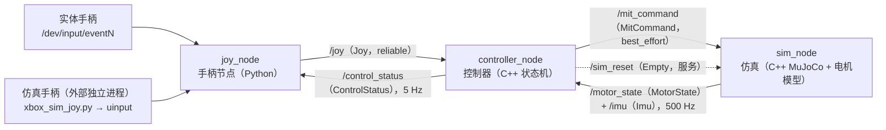

# 第四次培训：ROS 2（自定义消息 + 控制器/仿真/手柄三节点 + launch）

> 任务书：`ros2任务.pdf.md`（本机只读材料，四项：① 自定义消息 ② 把上次的 MuJoCo 站起/趴下仿真拆成控制器节点 + 仿真节点 ③ 手柄节点并与控制器互换消息 ④ launch 一键启动）。
>
> 本目录从 2026-10-05 起是**正式任务**目录；同期按教程走通 ROS 2 基础（工作空间/话题/参数/launch）的那份工作区已改名 [`../@20261005_ros2_example/`](../@20261005_ros2_example/README.md)，两者共用根 `pixi.toml` 的同一个 `ros2` 环境。
>
> 目录（TOC）：[做了什么](#做了什么) · [怎么跑](#怎么跑) · [接口](#接口) · [目录](#目录与文件) · [文档](#文档)
>
> **推进情况**（做到哪、下一步、阻滞项）在 [`docs/status.md`](docs/status.md)——本 README 只做入口，不记进度（[`../docs/conventions.md`](../docs/conventions.md) §2）。

## 做了什么

| 任务书 | 实现 | 入口 |
|---|---|---|
| ① 自定义消息类型 | 一个包里三个消息：`MitCommand`（控制器 → 仿真）、`MotorState`（仿真 → 控制器）、`ControlStatus`（控制器 → 手柄，回程） | [`ws/src/quadruped_ros2/msg/`](ws/src/quadruped_ros2/msg/) |
| ② 两个节点：控制器（C++）+ 仿真 | `controller_node`（C++，状态机 + MIT 五参数）、`sim_node`（C++，MuJoCo 官方窗口 + 电机模型 + IMU） | [`ws/src/quadruped_ros2/src/`](ws/src/quadruped_ros2/src/) |
| ③ 手柄节点 + 互换消息 | `joy_node`（Python，读 `/dev/input` → `sensor_msgs/Joy`）订阅 `/control_status` 拿控制器回程；控制器认 A/B/X 三个键 | [`ws/src/quadruped_ros2/scripts/joy_node.py`](ws/src/quadruped_ros2/scripts/joy_node.py) |
| ④ launch 一键启动 | `bringup.launch.py`：一次起三个节点，参数（窗口/起点/手柄设备/增益）都能从命令行覆盖 | [`ws/src/quadruped_ros2/launch/bringup.launch.py`](ws/src/quadruped_ros2/launch/bringup.launch.py) |
| 仿真手柄（实体稀缺时的替代） | `sim_joy/xbox_sim_joy.py`：鼠标造一个**真的** xbox 协议设备（`/dev/uinput`），手柄节点分不出真假 | [`sim_joy/`](sim_joy/)、[`scripts/setup_joy_devices.sh`](scripts/setup_joy_devices.sh) |
| 不接手柄也能验收 | `scripts/check_headless.py`：按脚本发 `/joy`，跑完判定（起身高度/四足触地/两次一致/实时率），退出码 0/1；`scripts/check_joystick_device.py`：再往前一步，真造一个 uinput 设备让手柄节点认领 | [`scripts/check_headless.py`](scripts/check_headless.py)、[`scripts/check_joystick_device.py`](scripts/check_joystick_device.py) |

**控制程序不是重写的**：`controller_node` 的控制核心移植自第三次培训子任务项一的"核心版" [`../@20260927_motor/cpp/essential_core/src/state.h`](../@20260927_motor/cpp/essential_core/src/state.h)（两状态机 + 一条 MIT 公式 + 低站姿），只去掉了"自己查 mjModel 下标"那一段——关节角现在随消息来。所以本任务的数字能与第三次培训的 sim 直接对照（实测末态 z 都是 **0.3836 m**）。

## 数据流

用 Mermaid 画（不依赖等宽字体，换字体/在网页上看都不会错位）：



控制周期 = 物理步长 = 2 ms（500 Hz）：仿真节点每步发一条 `/motor_state`，控制器每收到一条就回一条 `/mit_command`，电机侧（仿真节点）用它算力矩。接口细节、QoS 取舍、看门狗与实测数字见 [`docs/ros2-nodes.md`](docs/ros2-nodes.md)。

## 环境与依赖

- ROS 2 Humble 与 MuJoCo 都在根 [`pixi.toml`](../pixi.toml) 的**同一个环境**里（RoboStack **`robostack-humble` 稳定通道** + `conda-forge`；2026-10-06 起由"一个 MuJoCo 环境 + 一个 ros2 环境"合成单环境），所以命令一律 `pixi run …`、**不用再带 `-e ros2`**。环境里为此声明了 `mujoco = "3.12.*"`（仿真节点自己要链 MuJoCo C++ 与官方 Simulate 界面）、`glfw`、`evdev`（手柄节点与仿真手柄都要读写 `/dev/input`）与整套 `ros-humble-*`；依赖口径、从零重建与迁移记录见 [`docs/environment.md`](docs/environment.md)。
- 不依赖系统 `/opt/ros`，也不用 `sudo apt`；改环境只改 `pixi.toml` + `pixi lock`。为什么锁 MuJoCo 3.12、以及"要不要迁到 `robostack-humble` 稳定通道"的实测结论见 [`docs/environment.md`](docs/environment.md)。
- **不用手动 source**：仓库根的 [`scripts/activate_ros2_workspaces.sh`](../scripts/activate_ros2_workspaces.sh) 在激活 `ros2` 环境时自动发现并 source 所有已构建工作空间的 `install/setup.sh`，所以 `pixi run ros2 launch …` 直接可用；交互式长会话用 `pixi shell`。三种用法（一次性命令 / `pixi shell` / 官方手动 source）的取舍见 [`../@20261005_ros2_example/docs/pixi-ros2.md`](../@20261005_ros2_example/docs/pixi-ros2.md) §2.2。
- 手柄侧需要**一次性**特权配置（写 `/dev/uinput`、读 `/dev/input/event*`）：[`scripts/setup_joy_devices.sh`](scripts/setup_joy_devices.sh)，原因与实测见 [`docs/joystick.md`](docs/joystick.md)。

## 怎么跑

命令都在**仓库根目录**执行（仓库只用一个环境，不必再带 `-e`）：

```bash
pixi run ros2-build                  # 编译仓库里所有 colcon 工作空间（自动发现，含本任务的 ws/）
pixi run ros2 launch quadruped_ros2 bringup.launch.py            # ④ 一键起三个节点（开 MuJoCo 窗口）
pixi run ros2 launch quadruped_ros2 bringup.launch.py viewer:=false joy:=false   # 无窗口、不起手柄
pixi run ros2 run quadruped_ros2 sim_node                        # 单起仿真节点（参数用 --ros-args -p 覆盖）
pixi run ros2 run quadruped_ros2 joy_node                        # 单起手柄节点
pixi run python @20261005_ros2/sim_joy/xbox_sim_joy.py           # 鼠标造一个仿真手柄（另一个终端）
pixi run python @20261005_ros2/scripts/check_headless.py         # 自检①：不接手柄，脚本发 /joy，跑完判定
pixi run python @20261005_ros2/scripts/check_joystick_device.py  # 自检②：真造 uinput 手柄，走设备层（先跑 sudo 脚本）
```

操作：仿真手柄（或真手柄）按 **A = 站立、B = 阻尼、X = 复位**；MuJoCo 窗口里空格暂停、鼠标拖动转视角、点右上角关窗即退出。

常用 ROS 2 命令（都在 `pixi run` 里敲，工作空间已由激活脚本自动 source）：

```bash
ros2 node list                                        # /sim_node /controller_node /joy_node
ros2 topic list -t                                    # 五条业务话题与它们的类型
ros2 topic echo /control_status                       # 控制器的模式/斜坡/倾角/指令条数（低频）
ros2 topic echo /motor_state --once                   # 电机反馈（500 Hz，加 --once 只看一条）
ros2 topic hz /motor_state                            # 实测 499.98 Hz
ros2 interface show quadruped_ros2/msg/MitCommand     # 自定义消息长什么样
ros2 service call /sim_reset std_srvs/srv/Empty {}    # 不开手柄也能复位
```

## 接口

| 话题 | 类型 | 方向 | QoS | 频率 |
|---|---|---|---|---|
| `/mit_command` | `quadruped_ros2/msg/MitCommand` | 控制器 → 仿真 | best_effort / depth 1 | 500 Hz |
| `/motor_state` | `quadruped_ros2/msg/MotorState` | 仿真 → 控制器 | best_effort / depth 1 | 500 Hz |
| `/imu` | `sensor_msgs/msg/Imu` | 仿真 → 控制器 | best_effort / depth 1 | 500 Hz |
| `/joy` | `sensor_msgs/msg/Joy` | 手柄 → 控制器 | reliable / depth 1 | 100 Hz |
| `/control_status` | `quadruped_ros2/msg/ControlStatus` | 控制器 → 手柄 | reliable / depth 1 | 5 Hz |
| `/sim_reset`（服务） | `std_srvs/srv/Empty` | 控制器 → 仿真 | — | 按 X 时 |

字段与设计理由（为什么控制器只发 MIT 五参数、为什么带 `sim_time`、`cur` 怎么折算）见 [`docs/ros2-nodes.md`](docs/ros2-nodes.md) §1。

**上面是节点之间的接口；人 / 外部程序与这个包的接口有三处**，全量清单在 [`docs/ros2-nodes.md`](docs/ros2-nodes.md) §1.2（每个节点的参数名、类型、默认值、以及"能不能从 launch 改"）：

| 入口 | 是什么 | 怎么用 |
|---|---|---|
| **节点参数** | 三个节点一共 **25 个**（仿真 9 / 控制器 9 / 手柄 7） | 运行时 `ros2 param set /controller_node kp 100`；单节点起时 `ros2 run … --ros-args -p kp:=100`；看现状 `ros2 param list /controller_node` |
| **launch 参数** | 其中"会随外部世界变、要现场整定"的 **16 个**（15 个直接对应节点参数，另 1 个 `joy` 是起不起手柄节点的开关）：场景/形态、整定增益、手柄与按键映射、倾角阈值 | `ros2 launch quadruped_ros2 bringup.launch.py kd_damp:=0.8 ramp:=2.0`；全部列出 `… bringup.launch.py --show-args` |
| **手柄设备** | `/dev/input/event*` 上的真实手柄，或 `sim_joy/xbox_sim_joy.py` 造的 uinput 设备（**不经过 ROS**） | 插上就能被认；认哪台由 `device` / `name` 参数决定，见 [`docs/joystick.md`](docs/joystick.md) §2 |

## 目录与文件

```text
@20261005_ros2/
├── README.md                     # 本文件（入口）
├── docs/
│   ├── ros2-nodes.md             # 三节点与消息接口：设计取舍、线程模型、实测、坑
│   ├── joystick.md               # 手柄链路：设备/权限/映射/三级测试路线、与主办者仓库对照
│   ├── environment.md            # 环境里有什么、MuJoCo 版本口径、从零重建、robostack 迁移记录
│   └── status.md                 # 推进情况（阶段状态、阻滞项、下一步、提交建议）
├── ws/                           # colcon 工作空间（一个包 quadruped_ros2）
│   └── src/quadruped_ros2/
│       ├── msg/                  # 三个自定义消息
│       ├── include/quadruped_ros2/  # control.hpp（状态机）/ motor.hpp（电机模型）/ attitude.hpp
│       ├── src/                  # controller_node.cpp / sim_node.cpp
│       ├── scripts/joy_node.py   # Python 手柄节点（install(PROGRAMS) 装成可执行文件）
│       ├── launch/bringup.launch.py
│       └── .clang-format         # 4 空格 + Allman + 100 列 + C++17（新任务起步格式）
├── models/ + scenes/             # 模型与平地场景（从 @20260927_motor 复制；模型加了 imu site 与传感器）
├── sim_joy/xbox_sim_joy.py       # 仿真手柄（外部独立进程，走 /dev/uinput，不是 ROS 节点）
├── scripts/                      # setup_joy_devices.sh / pub_joy_sequence.py
│                                 #  check_headless.py / check_joystick_device.py
│                                 #（激活环境用的 source 脚本在**仓库根** scripts/，是仓库级的）
└── output/log/                   # 自检脚本的日志（可重跑，不入库）
```

`models/meshes` 是指向 [`../@20260923_mujoco/assets/urdf/meshes/`](../@20260923_mujoco/assets/urdf/meshes/) 的目录软链接（34 MB 只存一份）；`ws/` 下的 `build/`、`install/`、`log/` 是 colcon 产物，已被根 [`.gitignore`](../.gitignore) 排除。

## 文档

| 文档 | 内容 |
|---|---|
| [`docs/ros2-nodes.md`](docs/ros2-nodes.md) | 消息设计取舍、控制周期与线程模型、看门狗、与上一版的移植对照、全部实测数字、ROS 2 命令与坑 |
| [`docs/joystick.md`](docs/joystick.md) | 手柄三个角色（实体/仿真/节点）、设备与权限、轴按钮映射表、测试路线、与主办者仓库 `controller_input.py` 的对照 |
| [`docs/environment.md`](docs/environment.md) | 环境里有什么、MuJoCo 版本口径、从零重建、稳定通道迁移记录 |
| [`docs/status.md`](docs/status.md) | 推进情况：阶段状态、阻滞项、下一步、提交建议 |
| [`../@20261005_ros2_example/docs/pixi-ros2.md`](../@20261005_ros2_example/docs/pixi-ros2.md) | Pixi 装 ROS 2 的可行性实验（版本对照、跨安装互通、三种装法）；本任务是它的下游 |

模型与只读资料来自 [`../@20260923_mujoco/`](../@20260923_mujoco/README.md)（URDF 转 MJCF，Apache-2.0 / BSD-3-Clause 来源说明见那里）；控制核心移植自 [`../@20260927_motor/cpp/essential_core/`](../@20260927_motor/cpp/essential_core/src/state.h)。
