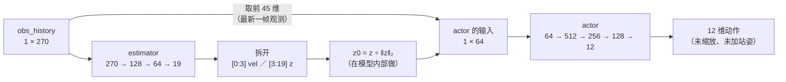

# best.pt 的模型架构：estimator + actor 两个子网络

> 本文回答"主办方给的这个 `.pt` 里到底是什么"：内部结构（§2、§3）、怎么被调用（§4）、与 `config.yaml` 的对应（§5）、部署时容易踩的三处（§6）、以及文件里看不出来的那部分（§7）；自己复核的命令与实测数字在 §8。
>
> 边界：[`porting.md`](porting.md) §5 讲的是**我们这一侧**怎么按大作业给的观测定义拼出 270 维输入、怎么把 12 维输出变成关节目标；本文只讲 `.pt` **内部**。状态与键位在 [`porting.md`](porting.md) §6，策略跑得怎么样的数字在 [`experiments.md`](experiments.md)。

## 1 它不是黑盒：归档里存着明文的前向代码

`best.pt` 是一个 zip 归档（TorchScript，991679 B），**里面带着导出时留下的模型源码**：`policy/code/__torch__/legged_gym/utils/helpers.py` 就是 `forward()` 的定义，`policy/code/__torch__/torch/nn/modules/{linear,container,activation}.py` 是各层的定义与形状。所以"这个网络长什么样"不用猜：打开归档就能读到，本文所有结论都来自这份源码加权重形状，并且有一条独立校验——**按结构手写一遍，与 `torch.jit` 的前向逐位相同（实测 `max|差| = 0.0`，§8 第 ④ 条）**。

归档里与权重有关的条目一共 14 个（`policy/data/0` … `policy/data/13`），按存储顺序依次是 `actor.0.weight`、`actor.0.bias`、`actor.2.weight`、`actor.2.bias`、`actor.4.weight`、`actor.4.bias`、`actor.6.weight`、`actor.6.bias`、`estimator.0.weight`、`estimator.0.bias`、`estimator.2.weight`、`estimator.2.bias`、`estimator.4.weight`、`estimator.4.bias`（每个条目与对应张量的原始字节**逐字节相同**，§8 第 ③b 条）；没有优化器状态、没有 RNN/卷积的缓冲、没有 BatchNorm 统计量。

再进一步：TorchScript 还把**编译前的训练侧源码逐行**记在 `policy/code/**/*.debug_pkl` 里。把 `policy/code/__torch__/legged_gym/utils/helpers.py.debug_pkl` 解出来就是未编译的版本（§8 第 ⑥ 条会打印它）：

```python
    def forward(self, obs_history):
        parts = self.estimator(obs_history)[:, 0:19]
        vel, z = parts[..., :3], parts[..., 3:]
        z = F.normalize(z, dim=-1, p=2.0)
        return self.actor(torch.cat((obs_history[:, 0:45], vel, z), dim=1))
```

同一份调试信息里还留着导出环境的痕迹：路径显示它来自 **HIMLoco 那份 legged_gym 工程**（`…/HIMLoco/legged_gym/legged_gym/utils/helpers.py`）、跑在一个 **Python 3.8 的 conda 环境**（名为 `himloco`）里；图上的源位置 `torch/nn/modules/activation.py:516:28` 与 **PyTorch 1.13.x** 的 `return F.elu(input, self.alpha, self.inplace)` 那一行对得上（`self.alpha` 正好在第 28 列）。文件里**没有存** torch 版本号，这是从调试信息反推的。

## 2 前向数据流：actor 的输入是"观测 + 估出来的量"



模型自己那句 `forward`（`policy/code/__torch__/legged_gym/utils/helpers.py`，逐字，只调了缩进）：

```python
class PolicyExporterHIM(Module):
  actor : ...Sequential
  estimator : ...Sequential
  def forward(self, obs_history: Tensor) -> Tensor:
    _1 = torch.slice((estimator).forward(obs_history, ))
    parts = torch.slice(_1, 1, 0, 19)
    vel = torch.slice(parts, -1, None, 3)
    z = torch.slice(parts, -1, 3)
    z0 = normalize(z, 2., -1, 9.9999999999999998e-13, None, )
    _2 = torch.slice(torch.slice(obs_history), 1, 0, 45)
    _3 = (actor).forward(torch.cat([_2, vel, z0], 1), )
    return _3
```

一句话：**actor 的 64 维输入 = 45 维"当前帧观测" + 3 维"估出来的速度" + 16 维归一化后的隐式表示**。那 19 维不是传感器读数，是 `estimator` 从 6 帧历史里算出来的中间量；两个子网络是一起导出、必须成对使用的。

名字与来历：这是 **HIMLoco**（Hybrid Internal Model，ICLR 2024）导出的策略。按论文的说法，它把地形、摩擦这类"外部状态"当成扰动，从机器人自己的响应里估计一个"混合内部表示"——其中**显式的部分是速度**、隐式的部分（本文里的 16 维 `z`）承担稳定性信息，再把它和当前观测一起交给 actor（论文 [arXiv:2312.11460](https://arxiv.org/abs/2312.11460)，代码库 [OpenRobotLab/HIMLoco](https://github.com/OpenRobotLab/HIMLoco)）。归档里 `legged_gym/utils/helpers.py` 这个路径也说明它是 legged_gym + rsl_rl 那套训练代码导出的（导出类名就叫 `PolicyExporterHIM`）。

## 3 逐层结构与参数量

层类型、形状与激活全部来自 §1 的归档源码，参数量由权重形状算出（§8 第 ③ 条）：

| 子网络 | 层 | 形状 | 激活 | 参数量 |
|---|---|---|---|---|
| `estimator` | `0` | 270 → 128 | ELU（α = 1.0） | 34688 |
| | `2` | 128 → 64 | ELU（α = 1.0） | 8256 |
| | `4` | 64 → 19 | 无 | 1235 |
| `actor` | `0` | 64 → 512 | ELU（α = 1.0） | 33280 |
| | `2` | 512 → 256 | ELU（α = 1.0） | 131328 |
| | `4` | 256 → 128 | ELU（α = 1.0） | 32896 |
| | `6` | 128 → 12 | 无 | 1548 |

两个子网络合计 **243231 个参数**，全部 float32 ⇒ 972924 B，与归档里 14 个 `policy/data/*` 的字节数之和逐字节相等（§8 第 ③ 条）。整个文件 991679 B 里，另外约 18 KiB 是 TorchScript 的代码、调试信息与元数据（`policy/code/**`、`data.pkl`、`version` = `4`、`constants.pkl`）。

几处容易看错的点：

- **只有 7 个全连接层**，没有 dropout、BatchNorm、卷积或循环层——所以 `train()` / `eval()` 两种模式没有区别，也没有隐藏状态需要在推理时维护。
- **激活是 ELU 而不是 ReLU**：把 §8 第 ④ 条的脚本里 `F.elu` 换成 `F.relu`，与 `torch.jit` 的前向差 **1.28**；全部去掉激活差 **32.5**——所以这条"逐位复现"确实钉住了激活函数（不是碰巧对上）。
- 上文的 `torch.slice` 参数是 `(维, 起点, 终点, 步长)`：`torch.slice(_1, 1, 0, 19)` = 在第 1 维上取 `[0, 19)`，`torch.slice(parts, -1, 3)` = 在最后一维上从下标 3 取到末尾。所以 19 维被切成"前 3 个 `vel`、后 16 个 `z`"，`torch.slice(obs_history, 1, 0, 45)` 取的是 270 维里的**最前面**那一帧。

## 4 在 rl_sar 这一侧怎么被调用

| 事 | 在哪 | 说明 |
|---|---|---|
| 加载 | `library/core/rl_sdk/rl_sdk.cpp:153`、`:154` | `policy/<robot_name>/<config_name>/<model_name>` 拼路径 + `torch::jit::load`；`robot_name` 是 ROS 参数，`config_name` 在 `policy/black/fsm.hpp:194` 里写死为 `himloco` |
| 历史缓冲 | `rl_sdk.cpp:150` | `observations_history` 非空时建 `ObservationBuffer(1, 45, 6)` |
| 每帧调用 | `src/rl_sim.cpp:336` | `model.forward({history_obs})`；入参是**一个 2 维**的 float32 张量 `[B, 270]`（不是序列、不是 list，也不能是 `[B, 6, 45]`——实测这三种写法都报形状错；`B` 任意），返回 `[B, 12]` |
| 周期 | `src/rl_sim.cpp:88` | 每 `dt × decimation` = 20 ms 一次（墙钟线程） |
| 输入侧 | `rl_sdk.cpp:105` | 拼好的 45 维先 `clamp` 到 ±`clip_obs`（100），**再**插入历史缓冲——截断在模型外 |
| 输出侧 | `rl_sdk.cpp:161`–`176` | 动作先 `clamp` 到 ±100，再 `× action_scale` + `default_dof_pos` = 关节目标 `q`；`dq = 0`，关节力矩由仿真侧的电机模型按 MIT 公式算 |

模型载入后 `training` 是 `true`（`rl_sar` 只 `torch::jit::load`、没调 `.eval()`，`rl_sdk.cpp:154`），但这里既没有 Dropout 也没有 BatchNorm，两种模式数值完全一样——写进文档是为了避免以后有人把它当成"必须补的调用"。

因为模型无状态，**同一个 270 维输入永远给出同一个 12 维输出**；这也正是 [`experiments.md`](experiments.md) 里"把 rl_sar 的拼法与独立重写的参考实现对照"能成立的前提。

## 5 与两份 yaml 的对应：模型只管网络，缩放和站姿都在外面

| 模型里的量 | 值 | 对应配置（`policy/black/himloco/config.yaml`） |
|---|---|---|
| 输入 270 | 45 × 6 | `num_observations: 45` × `observations_history` 的长度 6 |
| actor 直接吃的前 45 维 | 当前帧观测 | `observations` 六项的顺序，逐段算法见 [`porting.md`](porting.md) §5 |
| estimator 吃的 270 维 | 6 帧按"最新在前"拼 | `observations_history: [0,1,2,3,4,5]` + `ObservationBuffer::get_obs_vec`（`library/core/observation_buffer/observation_buffer.cpp:49`） |
| 输出 12 | 每条腿 3 个关节 | `num_of_dofs: 12`、`joint_names` 的顺序 FL / FR / RL / RR |
| **模型里没有** | — | `action_scale`、`default_dof_pos`、`rl_kp` / `rl_kd`、`torque_limits`、`clip_obs`、`clip_actions_*`、`joint_mapping`、`fixed_kp` / `fixed_kd`：这些全在 rl_sar 侧或电机侧生效 |

一个关键推论：`observations` 六项里**没有 `lin_vel`**（45 维里也不含速度），可 actor 要跟踪速度指令就必须知道自己当前的速度——这个"缺的那 3 维"正是 `estimator` 存在的理由。所以在我们的部署里，速度估计是否准，直接决定策略表现；而它是否准确只能靠"输入拼法与训练一致"来保证，不能靠模型本身检查出来（见 §7）。

45 维观测各段的物理量与缩放系数（`lin_vel_scale` / `ang_vel_scale` / `dof_pos_scale` / `dof_vel_scale` / `commands_scale`）见 [`porting.md`](porting.md) §3.1 与 §5；模型内部**不再做任何缩放**——它收到的就是缩放好的无量纲数。

## 6 部署时容易踩的三处（都实测过）

1. **6 帧的顺序不能反。** actor 取的是 `obs_history` 的前 45 维，也就是**最新一帧**；`observations_history: [0,1,2,3,4,5]` 配 `get_obs_vec` 拼出来的正是"最新在前"。实测：把同一份 6 帧倒序喂进去，输出变化 **2.02**（同一输入下输出本身的量级是 2.05，也就是说差异与输出同量级）。**这类错误不会报错、也不会崩**，只会让策略行为变样——所以历史顺序要当成接口的一部分验收。
2. **270 维每一维都参与计算。** actor 只看前 45 维，但 `estimator` 看全部 270 维，而它的输出又进 actor。实测：只把第 45–269 维清零，输出变化 **0.965**。
3. **不要自己归一化 `z`、也不要在模型外补激活。** 16 维 `z` 的 L2 归一化在模型内部（`normalize(z, 2, -1, eps = 1e-12)`）。实测 `z` 的模长约 **267**、归一化后是 **1.0000**——量级差两个数量级，但部署端拿不到 `z`，唯一正确的做法就是"老实喂 270 维"，别在中间插自己的处理。

## 7 文件里看不出来的（别当成已知）

- **`vel` 的坐标系与缩放**：源码里变量名就叫 `vel`（3 维），论文说它是 HIM 的"显式速度"，但训练代码不在这个文件里——"机体系还是世界系""有没有乘过 `lin_vel_scale`"从 `.pt` 里读不出来。能读出来的是**模型自己不做缩放**：`vel` 从 `estimator` 出来直接进 `aten::cat`，图里的浮点常数只有 `2.0`（L2 范数的 p）、`1e-12`（eps）和 `1.0`（ELU 的 α），既没有 `action_scale` 也没有任何 obs 缩放系数。所以训练时的缩放口径（如果有）已经学进权重里，部署端无从校对；我们能做的只是保证输入拼法与 `config.yaml` 一致（[`experiments.md`](experiments.md) 里参考实现与 ROS 链路对得上，是这条的外部旁证）。
- **训练时的观测噪声、延迟、地形与随机化**：都不在文件里，它们是训练配置而不是网络结构。
- **参数量不等于性能**：24 万参数对 12 维输出不算小，但结构说明不了策略好坏；速度跟踪、抗扰与失效边界在 [`experiments.md`](experiments.md)。
- 归档里的 `policy/code/**` 是 TorchScript 反序列化的产物，**不是**训练源码；它只包含前向需要的那些模块（`Linear` / `ELU` / `Sequential` / `normalize`）。训练侧的源码只在 `*.debug_pkl` 里留了编译过的那几行（§1）。

## 8 自己复核（从仓库根执行）

```bash
P=@20261007_assignment/ws/src/rl_sar/policy/black/himloco/best.pt

# ① 归档里有什么（模型的 forward 源码就在 policy/code/ 下）
pixi run python -c "import zipfile,sys; [print(f'{i.file_size:9d}  {i.filename}') for i in zipfile.ZipFile(sys.argv[1]).infolist()]" $P

# ② 读模型自己的 forward 定义
pixi run python -c "import zipfile,sys; print(zipfile.ZipFile(sys.argv[1]).read('policy/code/__torch__/legged_gym/utils/helpers.py').decode())" $P

# ③ 逐层形状、参数量，以及归档 14 个权重条目与 14 个张量的字节数是否一一对上
pixi run python -c "
import sys, zipfile, torch
m = torch.jit.load(sys.argv[1]).eval()
t = sorted(v.numel() * v.element_size() for v in m.state_dict().values())
d = sorted(i.file_size for i in zipfile.ZipFile(sys.argv[1]).infolist() if i.filename.startswith('policy/data/') and i.filename != 'policy/data.pkl')
for n, p in m.named_parameters(): print(f'{n:26s} {tuple(p.shape)}')
print('参数总数', sum(p.numel() for p in m.parameters()), ' 权重字节', sum(t), ' 归档条目字节', sum(d), ' 多重集相等', t == d)
" $P

# ③b 归档条目与张量的一一对应（逐字节比对，不是只看大小）
pixi run python - <<'PY'
import zipfile, torch
P = "@20261007_assignment/ws/src/rl_sar/policy/black/himloco/best.pt"
z = zipfile.ZipFile(P)
m = torch.jit.load(P).eval()
blobs = {k: v.detach().contiguous().numpy().tobytes() for k, v in m.state_dict().items()}
for i in range(14):
    raw = z.read(f"policy/data/{i}")
    print(f"data/{i:<2} {len(raw):7d} B -> {next(k for k, b in blobs.items() if b == raw)}")
PY

# ④ 按结构手写一遍，与 torch.jit 的前向对照（0.0 = 结构与激活都钉住了）
pixi run python - <<'PY'
import torch, torch.nn.functional as F
m = torch.jit.load("@20261007_assignment/ws/src/rl_sar/policy/black/himloco/best.pt").eval()
torch.manual_seed(0)   # 本文的数字都取自这个种子
sd = m.state_dict()
lin = lambda x, k: F.linear(x, sd[k + ".weight"], sd[k + ".bias"])
def manual(x):
    h = F.elu(lin(x, "estimator.0")); h = F.elu(lin(h, "estimator.2")); e = lin(h, "estimator.4")
    vel, z = e[:, :3], e[:, 3:19]
    z0 = z / torch.clamp_min(z.norm(2, dim=-1, keepdim=True), 1e-12)
    a = F.elu(lin(torch.cat([x[:, :45], vel, z0], 1), "actor.0"))
    a = F.elu(lin(a, "actor.2")); a = F.elu(lin(a, "actor.4"))
    return lin(a, "actor.6")
x = torch.randn(1, 270)
with torch.no_grad():
    print("max|jit - 手写| =", float((m(x) - manual(x)).abs().max()))
PY

# ⑤ §6 的三条实测：历史顺序、270 维都参与、z 的模长
pixi run python - <<'PY'
import torch
m = torch.jit.load("@20261007_assignment/ws/src/rl_sar/policy/black/himloco/best.pt").eval()
torch.manual_seed(0)   # 与 ④ 同一个种子，数字可复现
x = torch.randn(1, 270)
with torch.no_grad():
    y = m(x)
    print("输出量级 max|y| =", float(y.abs().max()))
    print("倒序 6 帧后的输出变化   =", float((m(x.view(1, 6, 45).flip(1).reshape(1, 270)) - y).abs().max()))
    x2 = x.clone(); x2[:, 45:] = 0.0
    print("第 45-269 维清零后变化  =", float((m(x2) - y).abs().max()))
    e = m.estimator(x); z = e[:, 3:19]
    print("‖z‖₂ =", float(z.norm(2)), " ‖z0‖₂ =", float((z / z.norm(2, dim=-1, keepdim=True)).norm(2)))
PY

# ⑥ 训练侧源码（从调试信息里取）＋ 输入的维数与 batch
pixi run python - <<'PY'
import zipfile, re, torch
P = "@20261007_assignment/ws/src/rl_sar/policy/black/himloco/best.pt"
raw = zipfile.ZipFile(P).read("policy/code/__torch__/legged_gym/utils/helpers.py.debug_pkl")
for s in re.findall(rb"[\x20-\x7e]{6,}", raw):
    if any(k in s for k in (b"def forward", b"estimator(", b"vel, z", b"normalize", b"return self.actor")):
        print(s.decode())
m = torch.jit.load(P)
for shape in [(1, 270), (3, 270), (1, 6, 45), (1, 45, 6), (270,)]:
    try:
        with torch.no_grad(): y = m(torch.zeros(*shape))
        print("OK  ", shape, "->", tuple(y.shape))
    except Exception as e:
        print("FAIL", shape, "->", str(e).splitlines()[-1][:60])
PY
```

实测输出（2026-10-09，本机 `pixi run` 环境）：

| 检查（§8 的第几条命令） | 结果 |
|---|---|
| ③ 参数总数 / 权重字节 / 归档条目字节 / 多重集相等 | `243231` / `972924` / `972924` / `True` |
| ③b `policy/data/0…13` 与 14 个张量的逐字节比对 | 全部一一对应（`actor.0.weight` … `estimator.4.bias`，按存储顺序，无歧义） |
| ④ `max\|jit − 手写\|`（ELU） | **0.0** |
| ④ 同上但把 `F.elu` 换成 `F.relu` | 1.28 |
| ④ 同上但去掉全部激活 | 32.5 |
| ⑤ 把 6 帧历史倒序后的输出变化 | 2.02 |
| ⑤ 把第 45–269 维清零后的输出变化 | 0.965 |
| ⑤ `‖z‖₂` / `‖z0‖₂` | 266.65 / 1.0000 |
| ⑥ 输入维数 | `(1,270)` `(3,270)` 通过；`(1,6,45)` `(1,45,6)` `(270,)` 报形状错 |

## 9 一句话总结

`best.pt` = **HIMLoco 的 `estimator`（270 → 19：3 维速度 + 16 维隐式表示）＋ `actor`（64 → 12）**，一共 243231 个 float32 参数；用的时候把"6 帧、最新在前、已按 config 缩放过的 270 维观测"喂进去，拿到 12 维未缩放动作，剩下的截断、缩放与加站姿都在 rl_sar 侧完成。
