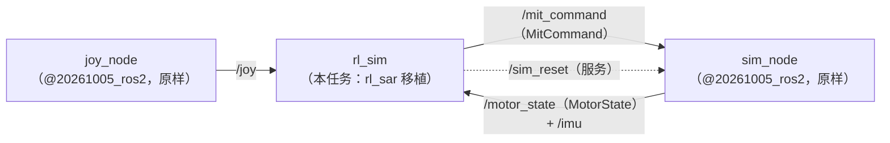
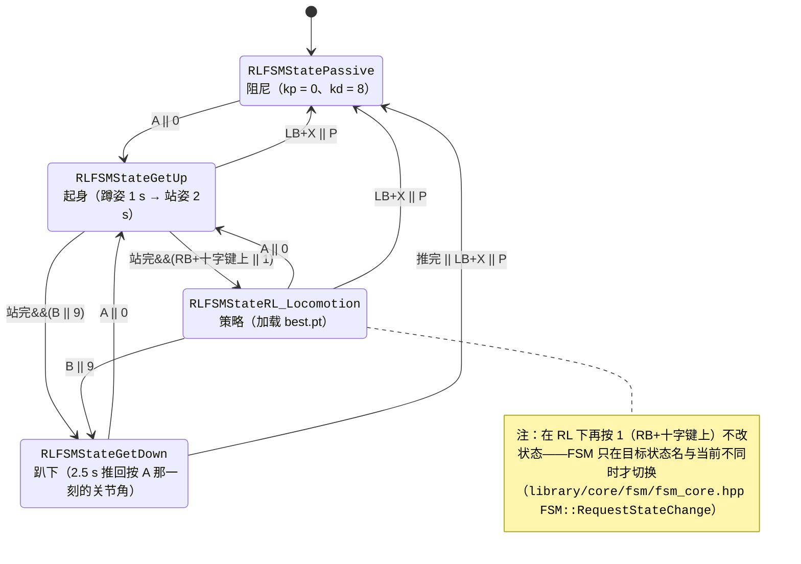

# 移植说明：把 rl_sar 接到上次写的仿真节点上

本文回答四个问题：rl_sar 在系统里替换的是哪一层（§1）、从上游拿了什么、改了什么（§2、§3）、它和仿真节点之间怎么接（§4、§5、§6），以及上游有哪些不足、为什么保留原样（§7）。实验数字都在 [`experiments.md`](experiments.md)。

## 1. rl_sar 的生态位：替换控制器节点这一层

上次（`@20261005_ros2`）的系统是三个节点：手柄节点 → 控制器节点 ⇄ 仿真节点。rl_sar 正好占**控制器节点**这一格：它订阅关节反馈与 IMU，输出 MIT 五参数（kp、kd、q、dq、tau），力矩仍由仿真节点里的电机模型算——分工与上次完全一样，所以**仿真节点和手柄节点一行没改**，只把 `controller_node` 换成了 `rl_sim`。



rl_sar 内部分三层，移植只动后两层：

| 层 | 位置（`ws/src/rl_sar/`） | 作用 | 本任务 |
|---|---|---|---|
| 框架 | `library/core/`（`rl_sdk`、`observation_buffer`、`fsm_core`、`loop`） | 拼观测、维护历史帧、推理、把动作换算成关节目标、读 yaml、调度状态机 | **逐字复制**，一字未改 |
| 机器人 | `policy/black/`（`base.yaml`、`himloco/config.yaml`、`best.pt`、`fsm.hpp`） | 这台狗的参数、策略与状态机 | 新写（照上游 go2 的模板） |
| 通信 | `src/rl_sim.cpp`、`include/rl_sim.hpp` | `RL` 的子类：实现 `GetState` / `SetCommand`，接 ROS 话题 | 改写上游的 Gazebo 版，接我们的话题 |

## 2. 文件清单：逐字复制 / 改写 / 新写

上游是 `fan-ziqi/rl_sar` 的 commit `e5c2f41`（2025-07-25，`main` 分支），许可证 Apache-2.0（[`../ws/src/rl_sar/LICENSE`](../ws/src/rl_sar/LICENSE)）。文件头口径（2026-10-10 起）：**改写过的文件**保留上游的 `Copyright` + `SPDX` 两行，并加一行 `Modified for @20261007_assignment from rl_sar e5c2f41 <上游路径>` 指向本节的清单——这是 Apache-2.0 第 4 条要求的"显著的修改声明"；**逐字复制**的 `library/core/**` 保持上游原样；**新写**的文件不带上游声明（与本仓既有新文件一致，许可由包内 `LICENSE` 覆盖）。**改动摘要只维护在下表**，文件头不再重复。

| 文件 | 来源 | 状态 | 改了什么 |
|---|---|---|---|
| `library/core/**`（6 个文件） | 同路径 | 逐字复制 | — |
| `LICENSE` | 仓库根 | 逐字复制 | — |
| `src/rl_sim.cpp` | `src/rl_sim.cpp` | 改写（删 333 行、加 62 行） | 见下面 7 条 |
| `include/rl_sim.hpp` | `include/rl_sim.hpp` | 改写（删 74 行、加 19 行） | 成员换成我们的消息类型；删 ROS 1 / Gazebo / 画图 |
| `policy/fsm.hpp` | `policy/fsm.hpp` | 改写 | 只注册 `black` 一个机器人 |
| `policy/black/fsm.hpp` | `policy/go2/fsm.hpp` | 改写 | 改名 go2 → black（namespace、factory、头文件保护宏）；起身前的蹲姿换成 black 的（§6.2）；旋钮改从 `base.yaml` 读、RL 状态读局部副本、状态行移走（下面第 9–11 条）。**状态、转移与斜坡结构本身与 go2 相同** |
| `policy/black/knobs.hpp` | — | 新写 | 四个部署旋钮（`kd_passive`、三段斜坡周期数）从 `base.yaml` 读，加两份 yaml 的 7 个同名字段自检；`fsm.hpp` 只调用它 |
| `policy/black/base.yaml`、`himloco/config.yaml` | 照 go2 的模板 | 新写 | 字段来源见 §3 |
| `policy/black/himloco/best.pt` | 大作业附件 | 原样 | md5 `7af7bab2cc1cb559000551f2637e0649`，与主办方分支里 `black/himloco/best.pt` 相同 |
| `CMakeLists.txt`、`package.xml` | — | 新写 | 上游 344 行大多是 ROS 1 与实机 SDK；这里只编 `rl_sim` 一个目标 |
| `launch/rl_sim.launch.py` | — | 新写 | 起 sim_node + joy_node + rl_sim |
| `.clang-format` | — | 新写 | `DisableFormat: true`：不许重排上游代码，否则 diff 会被格式变动淹没 |

`src/rl_sim.cpp` 的 7 处改动：

1. `robot_name` 改成本节点自己的参数（默认 `black`）。上游要另起一个 `/param_node` 来问，启动时会一直等它。
2. 删掉 `StartJointController()`。上游在启动时 fork 一个 `ros2 run controller_manager spawner`，失败就抛异常；我们没有 ros2_control。
3. 状态输入改成 `/motor_state`（`quadruped_ros2/MotorState`）+ `/imu`，**QoS 改成 best_effort**（§4 的坑）。
4. 指令输出改成 `/mit_command`（`quadruped_ros2/MitCommand`），字段一一对应，`dq` 对应我们的 `w`。
5. 复位从 `/reset_world` 改成我们的 `/sim_reset`；删掉 Gazebo 的暂停 / 继续（Enter / RB+X），我们的仿真在窗口里按空格暂停。
6. `JoyCallback` 加一处长度检查，摇杆满偏对应的速度改成参数 `joy_command_scale`（§6.1）。
7. 补 `#include <torch/utils.h>`：libtorch 2.12 的 `torch/script.h` 不再带出 `torch::set_num_threads`（见 [`../../docs/pitfalls/environment.md`](../../docs/pitfalls/environment.md)「libtorch / pytorch」一节）。

另外删掉了 ROS 1 分支与 matplotlib 画图（`PLOT`，需要 Python 开发头与 numpy）。控制流程——两条墙钟线程 + 状态机——**一行没改**。

后续按 `status.md` 的阶段清单又改了四处（都在本包自己的文件里，`library/core/**` 仍未动一行）：

8. **不再 push `output_dof_tau_queue`**（S1/P1-b）：上游从 `src/rl_sim.cpp` 与 5 个 `rl_real_*.cpp` push、但没有任何 FSM pop，队列无界 → 纯泄漏；本移植不用前馈 `tau`（fsm 里恒 0），所以删掉那次 push。
9. **RL 状态读局部副本**（S1/P2-c）：`policy/black/fsm.hpp` 的 RL 状态本来就 `try_pop` 出 `_output_dof_pos`/`_output_dof_vel`，却去读成员 `rl.output_dof_pos`；现在改读副本，pos/vel 保证同帧、也没有 Tensor 句柄竞争。
10. **状态行改成节点参数**（S1/P1-a）：原来 RL 状态每个控制周期（200 Hz）用 `\r` 打一行 `RL Controller x:…`；现在由 `rl_sim` 的 ROS 参数 `status_period_ms`（默认 0 = 关）节流，打印移到 `RL_Sim::RobotControl()`。
11. **四个部署旋钮进 `base.yaml` + 进 RL 前自检**（S2/P1-a、P2-e）：`kd_passive`（默认 8.0）、`getup_pre_cycles`（200）、`getup_cycles`（400）、`getdown_cycles`（500）——上游把前三个值写死在 `policy/go2/fsm.hpp` 的斜坡里；现在由**新写的** [`policy/black/knobs.hpp`](../ws/src/rl_sar/policy/black/knobs.hpp) 读 `base.yaml`（缺键/缺文件就用默认值并告警）。同时在进 Passive 与每次进 RL 时比对 `base.yaml` 与 `himloco/config.yaml` 的 7 个同名字段，不一致就 WARN（[`../../docs/learn/rl-sar.md`](../../docs/learn/rl-sar.md) §3）。**这段机制刻意不写在 `fsm.hpp` 里**：`fsm.hpp` 是与上游 `policy/go2/fsm.hpp` 对照的文件，抽出后它相对上游只剩调用点，机制本身作为一个新文件单独记在这里。

和上游逐行对照（先把上游 clone 到临时目录）：

```bash
git clone https://github.com/fan-ziqi/rl_sar.git /tmp/rl_sar_upstream && git -C /tmp/rl_sar_upstream checkout e5c2f41
U=/tmp/rl_sar_upstream/src/rl_sar; P=@20261007_assignment/ws/src/rl_sar   # 从仓库根执行
diff -u $U/src/rl_sim.cpp $P/src/rl_sim.cpp
diff -u $U/policy/go2/fsm.hpp $P/policy/black/fsm.hpp
diff -r $U/library/core $P/library/core | grep -v -E 'thirdparty|matplotlibcpp'   # 框架层：应只报上游独有的目录
```

## 3. 配置字段的来源

**本仓另外加了四个 `base.yaml` 专属键**（上游没有，值以前写死在 `policy/black/fsm.hpp`）：`kd_passive: 8.0`（Passive 的 kd）、`getup_pre_cycles: 200` / `getup_cycles: 400` / `getdown_cycles: 500`（三段斜坡的控制周期数）。它们只被 [`policy/black/knobs.hpp`](../ws/src/rl_sar/policy/black/knobs.hpp) 读、由 `fsm.hpp` 调用，不进 `RL` 的参数结构，所以也不受「7 个同名字段」的约束。

`ReadYamlBase()` / `ReadYamlRL()`（`library/core/rl_sdk/rl_sdk.cpp:360`、`:388`）缺任何一个字段都会抛异常，而大作业给的 `config.yaml` 只有一部分，所以要补。来源分三类：

先说明这两份 yaml 的分工：`base.yaml` 在**节点构造时**读（`dt`/`decimation`/关节表/`fixed_kp` 等，进 RL 之前就要用），`himloco/config.yaml` 在**每次进 RL** 时读；两边有 **7 个同名字段**（`default_dof_pos`、`fixed_kp`、`fixed_kd`、`joint_mapping`、`num_of_dofs`、`torque_limits`、`wheel_indices`），进 RL 时 config 的那份会**覆盖** base 的——所以这 7 项必须逐项相同，不一致不会报错、只会"分时刻生效"（逐一后果与两处真实实例列在 [`../../docs/learn/rl-sar.md`](../../docs/learn/rl-sar.md) §3；本任务打算加的护栏见 [`status.md`](status.md) P2-e。**black 这套数的来历，以及与 go2 等机型的逐项对照见同文 §9**——大作业给的 `config.yaml` 是主办方 black 策略配置的子集，缺的字段从主办方分支补，三处独立文件互证）：

| 字段 | 值 | 来源 |
|---|---|---|
| `observations`、`observations_history`、各 `*_scale`、`action_scale`、`rl_kp`、`rl_kd`、`torque_limits`、`default_dof_pos`、`joint_names` | 大作业给定 | 大作业 `config.yaml` |
| `dt`、`decimation` | 0.005、4（策略 50 Hz） | 大作业资料中没给；取主办方 rl_sar 分支（只读材料 `rl_sar-black-W`）`policy/black/base.yaml`，也是 legged_gym 的默认 |
| `fixed_kp`、`fixed_kd`（起身 / 趴下用） | 80、3 | 同上；恰好也是上次控制器（`@20261005_ros2`）的 kp / kd |
| `clip_obs`、`clip_actions_*` | 100、±100 | 同上 |
| `model_name`、`num_of_dofs`、`wheel_indices` | `best.pt`、12、`[]` | 显然值 |
| `joint_mapping` | `[0, 1, 2, `<br/>`  3, 4, 5,  `<br/>` 9, 10,11,`<br/>` 6, 7, 8 ]` | 本仓库仿真的执行器顺序选定 FL/FR/RR/RL，策略是 FL/FR/RL/RR。主办方分支是 `[3,4,5, 0,1,2,…]`，不应照抄 |

`joint_mapping[i]` 的含义是"策略第 i 个关节在仿真消息里的下标"：`GetState` 用它读（`src/rl_sim.cpp:128`），`SetCommand` 用它写（`src/rl_sim.cpp:138`）。`base.yaml` 与 `config.yaml` 里各有一份，`ReadYamlRL` 会用后者覆盖前者，所以两份必须相同。

关节符号已经核对过：我们模型的关节限位与 `default_dof_pos` 的符号一致（左腿大腿 +0.80 / 小腿 −1.53，右腿相反），基座 x 朝前、y 朝左，与训练约定相同。

### 3.1 各字段的单位

两份 yaml 里物理量字段的单位（12 维数组都是**策略顺序** FL / FR / RL / RR × hip / thigh / calf；这些名字来自上游 rl_sar / legged_gym，不带单位后缀，单位按这张表）：

| 字段 | 物理量 | 单位 |
|---|---|---|
| `dt` | 控制环周期 | s |
| `decimation` | 每几个控制周期推一次策略（策略周期 = `dt` × `decimation` = 20 ms） | 控制周期数（无量纲） |
| `default_dof_pos` | 12 个关节的站姿角 | rad |
| `action_scale` | 策略输出 1 个单位对应的关节角增量 | rad |
| `rl_kp`、`fixed_kp` | MIT 公式 τ = kp·(q_des − q) + kd·(w_des − q̇) 里的位置刚度 | N·m/rad（关节侧，不是转子侧；见 [`MitCommand.msg`](../../@20261005_ros2/ws/src/quadruped_ros2/msg/MitCommand.msg) 的注释） |
| `rl_kd`、`fixed_kd` | 同上的速度阻尼 | N·m·s/rad |
| `torque_limits` | 关节力矩上限 | N·m |
| `lin_vel_scale`、`ang_vel_scale`、`dof_pos_scale`、`dof_vel_scale`、`commands_scale` | 把物理量缩放成**无量纲**网络输入的系数（观测 = 物理量 × 系数） | 无量纲（数值上是"每物理单位"，如 `lin_vel_scale: 2.0` 作用在 m/s 上） |
| `clip_obs`、`clip_actions_lower`、`clip_actions_upper` | 观测 / 动作的截断阈值 | 无量纲 |
| `observations`、`observations_history`、`num_observations`、`num_of_dofs`、`wheel_indices`、`joint_names`、`joint_mapping`、`model_name`、`joint_controller_names` | 结构、名字、映射 | 非物理量 |

观测里各物理量的单位见 §5 的表。字段之外，代码里的连续量一律是 SI（米 / 秒 / 弧度 / N·m 系），名称里不带单位后缀是常态；少数非 SI 的量靠名字标注：`tilt_warn_deg` 与 `quadruped::attitude::TiltDeg()`（度，见 [`../../@20261005_ros2/docs/ros2-nodes.md`](../../@20261005_ros2/docs/ros2-nodes.md) §1.2）、诊断脚本的 `--period-ms` / `--delay-ms`（毫秒）。

例外的例外是上游框架层逐字拷来的 [`rl_sdk.cpp:228`](../ws/src/rl_sar/library/core/rl_sdk/rl_sdk.cpp) 的 `AttitudeProtect()`：阈值按度用（内部 `rad2deg`），名字却没带后缀；本移植里没人调用它（相关的 `TorqueProtect` 调用也被注释掉了，[`rl_sim.cpp:315`](../ws/src/rl_sar/src/rl_sim.cpp)）。

## 4. 接口对照

| 方向 | 上游 rl_sar（ROS 2 / Gazebo 版） | 本仓库 | 改法 |
|---|---|---|---|
| 状态入 | `robot_joint_controller/state`（`robot_msgs/RobotState`，float32，reliable） | `/motor_state`（`MotorState`，float64[12]，best_effort） | 换消息类型；按 `joint_mapping` 取下标 |
| IMU 入 | `/imu`（`sensor_msgs/Imu`，**reliable**） | `/imu`（同类型、同语义，best_effort） | **只改 QoS** |
| 手柄入 | `/joy`（摇杆上 / 左为正、十字键上 / 右为正） | `/joy`（同一约定，见 §6.1） | 只加长度检查 |
| 指令出 | `robot_joint_controller/command`（`RobotCommand`） | `/mit_command`（`MitCommand`，kp/kd/q/w/tau） | 换消息类型 |
| 复位 | `/reset_world`、`/pause_physics`、`/unpause_physics` | `/sim_reset` | 只接复位 |
| 参数 | 启动时向 `/param_node` 要 `robot_name` | 本节点参数 `robot_name`、`joy_command_scale`、`status_period_ms`（状态行周期 ms，0 = 关） | 改成 `declare_parameter` |

**话题名的前缀**：本节点是混用的——`/cmd_vel`、`/joy` 是绝对名，`imu`、`motor_state`、`mit_command`、`sim_reset` 是相对名（上游也混：`/cmd_vel`、`/joy`、`/imu` 绝对 + `<namespace>robot_joint_controller/*` 相对，我们只把 `imu` 改成相对、与仿真节点的相对名对齐）。默认都在 `/` 下，解析结果一样；但 `ros2 launch … --namespace /robot1` 时相对名跟着搬家、绝对名留在根，**静默对不上**。要统一建议全部用相对名（去掉 `cmd_vel`/`joy` 那两处的斜杠）。

**`/cmd_vel` 与导航模式**：这条话题全仓没有发布者——它是给外部/人用的（主办方那边由 `ros2_gateway.cpp` 收）。用之前要先按 `N`（键盘）或手柄 `X` 切到 navigation mode，`RunModel()` 才用 `/cmd_vel` 而不用摇杆：`pixi run ros2 topic pub -r 10 /cmd_vel geometry_msgs/msg/Twist "{linear: {x: 0.5}}"`；再按一次切回摇杆。本次任务不需要它，但按上游与主办方的做法保留（决定见 [`status.md`](status.md) P2-a）。

**QoS 的坑**：仿真节点的 `/motor_state` 与 `/imu` 是 best_effort 发的（500 Hz，只要最新）。ROS 2 里 **reliable 订阅者收不到 best_effort 发布者**（两端不匹配，不报错，只是一条也收不到），所以上游那种 `SystemDefaultsQoS()`（= reliable）订阅必须改成 best_effort（`src/rl_sim.cpp:22` 的 `LatestQoS()`，与仿真节点同一个定义）。反过来不受影响：reliable 发布、best_effort 订阅可以匹配，所以 `/joy` 不用改。

## 5. 一帧观测与动作是怎么算出来的

两条墙钟线程（`src/rl_sim.cpp:87-88`，计时在 `library/core/loop/loop.hpp:70-80`）：

* **控制线程**，每 5 ms（`dt`）一次 `RobotControl()`：`GetState()` 把最新收到的消息拷进 `robot_state` → 状态机 `Run()` 填 MIT 五参数 → `SetCommand()` 发 `/mit_command`。
* **策略线程**，每 20 ms（`dt × decimation`）一次 `RunModel()`：拼观测 → 推理 → 换算成关节目标，放进队列；控制线程在 RL 状态下从队列里取（`policy/black/fsm.hpp:216`）。这个队列是 TBB 的 `tbb::concurrent_queue`——它是什么、为什么用它见 [`../../docs/learn/tbb.md`](../../docs/learn/tbb.md)。

观测（45 维，顺序按 `config.yaml` 的 `observations`，拼接在 `library/core/rl_sdk/rl_sdk.cpp:26` 起的 `ComputeObservation()`）：

| 段 | 维数 | 算法 | 缩放 |
|---|---|---|---|
| `commands` | 3 | 摇杆或键盘给的 (vx, vy, wz) [m/s, m/s, rad/s] | × (2.0, 2.0, 0.25) |
| `ang_vel` | 3 | IMU 陀螺 [rad/s]（机体系；`ang_vel` 在 `InitRL` 里被换成 `ang_vel_body`） | × 0.25 |
| `gravity_vec` | 3 | 无量纲（单位向量）。(0, 0, −1) 用 IMU 四元数转到机体系（`QuatRotateInverse`，`rl_sdk.cpp:178`） | 不缩放 |
| `dof_pos` | 12 | 关节角 [rad] − `default_dof_pos` | × 1.0 |
| `dof_vel` | 12 | 关节角速度 [rad/s] | × 0.05 |
| `actions` | 12 | 上一帧的网络输出（无量纲，未缩放） | 不缩放 |

然后整体截到 ±`clip_obs`，插进 6 帧的历史缓冲，**最新一帧排在最前**（`observation_buffer.cpp:49` 的 `get_obs_vec`，`observations_history: [0..5]` 里 0 是最新）——这个顺序不能反：`best.pt` 是 HIMLoco，actor 只取 270 维输入的**前 45 维**当"当前帧"，其余交给速度估计器（`.pt` 内部就是 `estimator` + `actor` 两个子网络，逐层结构、参数量与"顺序反了会怎样"的实测见 [`policy-model.md`](policy-model.md)）。

动作（`rl_sdk.cpp:161` 的 `ComputeOutput()`）：网络输出 12 维 → 截到 ±100 → × `action_scale`（0.25）→ 加 `default_dof_pos` = 关节目标 `q`；`dq` = 0；kp / kd 取 `rl_kp` / `rl_kd`（40 / 1.2）。仿真节点按 τ = kp·(q − q_now) + kd·(0 − dq_now) 算力矩，再在 ±20 N·m 限幅（实验表明这个限幅够用，见 [`experiments.md`](experiments.md) §2）。

这套拼法有一个**独立实现**做对照：[`../scripts/agent_scripts/policy_reference.py`](../scripts/agent_scripts/policy_reference.py) 按大作业说明在 Python 里重写了一遍观测与动作，不经 ROS、按仿真时间锁步跑；两边在同一指令下的结果对得上（[`experiments.md`](experiments.md) §3）。

## 6. 手柄与状态机

### 6.1 手柄的轴与正负号

`/joy` 的接口（8 轴 / 12 按钮的顺序与正负号）定义在 [`../../@20261005_ros2/docs/joystick.md`](../../@20261005_ros2/docs/joystick.md) §3，本节只讲 rl_sar 这一侧。

上游 `JoyCallback` 按"摇杆上 / 左为正、十字键上 / 右为正"读：`control.x = axes[1]`（前后）、`control.y = axes[0]`（左右）、`control.yaw = axes[3]`（转向），十字键上是 `axes[7] > 0`。这正是主办者 `gamepads.yaml` 的约定，也是我们的 `joy_node` 从 2026-10-08 起输出的约定，所以**这个函数只加了一处长度检查**（消息短于 8 轴 / 11 键时直接返回，免得越界），再把写死的 1.5 换成参数 `joy_command_scale`。

过程记录：一开始 `joy_node` 照搬内核的正负号（摇杆上 / 左为负、十字键上为负），rl_sim 里曾对 axes 0、1、3、4、7 取反来适配；同时发现上次的仿真手柄十字键竖轴与实体手柄相反。理清后把正负号统一放进 `joy_node`（与主办者把它放在手柄节点里的做法一致），仿真手柄也改成内核的约定，rl_sim 里的取反就删掉了。细节与内核源码出处见上面那节。

### 6.2 按键与状态

状态机是上游 go2 的那套（`policy/black/fsm.hpp`），一共 **4 个状态**，上电在 `RLFSMStatePassive`（阻尼：kp = 0、kd = 8）。状态名、转移条件与按键（手柄 / 键盘）画在下面这张图里，箭头上的标签是"手柄键 / 键盘键"；只有 `GetUp` 出去的那两条带前提（"站完"= `running_percent == 1`），其余按下就切：



① 从 `GetUp` 进 `RL_Locomotion` 要求起身斜坡已经走完（`running_percent == 1`；`RLFSMStateGetUp::CheckChange()` 里那个 `if`），斜坡没走完时按 `1` / RB+十字键上不会有反应；\
② `R` / RB+Y 不进状态机——它在 `RobotControl()` 里直接调 `/sim_reset`（[`../ws/src/rl_sar/src/rl_sim.cpp:151`](../ws/src/rl_sar/src/rl_sim.cpp)），状态保持不变。

| 操作（手柄 / 键盘） | 从 | 到 | 做什么 |
|---|---|---|---|
| A / `0` | Passive、GetDown | GetUp | 1 s 推到蹲姿，再 2 s 推到站姿 `default_dof_pos`（kp 80 / kd 3） |
| RB + 十字键上 / `1` | GetUp（站完后） | RL_Locomotion | 加载 `best.pt`，按策略走；左摇杆前后 / 左右、右摇杆转向，满偏 = 1.5 m/s 或 rad/s |
| B / `9` | GetUp、RL_Locomotion | GetDown | 2.5 s 把关节推回**按 A 那一刻**的关节角，然后转 Passive |
| LB + X / `P` | 任意 | Passive | 立刻转阻尼 |
| RB + Y / `R` | 任意 | （不变） | 调 `/sim_reset` 复位仿真 |

蹲姿：go2 的四条腿同号，而 black 的右腿关节是镜像的（符号相反），且 go2 的小腿 −2.65 超出 black 的小腿限位 [−2.5, −0.85]。所以换成主办方分支里 black 的蹲姿 (0, ±1.40, ∓2.20)，四条腿都在我们模型的限位内。

**键位是哪来的**：上游 rl_sar 自带一张参考键位表（只读材料里那份 e5c2f41 副本的 `README.md` 第 197–227 行 `Gamepad and Keyboard Controls`，线上同表见 [README_CN.md 的「使用手柄或键盘控制」](https://github.com/fan-ziqi/rl_sar/blob/main/README_CN.md)）。我们这套就是它的 go2 那一组——含"RB + 十字键上 = 进 Locomotion"这个组合键——不是自己编的；大作业要求文档里没有任何键位规定。与主办方 black 分支逐条对照只有一处不同：趴下用上游的 `B`（主办方改成 `RB + B`）。上游表里其余那些（`LB+A`/`LB+B` 电机使能、`LB+RB` 急停、`Num2`–`Num8` 技能槽、`Enter`/`RB+X` Gazebo 暂停）本移植没有实现：我们没有 ros2_control 与 Gazebo，暂停在仿真窗口里按空格。

键盘：rl_sim 直接读终端的 stdin，所以只在 `ros2 run` 独占一个终端时有效（launch 里不行）。另外，`joy_node` 在跑时每 10 ms 发一条 `/joy`，会把键盘 WASD 累加的速度覆盖掉——用键盘控速度时要 `joy:=false`。

## 7. 上游的不足与处理

按"先做实验，不严重就保留原样"的原则处理（数字见 [`experiments.md`](experiments.md)）：

| 不足 | 位置 | 影响 | 处理 |
|---|---|---|---|
| 两条墙钟线程，与仿真时间无关 | `loop.hpp:70-80` | 实时运行时策略周期在仿真时间里是 20.8 ms（训练是 20 ms），速度 −4.5%；仿真比实时快 3 倍以上会摔 | **保留**；launch 固定 `realtime:=true`，见 experiments §4、§5 |
| 线程间共享数据不加锁 | 下表 | 实测不出问题，理论上最坏是同一条指令里混入相邻两帧的数据 | 前两处**保留**；第 3 处**改成读局部副本**（一行，见下文与 [`status.md`](status.md) P2-c） |

不加锁的共享数据有三处：

1. ROS 回调线程写 `motor_state_msg` / `imu_msg` / `control.x/y/yaw`（`src/rl_sim.cpp:212`、`:222`、`:277`），控制线程同时读。我们的消息是**定长数组**（`float64[12]`），赋值不会重新分配内存，最坏是读到"一半新、一半旧"的一帧，下个 5 ms 就被覆盖。
2. 控制线程写 `robot_state`（`src/rl_sim.cpp:206`），策略线程读（`:287`、`:296-298`）。`std::vector<double>` 大小不变，同上。
3. 策略线程给 `output_dof_pos` 重新赋值（`:301`），控制线程读同一个成员（`policy/black/fsm.hpp:222`）——它刚用 `try_pop` 取出了一份副本 `_output_dof_pos`（`:216`），却没有用。这是三处里唯一的 Tensor 句柄竞争：最坏情况是读到被释放的内存。但被替换掉的那个 Tensor 同时被队列或刚取出的副本持有引用，至少要再过一个 20 ms 周期才会释放，而控制线程读 12 个数只要几微秒，所以实际只会读到"新的或旧的那一帧"。

三处都是上游原样（第 3 处上游 `policy/go2/fsm.hpp:207-214` 也是「取出来却读成员」），我们一行没改；5 分钟连续行走（约 15000 次推理）的结果见 experiments §6。

**2026-10-09 的复查结论**：前两处**不值得修**——消息与 `robot_state` 都是定长、运行期从不重新分配，最坏只混入相邻一帧（差 2 ms），而修它们要么加锁、要么改成槽位拷贝，收益只是"形式上不再是数据竞争"（严格说它们都是 C++ 未定义行为，TSAN 会报）。第 3 处**建议修**：`fsm.hpp:222` 的 `rl.output_dof_pos[0][i]` 改成 `_output_dof_pos[0][i]`（`dq` 那处同理 `_output_dof_vel`）——它本来就已经 `try_pop` 出了一份副本，改完成本为零，而且保证 pos/vel 来自同一帧（现在的 `try_pop(pos) && try_pop(vel)` 是短路的，vel 为空时那帧 pos 会被丢掉）。真要再进一步，第 1 处可以照仿真节点对 `/mit_command` 的做法（`sim_node.cpp:312-321` 的 `cmd_mutex_` + `have_cmd_`）加一把小锁；另外若按 [`status.md`](status.md) P1-c 把控制改成在 `MotorStateCallback` 里跑，第 1 处会自然消失（回调与控制同一条执行器线程）。
