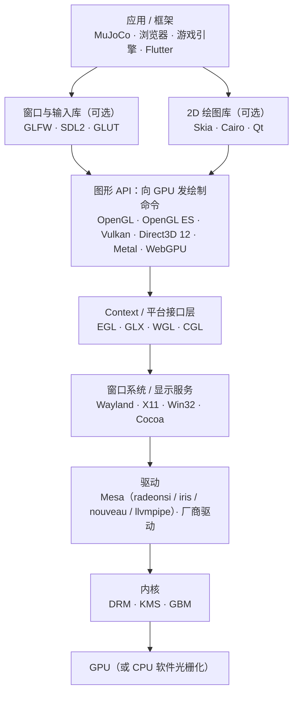
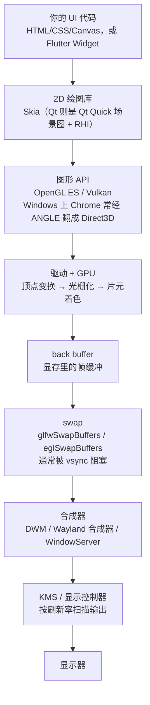
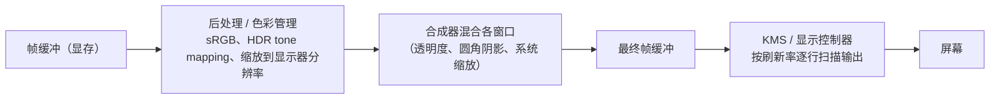
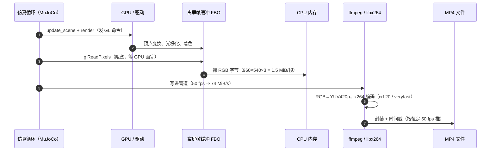

# 图形 / 渲染 / 视频 栈速查

> 目的：把" GPU 画图"这件事的各个名词放到一张分层图上，标出 **MuJoCo 在哪一层**。 相关文档：[`mujoco.md`](mujoco.md)（第 7 节讲 `MUJOCO_GL` 与渲染开销）、 [`../pitfalls/environment.md`](../pitfalls/environment.md)（本机的显卡与后端实测）、 任务记录 [`@20260923_mujoco/README.md`](../../@20260923_mujoco/README.md)、 上游仿真器结构研读 [`unitree-mujoco.md`](unitree-mujoco.md)；文档索引见 [`../../README.md`](../../README.md)。

---

## 1. 分层图



记住三条"同一层里的兄弟"，剩下的就好记了：

| 层 | 兄弟 | 平台 |
|---|---|---|
| 图形 API | OpenGL / Vulkan / Direct3D / Metal | 跨平台 / 跨平台 / Windows·Xbox / Apple |
| Context 接口 | **EGL** / GLX / WGL / CGL | 跨平台（含离屏）/ X11 / Windows / macOS |
| 窗口库 | GLFW / SDL2 / GLUT | 跨平台（都只建窗口和 context，自己不渲染） |

---

## 2. 各层的名字是什么意思

### 2.1 图形 API（"你写代码调的那一层"）

| 名字 | 全称 / 来历 | 干什么 |
|---|---|---|
| **OpenGL** | *Open Graphics Library*，1992 年由 SGI 的 IRIS GL 演化而来，现由 Khronos 维护 | 跨平台的 3D 图形 API。风格是"**状态机**"：设好状态、发绘制命令。桌面版最广为人知 |
| **OpenGL ES** | *OpenGL for **E**mbedded **S**ystems* | OpenGL 的嵌入式精简版（去掉老式即时模式等），手机 / 浏览器 / 嵌入式的事实标准。MuJoCo 的离屏渲染（`mjr_*` 那套）就走 GL / GLES |
| **Vulkan** | Khronos 2015 年发布，名字沿用 Vulcan/MoltenVK 的梗 | 下一代**显式** API：显存、同步、多线程都要自己管，换来做更少的驱动猜测和更高的性能。Android 现在默认它 |
| **Direct3D / DirectX** | **DirectX 是微软整套多媒体 API 家族的名字**（Direct3D 管 3D、DirectSound 管音频、DirectInput 管输入…），其中 **Direct3D 12** 是低层显式 API | Windows / Xbox 上的图形 API。说"DirectX"其实通常指 Direct3D |
| **Metal** | Apple 的 GPU API | macOS / iOS |
| **WebGL / WebGPU** | WebGL ≈ 浏览器里的 OpenGL ES；WebGPU 是浏览器里的新一代（对标 Vulkan/D3D12 的思路） | 网页里的 GPU 访问 |

### 2.2 2D 绘图库（"画形状/文字/图片"，本身不是 GPU API）

| 名字 | 是什么 |
|---|---|
| **Skia** | Google 的开源 **2D 图形库**（官方自称 *The 2D Graphics Library*），是 Chrome / ChromeOS / Android / Flutter 的图形引擎。它负责"把一个圆角矩形、一段文字、一张图片画出来"这种高层语义，**底下再走 OpenGL / Vulkan / Metal 或纯 CPU 软件光栅**。所以 Skia 和 DirectX 不在同一层：DirectX 是 API，Skia 是用 API 的库 |
| **Cairo / Qt** | 同类或更上层：Cairo 是 2D 矢量绘图库；Qt 是应用框架（内部有自己的 RHI 抽象层） |
| **ANGLE** | *Almost Native Graphics Layer Engine*（Google，Chromium 项目）。它是一个**翻译层**：把 OpenGL ES 调用翻译成目标平台已有的 API（Windows 上翻成 Direct3D，也可翻成 Vulkan / 桌面 GL / Metal）。Chrome 和 Firefox 在 Windows 上的 WebGL 默认就走它；它同时提供一份 **EGL 1.5 的实现**。附带的 shader 编译器还能把 GLSL 翻成 HLSL / SPIR-V 等 |

### 2.3 Context / 平台接口层（"怎么拿到一个可以画画的 context"）

| 名字 | 全称 | 干什么 |
|---|---|---|
| **EGL** | *Khronos Native Platform Graphics Interface*（EGL 1.2 起的规范名；之前叫 *OpenGL ES Native Platform Graphics Interface*；X.Org 术语表写作 *Embedded-System Graphics Library*） | 管理 GL context / surface 的创建、绑定与同步。**关键：它也能渲染到离屏 buffer**，所以没有显示器、没有窗口也能渲染（本仓库录像就靠这个） |
| **GLX / WGL / CGL** | GLX = *OpenGL Extension to the X Window System*；WGL = Windows 的 GL 接口；CGL = *Core OpenGL*（macOS） | 同一层的老接口，各自绑定自己的窗口系统 |
| **Vulkan 的对应物** | Vulkan 不用 EGL/GLX/WGL，**自带 surface/WSI**（Window System Integration）；但"从窗口拿到可绘制表面"那一步仍是平台相关代码 | |

### 2.4 窗口 / 输入库（"帮你建窗口、收键盘"）

| 名字 | 是什么 |
|---|---|
| **GLFW** | *Graphics Library Framework*：跨平台的窗口 + GL context + 输入库（Windows / macOS / Wayland / X11）。它的 FAQ 明确列了"**不是** OpenGL 的实现、**不渲染任何东西**"。MuJoCo 的 `launch_passive` 交互窗口就是它 |
| **SDL2 / GLUT** | 同类。SDL 更重（还管音频、事件循环）；GLUT 是上古 API，freeglut 是它的开源实现 |

**一个容易搞混的细节**：GLFW 在 Linux 上**自己就是用 EGL/GLX 建 context 的**——官方 FAQ 的 "What window system APIs does GLFW use?" 写着：

* Wayland → 输入用 Wayland，**context 用 EGL**；
* X11 → 输入用 Xlib，**context 用 GLX 或 EGL**；
* Windows → Win32 + **WGL 或 EGL**；macOS → Cocoa + NSOpenGL。

所以"GLFW 下面是 EGL"在 Wayland 上确实成立；但它们的关系是"**窗口库调用平台接口**"， 而 MuJoCo 的 `MUJOCO_GL` 只是在"自己直接选一条路拿 context"时给你二选一 —— `glfw`（让 GLFW 搞定一切）或 `egl` / `glx` / `osmesa`（自己走那条接口）。

### 2.5 驱动 / 内核 / 硬件

| 名字 | 是什么 |
|---|---|
| **Mesa** | Linux 上 OpenGL / **OpenGL ES** / Vulkan / EGL / OpenCL 的**开源实现**（不是驱动本身，而是"API 的软件实现 + 一堆厂商驱动"）。Intel 在 Linux 上只用 Mesa（`iris`/`crocus`/`i965`），AMD 官方用 Mesa（`radeonsi`/`radv`），NVIDIA 有社区反向工程驱动 `nouveau`/`nvk`。它还带**纯软件渲染**：`llvmpipe`（OpenGL）、`lavapipe`（Vulkan）、`OSMesa`（离屏） |
| **DRM / KMS / GBM** | Linux 内核的显示子系统：DRM = *Direct Rendering Manager*（显存/命令提交），KMS = *Kernel Mode Setting*（显示模式设置），GBM = *Generic Buffer Management*（缓冲分配，Wayland 合成器常用）。**Wayland 客户端就是通过 EGL + GBM 直接画进 framebuffer 的** |
| **厂商驱动** | NVIDIA/AMD 的闭源驱动等，实现了同样的 API，但直接和自家硬件对话 |

### 2.6 计算（不是"画图"，但常一起出现）

| 名字 | 是什么 |
|---|---|
| **CUDA / OpenCL / compute shader** | GPU 通用计算：CUDA 是 NVIDIA 专属；OpenCL 跨厂商；compute shader 是 Vulkan/D3D12/Metal 里顺带做计算的路子 |
| **JAX(XLA) / Warp** | MuJoCo 的 GPU 仿真支线：**MJX** 用 JAX（底层经 XLA 编到 CUDA），**MJWarp** 用 NVIDIA Warp。都需要较新的卡（本机 MX350 是 sm_61，两者都用不了） |

### 2.7 着色器与"最后一步：编码"

| 名字 | 是什么 |
|---|---|
| **GLSL / HLSL / MSL** | 写 shader 的语言：GLSL（GL/GLES 用）、HLSL（Direct3D 用）、MSL（Metal 用）。写法高度相似 |
| **SPIR-V** | Khronos 的 shader **中间字节码**：GLSL/HLSL 都能编成它，再交给 Vulkan 等消费 |
| **ffmpeg / libx264** | 跟上面整条渲染栈**无关**：它只是把 MuJoCo 渲染出来的 RGB 帧（每帧 1.5 MB 的裸数据）**编码**成 H.264 MP4。本仓库录像链路 = `Renderer` 出帧 → 管道给 ffmpeg → `libx264` 编码 |

---

## 3. 一个普通桌面窗口应用是怎么画出一帧的

以 **Electron（Chromium）** 或 **Flutter 桌面**为例：



四个常被忽略的点：

* ②～④ 里 CPU 只是「发命令」，真正画像素的是 GPU，而且是**异步**的（所以 `glReadPixels`/ swap 这类“要结果”的调用才特别贵）；
* ⑤ 的 swap 通常**阻塞到显示器刷新**（vsync，60/120 Hz）—— 这直接解释了为什么 MuJoCo 里 每步调 `viewer.sync()` 会把仿真钉在 10% 实时（见 [`mujoco.md` 第 7 节](mujoco.md)）；
* ⑥ 是**应用之外**的事：普通应用并不直接把像素送到屏幕（全屏独占例外），必须经过合成器；
* 窗口重绘是**事件驱动**的（鼠标、动画定时器、resize），不是“无条件每帧重画”。

三条常见技术栈的差别其实很小：

| 技术栈 | 2D / UI 层 | 图形 API | 窗口与输入 |
|---|---|---|---|
| Electron | Chromium 的 Blink + Skia | GL ES（Windows 上经 ANGLE→D3D）、Vulkan、Metal | 自带窗口层（Linux 上走 X11/Wayland） |
| Qt（Quick） | Qt Quick 场景图 + Qt RHI | OpenGL（默认）、Vulkan、Metal、D3D11/12 | Qt 自己的平台插件 |
| Flutter 桌面 | Skia（Widget → 图层 → 绘制） | OpenGL / Vulkan / Metal | Flutter engine 自建 |
| **MuJoCo viewer** | **没有**（只有 3D） | OpenGL | **GLFW** |

## 4. MuJoCo 渲染走的是同一条路吗？

**部分相同：** 从「图形 API → 驱动 → GPU → 帧缓冲」这一段完全一样（甚至用的还是更老的 OpenGL，不是 Vulkan）。**不同的在后面：帧给谁、什么时候给、要不要上屏。**

| | 普通窗口应用 | MuJoCo `Renderer`（本仓库录像） | MuJoCo `launch_passive` 窗口 |
|---|---|---|---|
| 谁驱动“画下一帧” | 事件循环 / 动画计时器（60~120 Hz） | **仿真循环**：每个 `mj_step` 后按需取帧（`capture()` 按 `data.time` 节流） | 同左，但每 N 步 `viewer.sync()` 才上屏 |
| 画到哪 | 窗口的 back buffer | **离屏 FBO**（尺寸由 `offwidth/offheight` 决定） | 窗口的 back buffer |
| 怎么“交付” | `swap` 给合成器 | **`glReadPixels` 回读到 CPU 内存** → 送 ffmpeg | `swap`（和普通应用一模一样） |
| 受 vsync 影响吗 | 是 | **否**（离屏没有刷新概念） | 是（所以 sync 要降频） |
| 需要窗口系统吗 | 需要 | **不需要**——EGL 就够了（无显示器也能跑） | 需要（GLFW） |

一句话：**MuJoCo 的离屏渲染是“给数据拍快照”，不是“给用户画界面”。** 它没有事件循环、 没有合成、没有脏区域重绘，所以比 UI 应用简单得多；一旦你把它接到 `launch_passive` 窗口， 它就又变回一个普通的 GLFW 窗口应用了（只是循环频率由 `timestep` 决定，可能是 500 Hz， 而屏幕还是 60 Hz）。

## 5. 光栅化之后还有哪些环节？

有，而且分两条完全不同的路。

### 5.1 上屏路径（每帧都要走一遍）



其中的关键机制：

* **双/三缓冲**：前台 buffer 正在被扫描输出时，你就得画到后台 buffer；
* **vsync**：swap 等到扫描到安全时刻才生效，否则画面会被撕成两半（tearing）；代价是帧率被钉在刷新率上；
* **合成器**：多窗口、透明度、圆角阴影、系统级缩放都在这一步完成（Windows DWM / Wayland compositor / macOS WindowServer）。

### 5.2 变成视频文件的路径（本仓库走的）

这是一条**有先后顺序**的流水线，所以用时序图更贴切（横轴是时间）：



**谁负责哪一段：**

| 环节 | 谁干的 | 跟 GPU 有关吗 |
|---|---|---|
| 渲染 / 光栅化 | MuJoCo + 驱动 + GPU | 是（可用 `MUJOCO_GL=osmesa` 改成 CPU 软光栅）|
| 回读 `glReadPixels` | MuJoCo Python 绑定 | 是（而且要等 GPU 完成）|
| 管道传输 + 编码 | 系统 ffmpeg + libx264 | **否，纯 CPU** |
| 封装 / 播放 | ffmpeg / 播放器 | 否 |

实测（960×540，本机 `MUJOCO_GL=egl` → **NVIDIA MX350**）：**渲染 + 回读 5.5 ms/帧**， 整条「渲染 + 回读 + 编码」**7.1 ms/帧** —— 其中编码与管道只占 **~1~2 ms**。 **大头是渲染，不是编码**（详见 [`mujoco.md` 第 7.2 节](mujoco.md)）。

## 6. MuJoCo 在这张图的哪里

| MuJoCo 的功能 | 落在哪一层 |
|---|---|
| **物理仿真本体** | **不在这张图上**：纯 CPU 计算（用 SIMD + 多线程），没有 GPU 版本 |
| 离屏渲染 `mujoco.Renderer` / `mjr_*` | 图形 API 层的 **OpenGL**（内部实现是 GL/GLES 那套） |
| 选"走哪条路拿 GL context" | **`MUJOCO_GL`**：`glfw` / `egl` / `glx` / `osmesa`（+ Windows/macOS 的 `wgl`/`cgl`）。见 [`mujoco.md` 第 7 节](mujoco.md) |
| `launch_passive` 交互窗口 | **GLFW**（+ 其背后的 EGL/GLX） |
| 录像成 MP4 | `Renderer` 出 RGB 帧 → **ffmpeg/libx264**（栈外） |
| GPU 加速仿真（MJX / MJWarp） | 计算层（**JAX / Warp**），不是渲染层 |
| `mujoco-simulate` GUI | MuJoCo 自带的 C++ 程序，同样走 GLFW + OpenGL |

一句话：**MuJoCo 本体是 CPU 的，GPU 只在"渲染"和"MJX/MJWarp"两条支线里出现**， 而渲染那条支线里，`MUJOCO_GL` 决定的是"**用谁把 GL context 交给我**"。

---

## 7. 容易混淆的几点

1. **DirectX ≠ Direct3D**：前者是家族（音频、输入都算），3D 渲染叫 Direct3D。
2. **Skia 不是 GPU API**：它是 2D 图形库，下面照样走 OpenGL/Vulkan/Metal。
3. **GLFW 不是图形 API**：它只建窗口和 context，渲染一行都不做。
4. **OpenGL 是"规范"，不是某个文件**：实现由驱动（Mesa / NVIDIA）提供；所以"OpenGL 版本"实际上是驱动支持的版本。
5. **EGL / GLX / WGL / CGL 是四胞胎**：同一层、四套窗口系统；Vulkan 把它们换成了自己的 WSI。
6. **ANGLE 是翻译层**：浏览器里写 GLES，Windows 上可能实际跑的是 Direct3D。
7. **"离屏渲染"不需要窗口**：EGL 可以只创建离屏 buffer —— 这是服务器/无显示器环境能出图的关键。
8. **视频编码不在渲染栈里**：MP4 是 ffmpeg/libx264 干的，跟 GPU 无关（本机实测：960×540 一帧编码约 1~2 ms，而渲染要 5.5 ms —— 大头是渲染）。
9. **光栅化 ≠ 看到画面**：中间还隔着回读/合成/扫描输出（上屏）或回读/编码/封装（存文件）， 见 §5；GPU 画完只是“像素在显存里”。
10. **vsync 不是“性能优化”**：它是防撕裂的同步机制，代价是把帧率钉在刷新率上；
    对仿真来说，这意味着“上屏”会反过来限制仿真速度（所以 `viewer.sync()` 要降频）。

## 8. 一块像素从物理到屏幕：本机实测链路（2026-10-06）

问题是"从物理仿真到 bitmap、再到 Wayland 缩放窗口，中间经历了几次像素数/密度转换"。本机（KDE/KWin + Wayland，eDP-1 面板原生 **1920×1080**）逐环实测：

| 环节 | 数值 | 怎么量的 |
|---|---|---|
| ① 物理状态 `mjData` | 米 / 弧度，**没有像素** | — |
| ② `mjv_updateScene` → `mjvScene` | 世界坐标的几何 + 相机，**仍然没有像素** | — |
| ③ `mjr_render(视口, scn, con)` | **唯一把几何变成像素的地方**；视口 = `glfwGetFramebufferSize` = **2560×1440** | 自检打印 + 截图尺寸 |
| ④ GL framebuffer → Wayland surface buffer | **1:1，同一个缓冲区**（GLFW 直接把 framebuffer 当 surface 的 buffer，没有拷贝/缩放） | 截图 = 2560×1440 |
| ⑤ 合成器（KWin）按输出缩放重采样 | 2560×1440 → 屏幕上 **1600×900 物理像素**，即输出缩放 **1920/1600 = 1.25×**（逻辑桌面 1536×864） | 造一只纯洋红窗口 + `spectacle -b -n -f` 截屏 + 数色块边界 |
| ⑥ 面板 | 1920×1080 扫描输出 | DRM `modes` |

**所以窗口路径上真正的"像素化"是两次**：③ 光栅化（几何 → 2560×1440 像素，**抗锯齿与否在这一步定型**）和 ⑤ 合成器重采样（2560×1440 → 1600×900，属于**降采样**，会顺带轻微平滑，但**抹不掉已经光栅化进图里的锯齿**）。窗口的逻辑尺寸（1280×720）只影响合成器的摆放，不影响我们的光栅化分辨率——分辨率完全由 framebuffer 决定，而 framebuffer 又由合成器的缩放决定（同一份代码在不同时刻量到过 1280×720 与 2560×1440 两种，所以 `viewer.hpp` 每帧重新读 `glfwGetFramebufferSize`）。

**另一条分支（视频 / 离屏截图）只经过一次像素化**：`world → mjFB_OFFSCREEN → mjr_render → mjr_readPixels → 文件`，尺寸与多重采样由模型字段 `mjVisual.quality.offwidth/offheight/offsamples` 决定，**不经过合成器**；要出 1080p 视频就把 `offwidth/offheight` 设成 1920×1080，与窗口大小无关。

### 8.1 抗锯齿：官方有、我们漏了，以及本机的坑

官方 `simulate/glfw_adapter.cc:53` 建窗时请求 `glfwWindowHint(GLFW_SAMPLES, 4)`；我们这套自建窗口（沿用 `@20260927_motor/cpp/src/viewer.h`）**一个采样都没请求**——放大看部件边缘就是明显锯齿。

补上后发现**本机 Mesa Intel UHD（ICL GT1）三条平台路径（wayland / x11 / auto）请求 4× 都只拿到 0×**（`glfwGetWindowAttrib(GLFW_SAMPLES)` 回读为 0），即窗口默认 framebuffer 根本开不出 MSAA。于是改走**离屏渲染 + 缩放 blit**：`mjr_resizeOffscreen(倍率×framebuffer)` → `mjr_setBuffer(mjFB_OFFSCREEN)` → `mjr_render` → `mjr_blitBuffer(src=离屏, dst=窗口)`（`mujoco.h:915` 明确写了"src/dst 尺寸不同且 `flg_depth==0` 时用 GL_LINEAR 插值"，缩回窗口正是靠它）→ 切回窗口画 HUD。

同一帧、同相机的实测（2560×1440 输出，梯度用相邻像素各通道最大差）：

| 配置 | 硬台阶像素（\|∇\|>120） | 过渡像素（20~120） | \|∇\| p99.9 |
|---|---|---|---|
| 直接画窗口（无抗锯齿） | 3959 | 6746 | 130.0 |
| 离屏 1× + MSAA 4× | 3286（−17%） | 8289 | 101.0 |
| **离屏 2× 超采样（默认，`viewer_render_scale=2`）** | **2452（−38%）** | 9588 | **85.0（−35%）** |
| 离屏 2× 超采样 + MSAA 4× | **画面全黑** ✗ | — | — |

**两个抗锯齿旋钮的分工**（`viewer_msaa` 与 `viewer_render_scale`，都在建窗时定、改要重启）：

| | `viewer_msaa`（默认 4） | `viewer_render_scale`（默认 2） |
|---|---|---|
| 是什么 | **MSAA**：一个像素带多个采样点，驱动在最后 resolve 成 1 个像素 | **超采样（SSAA）**：离屏按 `倍率 × framebuffer` 整帧渲染，再 `mjr_blitBuffer` + `GL_LINEAR` 缩回窗口 |
| 治什么 | **几何边缘的覆盖率**（三角形边的台阶、细长几何的闪烁） | **全部内容**：几何边缘、明暗跳变，也包括**片元着色里的二值判断**（阴影边界） |
| 采样数 | 请求多少就是多少（4× = 每像素 4 个子样本） | 倍率的平方：2× → 每输出像素 4 个样本，3× → 9 个（像素量同理翻 倍率²） |
| 阴影边界 | **基本不动**：阴影是逐片元的二值深度比较，采样点落在同一片元里不会改变这个判断；它只把"台阶的边缘"按规定覆盖抹一下 | 把台阶的**边缘**抹软（在 2×2 个样本上平均），但**不改变台阶的位置**——台阶的宽窄仍由阴影贴图纹素决定（§8.3） |
| 本机可用性 | 窗口 framebuffer 请求 4× **实得 0×**（Mesa 三条平台路径都如此）→ 只能退到离屏缓冲的 `offsamples` 上开 | 一直可用（不依赖窗口 MSAA） |
| 开销 | 小（多几个采样 + 一次 resolve） | 大（像素量 × 倍率²；本机实测 1280×720 → 2560×1440 的同一帧离屏渲染 5.35 → 9.58 ms） |
| 互斥 | 与超采样同开在本机驱动上**画面全黑**（确定性复现） | 节点里 `render_scale > 1` 时自动把 MSAA 关掉并提示 |

一句话：**MSAA 买"边缘覆盖率"，超采样买"整帧平均"**；本机窗口拿不到 MSAA，所以默认用 2× 超采样，而阴影的量化要靠阴影贴图参数解决，不是这两个旋钮。

黑屏那条是**确定性复现**的坑：只把离屏采样数（`offsamples`）设为 0 仍然黑屏，必须**连窗口的 `GLFW_SAMPLES` hint 一起关**，说明触发点在"多重采样窗口 + 离屏 blit"这条路上（具体是驱动还是 MuJoCo 的 blit 路径没再深挖，已按现象规避）。节点里的规则：`viewer_render_scale > 1` 时自动把 MSAA 关掉并打一行提示。

复现（截图诊断 + 参数对照）：

```bash
# 存一帧窗口画面（PPM，不需要截图工具；Wayland 下 X11 工具也看不到我们的窗口）
# 画质对照：无抗锯齿 / 离屏 MSAA / 2× 超采样
… -p viewer_msaa:=0 -p viewer_render_scale:=1     # 基准：不抗锯齿
… -p viewer_msaa:=4 -p viewer_render_scale:=1     # 离屏 MSAA
… -p viewer_msaa:=4 -p viewer_render_scale:=2     # 默认：超采样（MSAA 自动关）
```

超采样的开销：同一台机器上帧时间从 42.2 fps 档位到 40.5 fps（约 −4%，而且当时帧率是**被合成器 present 限制**的，不是被渲染限制）；`mjr_render` 的 CPU 侧提交仍是 0.4 ms 量级，GPU 那一份藏在 swap 等待里。

口径提醒：上表那两个"硬台阶像素"是**整图**口径，和 §8.3 指出的一样含 HUD 文字的成分，绝对数不可跨场景比；"超采样让台阶变少"这个方向在同样的画面里对照成立，要更细的验证请用 §8.3 那种隔离口径（开/关 + 掩膜）。

### 8.2 能不能"按滚轮缩放自适应"地抗锯齿？（2026-10-06 结论：能，但先不做）

结论先说：**没有硬阻断**——缩放倍率是能直接拿到的；**官方 viewer 也没做自适应**（写死 4× MSAA）；真正的难点是"换离屏尺寸要重新分配缓冲"，实测一次要几十到上百毫秒，边缩放边换必然卡顿。

**① 官方怎么做的**：`simulate/` 里与抗锯齿相关的只有 `glfw_adapter.cc:53` 的 `glfwWindowHint(GLFW_SAMPLES, 4)` 一条，**从不碰** `mjr_resizeOffscreen` / `offsamples`，也不读相机视锥——即官方是"固定 4× MSAA"，与缩放无关（缩放到很近时同样会露出锯齿，只是 4× 让它淡一些）。

**② 缩放倍率能拿到吗**：能。
- `mjvCamera.distance`（我们自己的窗口就用 free 相机，`viewer.hpp` 里 `cam_` 是成员）+ 模型 `vis.global.fovy`，直接算出**像素/米** = 视口高 / (2·distance·tan(fovy/2))。本仓库场景（fovy=45°，视口高 1440）实测：

| `cam.distance` | 4.0 | 2.0 | 1.0 | 0.5 | 0.25 |
|---|---|---|---|---|---|
| 像素/米（纵） | 435 | 869 | 1738 | 3477 | 6953 |

- 别走另一条看着更"通用"的路：**`mjvScene.camera[0].frustum_width/frustum_top/bottom` 在 `mjv_updateScene` 之后并没有被填成相机视锥**（C++ 与 Python 两条路都实测恒为 `frustum_width=0`、可见高度 0.011 m，与 `distance` 无关）。

**③ 自适应真正的障碍是开销**：倍率一变就得重新分配离屏缓冲，`mjr_resizeOffscreen` 实测（2560×1440 基准）：

| 目标尺寸 | 用时 |
|---|---|
| 2560×1440（1×） | 16.6 ms |
| 5120×2880（2×） | **61.2 ms** |
| 7680×4320（3×） | **168.6 ms** |
| 又调回 2560×1440 | 2.0 ms（同尺寸重建也要 55 ms 一档） |

也就是说"滚轮一动就换倍率"会带来 60~170 ms 的卡顿帧，比锯齿难看得多。

**④ 可行的设计（留作后续）**：启动时**一次性分配最大倍率**（如 3×）的离屏缓冲，之后只在它的**不同子矩形**之间切换——渲染到 `scale×viewport` 的子矩形、blit 该子矩形，**零重分配**；倍率按"像素/米"分档（1× / 1.5× / 2× / 3×）+ 迟滞（例如跨档阈值留 20% 余量、且每档至少停 0.5 s），HUD 上显示当前档位。估算 50~70 行（含参数与自检），风险主要在子矩形坐标与迟滞调参。

**⑤ 值不值得**：本机固定 2× 的代价只有 **−4% 帧时间**，而且当前帧率还是被合成器 present 限制的（不是被渲染限制）——自适应主要是"不需要时省点 GPU"。所以按"先做电机真实参数"的优先级，**自适应放到之后**；触发条件：framebuffer 变大（4K 全屏 → 离屏像素 4 倍）、场景变重、或希望"缩放时画质恒定"。

### 8.3 阴影的锯齿：成因、实测与配方

**现象**：视口里狗的**投影阴影**明显比狗自身的轮廓糙（放大看尤其明显）。下面把它量化，并给出可复现的配方。

**机制**（读 MuJoCo 3.12 源码 + 隔离实验）：经典 GL 渲染器的阴影贴图是 `GL_DEPTH24_STENCIL8` + `GL_TEXTURE_MIN/MAG_FILTER = GL_NEAREST` + `GL_COMPARE_R_TO_TEXTURE` / `GL_GEQUAL`（`src/render/classic/render_context.c` 的 `makeShadow()`，3.12 行号 1146–1160）→ **逐片元硬深度比较，没有 PCF、也没有双线性**。所以阴影边界不是由屏幕像素决定，而是被**阴影贴图的纹素格子**决定；平行光的阴影投影是正交的（`glOrtho(-shadowClip, +shadowClip, …)`、视口 `shadowSize−2` 见方，`src/render/classic/render_gl3.c:1272/1292`），而

```text
世界空间纹素 = 2 · stat.extent · vis.map.shadowclip / (vis.quality.shadowsize − 2)
```

`con->shadowClip = stat.extent × vis.map.shadowclip` 与 `con->shadowSize = vis.quality.shadowsize` 在 `mjr_makeContext` 里**只读一次**（同文件 1708/1722 行）——两个参数都必须**在建 GL 上下文之前**设，运行中改无效（这一点 2026-10-06 已经查对）。

本场景 `stat.extent = 1.3313 m`：`clip 1.0 / shadowsize 1024` 的纹素是 **2.61 mm**，`4096` 是 **0.65 mm**；而狗自身是按 framebuffer 分辨率光栅化 + 2× 超采样（§8.1）画的。纹素偏大时"阴影比本体糙"就是**必然**的：两者的量化尺度差几倍，而且差距随放大同比放大。

**直观理解**：阴影贴图就是从**光源视角**给场景拍的一张深度图（`shadowsize × shadowsize`）。主渲染时每个片元按自己的"光空间坐标"去查这张图、跟自己的深度比一次远近：比图里记录的更远 ⇒ 在阴影里。所以"阴影边界能分辨的最小尺度"就是这张深度图的**纹素**，不是屏幕像素——贴图边长翻倍 ⇒ 纹素减半 ⇒ 边界更细；正交盒收紧同理，但它同时把"看得见的范围"一起缩小。

**关键推论**：画质只取决于 `clip / shadowsize` 的**比值**（正比于纹素尺寸），不是 `shadowsize` 单独多大。

**实测**（[`scripts/agent_scripts/shadow_probe.py`](../../@20261005_ros2/scripts/agent_scripts/shadow_probe.py)：离屏、与视口同相机、同帧开/关阴影取差、再用分割渲染扣掉狗身自遮蔽，以 4096/clip0.25 的边界作准精确参考；d = 0.5 m ⇒ 1738 px/m）：

| 配置 | 纹素 | 边界偏移（均值） | 与参考的 XOR 面积 |
|---|---|---|---|
| 1024 / clip 1.0 | 4.53 px | 0.728 px | 2733 px |
| 2048 / clip 1.0 | 2.26 px | 0.371 px | 1394 px |
| **4096 / clip 1.0（默认）** | **1.13 px** | **0.171 px** | **643 px** |
| 2048 / clip 0.5 与 1024 / clip 0.25（比值相同） | 1.13 px | 0.177 / 0.25 px | 666 / 938 px |
| 4096 / clip 0.5 | 0.57 px | 0.082 px | 309 px |
| 4096 / clip 0.25（准精确参考） | 0.28 px | 0.000 px | 0 px |
| 256 / clip 1.0（反例） | 18.2 px | 1.993 px | 7483 px |
| 64 / clip 1.0（反例） | 74.7 px | 5.370 px | 20164 px |

边界偏移与纹素近似线性（≈0.16 × 纹素）；"比值相同 ⇒ 画质相同"这条在三个不同的 (shadowsize, clip) 组合上成立（0.171 / 0.177 / 0.25 px，±0.05 px 是网格相位噪声）。

**“阴影 vs 狗自身”差多少**（同相机、1024/clip1.0）：距离 2.0 m ⇒ 阴影边界偏移是狗轮廓的 **2.8×**，1.0 m ⇒ **6.6×**，0.5 m ⇒ **14.9×**。狗轮廓的 `max|Δy|` 恒为 1 px（纯屏幕光栅化噪声），阴影会出现 5~7 px 的单列跳变——肉眼看到的“阴影比本体糙”就是它。

**一条量不到阴影的判据（写在这里当反例）**：拿“整图相邻像素梯度 > 120 的像素数”当画质分，1024/2048/4096 三档的读数是 7605/7904/7683（±4%），连 256/64 这种一眼更糙的配置还更低。两个原因：① HUD 是 1 px 白字（对比度 255），主导了这个计数；② 地面上“阴影/受光”的反差够不到阈值，阴影边界根本没进统计。要量阴影得先做**开/关对照 + 掩膜**把它单独取出来（[`../conventions.md`](../conventions.md) §5）。

**另一条容易走偏的路：指望 `light_bulbradius` 做软阴影**

* 经典渲染器里这个字段**完全不被读取**：`grep bulbradius src/render/classic/` 无命中，只有 filament 渲染器用（`src/render/filament/support/model_lights.cc`）；实测方向光与聚光下 `bulbradius` 0.02 vs 0.3 都逐位相同（最大像素差 0）。
* “换聚光灯 + cutoff 90 + bulb 0.3”那组参数让整图硬台阶少了 27%，但那来自**地面变暗 + 阴影面积 +33%**，阴影本身更糙了（纹素 8.08 mm、边界偏移 1.566 px，是默认配置的 2.1×）。

**配方（已落地为默认值）**：`viewer_shadow_size` 1024 → **4096**，新增的 `viewer_shadow_clip` 保持 **1.0**（覆盖半径 ±1.33 m 不变）。代价（2560×1440 离屏、`offsamples=0`、11 次中位）：1024 → 9.67 ms/帧、4096 → **9.85 ms/帧**，净阴影开销 2.83 → 3.17 ms，即只多 **0.2~0.6 ms**。（同一份代码透过真实窗口量到的绝对值含 vsync 与 blit，跨口径不可比。）

**不建议**用收紧 `shadowclip` 换画质：它的画质与覆盖严格此消彼长——2048/clip0.5 画质等同 4096/clip1.0，但覆盖掉到 ±0.67 m；1024/clip0.25（±0.33 m）在狗挪到 x = 0.5 m 时阴影只剩 9398 px（clip1.0 是 43399 px）。**覆盖范围**：clip 1.0 的盒子半宽是 ±1.33 m——狗走到 x ≈ 1.5 m 时阴影整块消失（实测 0 px）。要更大活动范围得同时加 clip 与 shadowsize（clip 2 要保持画质得上 8192），或者让光源跟着狗走。

**和"远处地面变暗"不是一回事**：本节说的全是**狗投在地面上的那块阴影**（以及狗身自遮蔽）——它来自上面的深度比较，是二值的。MuJoCo 另有一个**雾**机制：`vis.map.fogstart / fogend`（乘 `stat.extent`，本场景 = **4.0 m / 13.3 m**）、雾色 `vis.rgba.fog`（默认黑），按片元的**深度**做线性混合，由渲染标志 `mjRND_FOG` 控制（`mjv_makeScene` 的默认表里是 **0 = 关**，我们窗口里按 **G** 可以切）。本场景里它**默认关着**（`mjv_makeScene` 的默认表里 `Fog` = 0，窗口里按 **G** 切），所以地面一直到地平线都是亮的；真要打开就是“越远越黑”：实测开/关在画面 y≈132–235 那条带（对应地面 **> 4 m** 的部分）有 **76 582** 个像素不同、最大差 **121/255**，而近处那片地面（画面下半部分，深度缓冲实测 **1.2~3.0 m**）本来就不在雾的作用范围内。所以“地面远处更暗”要么来自雾（`mjRND_FOG`），要么来自点光/聚光的距离衰减，**都不是阴影贴图**。另外本场景光源是**平行光**且 `light_attenuation = [1, 0, 0]`，没有距离衰减；换成点光/聚光才会有随距离变暗的照明。

`render_scale`（§8.1 的 2× 超采样）**不解决**这个问题：它只把台阶的边缘抹软，台阶的**位置**仍由纹素决定，放大时照样看得见。

复现（仓库根，全量约 40 s，产物写到 `@20261005_ros2/output/shadow/`）：

```bash
pixi run python @20261005_ros2/scripts/agent_scripts/shadow_probe.py          # 20 条配置 + 9 张对照图
pixi run python @20261005_ros2/scripts/agent_scripts/shadow_probe.py --quick  # 约 20 s
```

最直观的是 `output/shadow/shadow_crop_detail_8x.png`（8× 放大三档，第 4 块把"默认边界（红） vs 准精确参考（蓝）"叠在暗化画面上）；`shadow_crop_1024_clip1_vs_4096_clip0.25_vs_2048_clip0.5_vs_4096_clip1.png` 是四档并排 + 分歧图；原始数字在 `shadow_probe_summary.csv/json`（20 条记录）。

