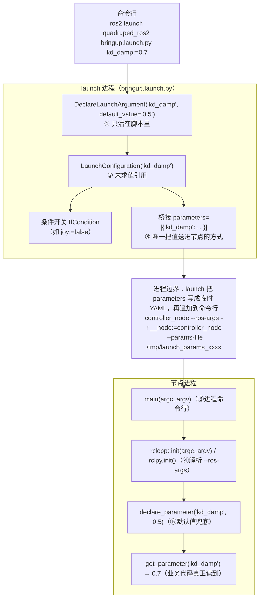

# ROS 2：launch 参数、节点参数与命令行参数的关系（核对版）

> 来源：[2026-10-06 与元宝的问答](https://yb.tencent.com/s/BAIdmoQlTEjp)，**本文是核对后的版本**：结论基本正确，只更正/补充了三处（见 §3），并补上本仓库自己的实测证据（见 §2）。
>
> 相关：本任务三个节点的**参数清单**（名字/类型/默认值/能否从 launch 改）在 [`../../@20261005_ros2/docs/ros2-nodes.md`](../../@20261005_ros2/docs/ros2-nodes.md) §1.2；环境与 `[activation]` 写在根 [`pixi.toml`](../../pixi.toml)。

## 1 两套机制，五个名字

"参数"这个词在 ROS 2 里其实只有**两套机制**，其余都是传输通道：

| # | 名字 | 属于谁 | 生命周期 | `ros2 param list` 看得到吗 |
|---|---|---|---|---|
| ① | `DeclareLaunchArgument` | **launch 脚本里的变量** | 只在这次 launch 进程里 | ❌ 看不到 |
| ② | `LaunchConfiguration('x')` | ①的**未求值引用**（Substitution） | 同上 | ❌ |
| ③ | `Node(parameters=[…])` | launch 侧的**桥**：把值塞进节点进程 | 进程启动时 | ✅（作为节点的参数值） |
| ④ | `main(argc, argv)` / `rclcpp::init` / `rclpy.init` | 进程命令行 + rcl 解析 | 进程启动时 | —（是通道，不是值） |
| ⑤ | `declare_parameter('x', default)` | **节点进程里的键值** + 默认值兜底 | 节点整个生命期 | ✅ |

一句话：**①是脚本变量，②是引用，③是桥，④是管道，⑤是终点**。①和⑤没有任何自动联系——**必须显式桥接**，这是最容易误解的一点：

```python
DeclareLaunchArgument("kp", default_value="80.0")           # ①
Node(..., parameters=[{"kp": LaunchConfiguration("kp")}])    # ③ 桥
```

## 2 值是怎么流的（含本仓库实测证据）



本仓库里可以逐条对上的证据：

| 环节 | 证据（都在本任务实测） |
|---|---|
| ③→④ 走的是 **`--params-file`** | 三节点联跑的 launch 日志里每个进程的命令行都是 `… --ros-args -r __node:=<名字> --params-file /tmp/launch_params_xxxx` |
| ①的值确实到了⑤ | `kd_damp:=0.7 ramp:=2.0 tilt_warn_deg:=45 deadband:=0.12` 起一次，`ros2 param get` 回读全部一致 |
| ⑤的默认值只是兜底 | 不给 launch 参数时，`start` 取 `declare_parameter("start", "raw")` 的 `raw` |
| 运行期还能改 | `ros2 param set /controller_node ramp 8.0` → 起身确实用了 8 s（节点装了 `add_on_set_parameters_callback`） |
| ④解析的不只是参数 | `joy_node.py` 里写的是 `rclpy.init()`（不传 `args`），launch 注入的 `-r __node:=joy_node` 因此生效——日志里的节点名就是 `/joy_node` |

## 3 原问答里需要更正/补充的三处

1. **"launch 把参数展开成 `--ros-args -p k:=v`"——不准确**。`Node(parameters=[…])` 的真实机制是：launch_ros 把 dict/YAML **写成一个临时文件**，命令行里传的是 `--ros-args --params-file /tmp/launch_params_xxxx`（remap 才是字面的 `-r`）。上面那张联跑日志就是原文证据。区别不是文字游戏：`--params-file` 意味着"参数"在节点启动时被整体读入，也意味着**文件里可以有类型**（int/double/bool），而 `-p` 是字符串按 YAML 规则解析。
2. **"`Node(parameters=[…])` 是唯一通道"——要加限定**。它确实是 launch 里**声明式**传参的唯一通道，但同一个 launch 文件里还可以用 `Node(arguments=["--ros-args", "-p", "foo:=1"])` 直接注入命令行参数，或用 `SetParametersFromFile`／`SetParameter` 动作在运行期设。ComposableNode 则走 `NodeOptions`/`extra_arguments`，不经过命令行（这一点原问答已经提到）。
3. **补一条实践口径**：launch 参数从命令行进来时都是**字符串**，由 YAML 规则转类型（`viewer:=false` → 布尔 `false`、`kp:=80.0` → double）。所以 `-p status_period_s:=0` 在**节点命令行**上会报"给了整数、要 double"，要写 `0.0`（我们踩过，见 [`../../@20261005_ros2/docs/ros2-nodes.md`](../../@20261005_ros2/docs/ros2-nodes.md) §7 坑 11）。

## 4 三个坑（原文结论正确，照录）

1. **声明了 launch argument ≠ 设了节点参数**：必须显式桥接（§1 的例子）。
2. **`rclpy.init(args=[])` 会把 launch 注入的东西全部作废**：namespace、remap、参数一起静默失效。要么 `rclpy.init(args=args)`，要么干脆 `rclpy.init()`（走 `sys.argv`）。
3. **`generate_launch_description()` 里读不到 `LaunchConfiguration` 的值**：它是未求值的 Substitution；要在脚本里做判断得用 `OpaqueFunction`：

```python
def launch_setup(context, *_args, **_kwargs):
    value = LaunchConfiguration("use_sim").perform(context)   # 这里才是真值
    ...

LaunchDescription([OpaqueFunction(function=launch_setup)])
```

## 5 优先级（谁盖谁）

同一个参数按"越靠外越优先"：

```
命令行 / --params-file（含 launch 桥过去的）  >  declare_parameter 的默认值
```

细化两点：① 参数文件里的值按**加载顺序**后者盖前者；② 运行期 `ros2 param set` 只有在参数**已声明**（且没被声明为只读）时才生效——我们的节点都装了 `add_on_set_parameters_callback`，所以 `kp/kd/kd_damp/ramp` 等可以边跑边调，改完立刻用。

## 6 参数 YAML 文件：与 launch 桥接是同一机制的两副面孔

§1 的"③桥"拆开看就是这个机制：`Node(parameters=[{…}])` 的内部动作是把字典**写成临时 YAML 文件**，命令行上传 `--params-file /tmp/launch_params_xxxx`（§2 的日志证据；临时文件长什么样见环境里的 `launch_ros/actions/node.py:369`——`{节点名: {ros__parameters: …}}`，节点名没写全时用 `/**`）。所以"自己写一个 YAML 文件传参"**不是另一套机制**，而是把那份一次性的临时文件换成仓库里持久、可入库的文件；节点侧完全一样：启动时读入 → `declare_parameter` 兜底 → 业务代码 `get_parameter`。

### 6.1 什么时候用哪个

以仿真节点（`sim_node`，参数清单见 [`../../@20261005_ros2/docs/ros2-nodes.md`](../../@20261005_ros2/docs/ros2-nodes.md) §1.2）为例：

| 维度 | launch 参数（`DeclareLaunchArgument` + 桥接） | 参数 YAML 文件（`--params-file`） |
|---|---|---|
| 怎么改 | 命令行 `… launch … key:=value`，一次一串 | 编辑文件；或对运行中的节点 `ros2 param dump` 导出骨架再改 |
| 加一个参数的代价 | 改三处：声明、桥接、`Node` 字典 | 文件里加一行——前提是节点里已经 `declare_parameter`（仿真节点 18 个都已声明，不用改代码） |
| 批量 / 预设 | 临时敲；适合"这一轮要扭的那几个" | 一份文件 = 一套完整预设，可入库多份（理想电机 / 带摩擦延迟 / 高画质 / 无窗口回归…） |
| 条件与组合逻辑 | 能做（`IfCondition`、Substitution 拼接、OpaqueFunction） | 做不了（静态值） |
| 类型 | 命令行全是字符串，按 YAML 规则转（§3 第 3 条） | 文件里就有类型（`0` 是整数、`0.0` 是 double） |
| 可发现性 | `ros2 launch … --show-args` 列出全部 | 文件自己就是清单，还能写注释 |
| 典型用途 | 现场开关、每轮实验要扭的旋钮 | 成组的常量或已验证的预设 |

一句话口径：**个位数的现场开关**（`viewer` / `realtime` / `start` / `scene`）留 launch 参数；**成组的常量或预设**（电机非理想项、画质三件套…）写 YAML 文件；两者可以叠加（见 6.3）。

### 6.2 写法（示意）

顶层键是**节点名**（含命名空间，如 `/sim_node`；`/**` 是通配），值写在 `ros__parameters:` 下：

```yaml
# 只写要改的键，其余仍用节点默认值（仓库里还没有这份文件，这里只是示意）
/sim_node:
  ros__parameters:
    motor_deadzone: 0.5      # double；写 0 会按整数解析，与声明不符会报类型错
    motor_delay_cycles: 2    # int
    viewer_shadow: false     # bool
```

两条路径都可用（都在仓库根执行；示例文件放 `/tmp`，正式预设放任务目录里、用相对路径引用）：

```bash
# ① 不经 launch：单节点直接给
pixi run ros2 run quadruped_ros2 sim_node --ros-args --params-file /tmp/sim_params.yaml

# ② 经 launch：列表里可以混用"文件 + 字典"，按顺序传给节点
#    parameters=["/path/to/sim_params.yaml", {"viewer": LaunchConfiguration("viewer")}]
```

关键行为（都能在环境里的 `launch_ros` 源码里对上）：`parameters` 列表里**每一项**按顺序变成命令行上的一个参数来源——字典 → launch 先写成临时 YAML 再 `--params-file`，文件路径 → 直接 `--params-file`（`Parameter(...)` 那种写法才是 `-p`）；**同名参数后者盖前者**；带完整节点名的键**优先于 `/**` 通配**，即使它出现得更早（`launch_ros/actions/node.py` 的 `parameters` 说明）。

两个容易踩的点：① 键名对不上（节点名写错、没写对命名空间）时那些值**不会被应用**——不会专门报错，用 `ros2 param get /sim_node <名字>` 回读确认最稳；② 类型以文件里的**字面量**为准，`0` 是整数、`0.0` 才是 double，与 `declare_parameter` 声明的类型对不上会报类型错误（命令行上我们踩过同一条：`-p status_period_s:=0`，见 §3 第 3 条与 [`../../@20261005_ros2/docs/ros2-nodes.md`](../../@20261005_ros2/docs/ros2-nodes.md) §7）。

**别混淆**：rl_sar 的 `policy/black/*.yaml` 不是 ROS 参数文件——那是它自己（yaml-cpp）读的应用配置，`--params-file` 管不到；`rl_sim` 的 ROS 参数只有 `robot_name` 与 `joy_command_scale` 两个。要把 kp/kd、站姿这类也变成能用参数文件传的，得先给 rl_sim 加 `declare_parameter`（那是改代码的事，不是写文件的事）。

## 7 工程惯例：参数只在启动时读一次，"热改"是进阶内容

§5 说运行期生效需要参数回调，但翻一遍培训方与主办方的**工程**代码，**没有一处**用 `add_on_set_parameters_callback`：上游 rl_sar 连 ROS 参数都没有（启动时向独立的 `/param_node` 要一个 `robot_name`，其余全在 yaml），主办方分支只 `declare_parameter` 三个字段，主办方自己的控制栈 gateway 七个字段 + 一套 `config_loader` 读 yaml 预设——**全是"启动读一次"**。逐代码库的证据表见 [`rl-sar.md`](rl-sar.md) §4。

讲义也把这件事讲成进阶话题（`ros2基本概念.md:754`，只读材料）：「我们的 talker 只在启动时读一次参数，所以 `param set` 虽然会显示成功，但不会立刻改变发布内容。想让参数在线生效，需要在代码里每次使用前重新读取，或者写参数回调——**这就是更进阶的内容了**」。

所以这类任务的调参正常路径是**改参数文件 + 重启**（§6.1），热改只在"现场整定"这种真需求下才加；判断一个节点属于哪种，看它有没有 `add_on_set_parameters_callback`——没有就是"重启生效"。注意后者有个坑：只在构造时 `get_parameter` 的节点，`ros2 param set` 会"改得动参数值、改不动行为"，看上去成功、实际没用（本仓 `rl_sim` 目前就是这个状态：参数面只有 2 个、都没有回调）。
