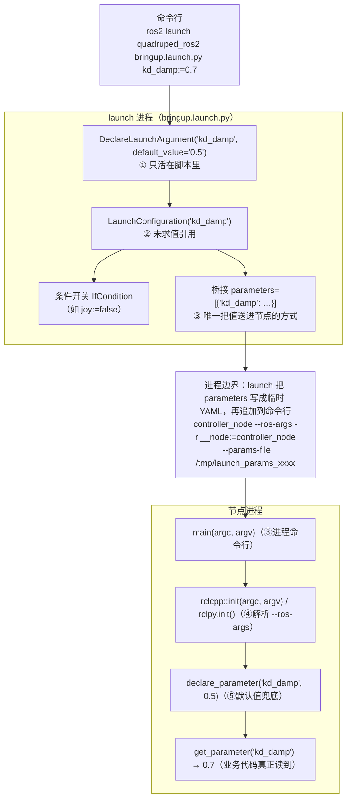

# ROS 2：launch 参数、节点参数与命令行参数的关系（核对版）

> 来源：[2026-10-06 与元宝的问答](https://yb.tencent.com/s/BAIdmoQlTEjp)，**本文是核对后的版本**：结论基本正确，只更正/补充了三处（见 §3），并补上本仓库自己的实测证据（见 §2）。
>
> 相关：本任务三个节点的**参数清单**（名字/类型/默认值/能否从 launch 改）在 [`../../@20261005_ros2/docs/ros2-nodes.md`](../../@20261005_ros2/docs/ros2-nodes.md) §1.2；环境与 `[activation]` 写在根 [`pixi.toml`](../../pixi.toml)。

## 1 两套机制，五个名字

"参数"这个词在 ROS 2 里其实只有**两套机制**，其余都是传输通道：

| # | 名字 | 属于谁 | 生命周期 | `ros2 param list` 看得到吗 |
|---|---|---|---|---|
| ① | `DeclareLaunchArgument` | **launch 脚本里的变量** | 只在这次 launch 进程里 | ❌ 看不到 |
| ② | `LaunchConfiguration('x')` | ①的**未求值引用**（Substitution） | 同上 | ❌ |
| ③ | `Node(parameters=[…])` | launch 侧的**桥**：把值塞进节点进程 | 进程启动时 | ✅（作为节点的参数值） |
| ④ | `main(argc, argv)` / `rclcpp::init` / `rclpy.init` | 进程命令行 + rcl 解析 | 进程启动时 | —（是通道，不是值） |
| ⑤ | `declare_parameter('x', default)` | **节点进程里的键值** + 默认值兜底 | 节点整个生命期 | ✅ |

一句话：**①是脚本变量，②是引用，③是桥，④是管道，⑤是终点**。①和⑤没有任何自动联系——**必须显式桥接**，这是最容易误解的一点：

```python
DeclareLaunchArgument("kp", default_value="80.0")           # ①
Node(..., parameters=[{"kp": LaunchConfiguration("kp")}])    # ③ 桥
```

## 2 值是怎么流的（含本仓库实测证据）



本仓库里可以逐条对上的证据：

| 环节 | 证据（都在本任务实测） |
|---|---|
| ③→④ 走的是 **`--params-file`** | 三节点联跑的 launch 日志里每个进程的命令行都是 `… --ros-args -r __node:=<名字> --params-file /tmp/launch_params_xxxx` |
| ①的值确实到了⑤ | `kd_damp:=0.7 ramp:=2.0 tilt_warn_deg:=45 deadband:=0.12` 起一次，`ros2 param get` 回读全部一致 |
| ⑤的默认值只是兜底 | 不给 launch 参数时，`start` 取 `declare_parameter("start", "raw")` 的 `raw` |
| 运行期还能改 | `ros2 param set /controller_node ramp 8.0` → 起身确实用了 8 s（节点装了 `add_on_set_parameters_callback`） |
| ④解析的不只是参数 | `joy_node.py` 里写的是 `rclpy.init()`（不传 `args`），launch 注入的 `-r __node:=joy_node` 因此生效——日志里的节点名就是 `/joy_node` |

## 3 原问答里需要更正/补充的三处

1. **"launch 把参数展开成 `--ros-args -p k:=v`"——不准确**。`Node(parameters=[…])` 的真实机制是：launch_ros 把 dict/YAML **写成一个临时文件**，命令行里传的是 `--ros-args --params-file /tmp/launch_params_xxxx`（remap 才是字面的 `-r`）。上面那张联跑日志就是原文证据。区别不是文字游戏：`--params-file` 意味着"参数"在节点启动时被整体读入，也意味着**文件里可以有类型**（int/double/bool），而 `-p` 是字符串按 YAML 规则解析。
2. **"`Node(parameters=[…])` 是唯一通道"——要加限定**。它确实是 launch 里**声明式**传参的唯一通道，但同一个 launch 文件里还可以用 `Node(arguments=["--ros-args", "-p", "foo:=1"])` 直接注入命令行参数，或用 `SetParametersFromFile`／`SetParameter` 动作在运行期设。ComposableNode 则走 `NodeOptions`/`extra_arguments`，不经过命令行（这一点原问答已经提到）。
3. **补一条实践口径**：launch 参数从命令行进来时都是**字符串**，由 YAML 规则转类型（`viewer:=false` → 布尔 `false`、`kp:=80.0` → double）。所以 `-p status_period_s:=0` 在**节点命令行**上会报"给了整数、要 double"，要写 `0.0`（我们踩过，见 [`../../@20261005_ros2/docs/ros2-nodes.md`](../../@20261005_ros2/docs/ros2-nodes.md) §7 坑 11）。

## 4 三个坑（原文结论正确，照录）

1. **声明了 launch argument ≠ 设了节点参数**：必须显式桥接（§1 的例子）。
2. **`rclpy.init(args=[])` 会把 launch 注入的东西全部作废**：namespace、remap、参数一起静默失效。要么 `rclpy.init(args=args)`，要么干脆 `rclpy.init()`（走 `sys.argv`）。
3. **`generate_launch_description()` 里读不到 `LaunchConfiguration` 的值**：它是未求值的 Substitution；要在脚本里做判断得用 `OpaqueFunction`：

```python
def launch_setup(context, *_args, **_kwargs):
    value = LaunchConfiguration("use_sim").perform(context)   # 这里才是真值
    ...

LaunchDescription([OpaqueFunction(function=launch_setup)])
```

## 5 优先级（谁盖谁）

同一个参数按"越靠外越优先"：

```
命令行 / --params-file（含 launch 桥过去的）  >  declare_parameter 的默认值
```

细化两点：① 参数文件里的值按**加载顺序**后者盖前者；② 运行期 `ros2 param set` 只有在参数**已声明**（且没被声明为只读）时才生效——我们的节点都装了 `add_on_set_parameters_callback`，所以 `kp/kd/kd_damp/ramp` 等可以边跑边调，改完立刻用。
